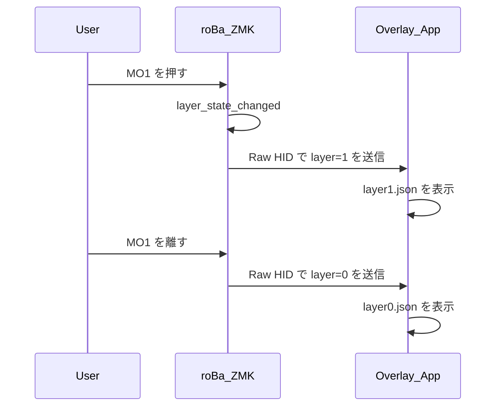
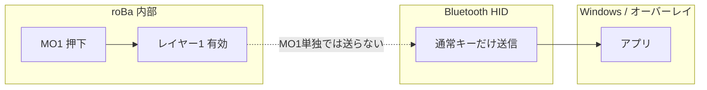
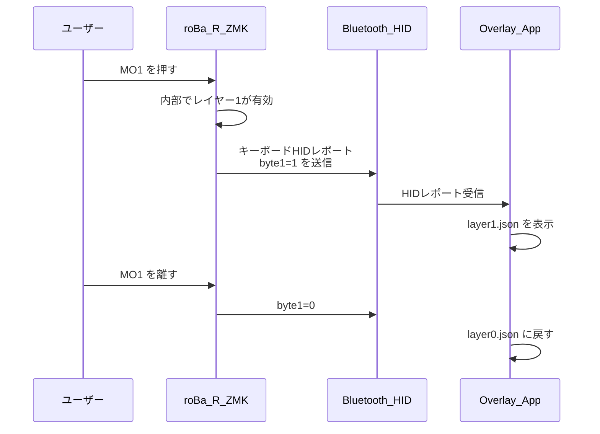

<!-- Generated by SpecStory, Markdown v2.1.0 -->

# 2026-05-09 00:59:59Z

<!-- Cursor IDE Session 5844e032-0f52-44ad-83ad-528243913da0 (2026-05-09 00:59:59Z) -->

_**User**_

roBaをパソコンに接続し、使用しているのですが、bluetoothの接続が時々切れてしまいます。トラックボールの操作を早くすると接続が切れるような気がします。現在の設定でこの現象を改善するにはどの設定をどのように変更することで改善できそうかを教えてください。

---

_**Agent (default)**_

<think><details><summary>Thought Process</summary>
The user experiences Bluetooth connection drops with their roBa keyboard when moving the trackball rapidly.</details></think>

_**Agent (default)**_

roBa の Bluetooth 切断について、リポジトリ内の設定と既知の対策を確認します。


_**Agent (default)**_

<tool-use data-tool-type="read" data-tool-name="read_file_v2">
<details><summary>Tool use: **read_file_v2** • Read file: c:\dev\zmk-config-roBa\.cursor\skills\zmk-roba\SKILL.md</summary>

</details>
</tool-use>

<tool-use data-tool-type="read" data-tool-name="read_file_v2"><details>
<summary>Tool use: **read_file_v2**</summary>

</details></tool-use>

_**Agent (default)**_

<tool-use data-tool-type="read" data-tool-name="read_file_v2">
<details><summary>Tool use: **read_file_v2** • Read file: c:\dev\zmk-config-roBa\CLAUDE.md</summary>

</details>
</tool-use>

<tool-use data-tool-type="read" data-tool-name="read_file_v2"><details>
<summary>Tool use: **read_file_v2**</summary>

</details></tool-use>

_**Agent (default)**_

<tool-use data-tool-type="search" data-tool-name="glob_file_search">
<details>
<summary>Tool use: **glob_file_search** • Searched codebase "" • **2** results in **1** directory</summary>

Directory: **c:\dev\zmk-config-roBa** (2 files)

| File |
|------|
| `../config/boards/shields/roBa/roBa_L.conf` |
| `../config/boards/shields/roBa/roBa_R.conf` |

</details>
</tool-use>

<tool-use data-tool-type="search" data-tool-name="glob_file_search"><details>
<summary>Tool use: **glob_file_search**</summary>

</details></tool-use>

_**Agent (default)**_

<think><details><summary>Thought Process</summary>
I have good context from CLAUDE. HIDCPIHID If the queue overflows or BLE cannot keep up, issues may occur. The current CONFIG_ZMK_BLE_KEYBOARD_REPORT_QUEUE_SIZE=30 could be increased further if ZMK supports separate mouse queue handling.

Connection interval and latency affect buffering; higher latency leads to more buffered reports. While CLAUDE.md indicates BT_PERIPHERAL_PREF_* are ZMK defaults not recommended for changes, the connection parameters are negotiated with Windows when the keyboard acts as peripheral during PC connection.</details></think>

_**Agent (default)**_

実際の `roBa_R.conf` とトラックボールのオーバーレイを確認し、調整候補を具体化します。


_**Agent (default)**_

<tool-use data-tool-type="read" data-tool-name="read_file_v2">
<details><summary>Tool use: **read_file_v2** • Read file: c:\dev\zmk-config-roBa\config\boards\shields\roBa\roBa_R.conf</summary>

</details>
</tool-use>

<tool-use data-tool-type="read" data-tool-name="read_file_v2"><details>
<summary>Tool use: **read_file_v2**</summary>

</details></tool-use>

_**Agent (default)**_

<tool-use data-tool-type="read" data-tool-name="read_file_v2">
<details><summary>Tool use: **read_file_v2** • Read file: c:\dev\zmk-config-roBa\config\boards\shields\roBa\roBa_R.overlay</summary>

</details>
</tool-use>

<tool-use data-tool-type="read" data-tool-name="read_file_v2"><details>
<summary>Tool use: **read_file_v2**</summary>

</details></tool-use>

_**Agent (default)**_

<tool-use data-tool-type="unknown" data-tool-name="ripgrep_raw_search">
<details>
<summary>Tool use: **ripgrep_raw_search**</summary>


Parameters:

```json
{
  "caseInsensitive": false,
  "glob": "*.{conf,overlay,dtsi,keymap}",
  "path": "c:\\dev\\zmk-config-roBa",
  "pattern": "QUEUE|PMW|pointing|mouse|HID"
}
```
Additional data:

```json
{
  "isPruned": true,
  "outputMode": "content",
  "path": "c:\\dev\\zmk-config-roBa",
  "pattern": "QUEUE|PMW|pointing|mouse|HID",
  "topFiles": [
    {
      "matchCount": 7,
      "uri": "config/boards/shields/roBa/roBa_R.conf"
    },
    {
      "matchCount": 1,
      "uri": "config/roBa.keymap"
    }
  ],
  "totalFiles": 2,
  "totalMatches": 8
}
```
Status: **completed**


</details>
</tool-use>

<tool-use data-tool-type="unknown" data-tool-name="ripgrep_raw_search"><details>
<summary>Tool use: **ripgrep_raw_search**</summary>

</details></tool-use>

_**Agent (default)**_

<think><details><summary>Thought Process</summary>
The repository already includes extended stacks and a mouse queue (40). The CLAUDE.md snapshot was slightly outdated; the actual file specifies ZMK_BLE_THREAD_STACK_SIZE=1536 and a mouse queue of 40. To improve performance, consider increasing the CONFIG_ZMK_BLE_MOUSE_REPORT_QUEUE_SIZE to 50-64 if bursts overflow, though RAM usage must be monitored. Additionally, reducing the trackball's `res-cpi` in the overlay from 400 to 300 may lower HID traffic, although fast movements can still generate numerous reports. Lowering CPI can reduce the report rate for the same physical motion, as higher CPI leads to more counts per mm and thus more reports. While smart-mode may already batch or optimize reports, checking ZMK PMW3610 documentation for sample rate behavior is advisable. Additionally, movement scaling in the keymap using &mmv with scale factors could help reduce effective burst rates. BLE connection parameters should also be reviewed for optimization. Shorter connection intervals use more airtime for notifications and less buffering, though Windows controls this. CONFIG_BT_GAP_AUTO_UPDATE_CONN_PARAMS is disabled; enabling it may let Windows request better parameters, but this is risky based on their testing. PHY 2M is disabled for compatibility, but enabling it could double throughput and help with burst HID, though it might worsen issues with Intel/Realtek adaptersthis is worth testing as an A/B comparison. USB dongles versus onboard Bluetooth offer different environmental advantages.</details></think>

_**Agent (default)**_

キーマップのポインティング関連と `roBa_L.conf` を確認します。


_**Agent (default)**_

<tool-use data-tool-type="read" data-tool-name="read_file_v2">
<details><summary>Tool use: **read_file_v2** • Read file: c:\dev\zmk-config-roBa\config\roBa.keymap</summary>

</details>
</tool-use>

<tool-use data-tool-type="read" data-tool-name="read_file_v2"><details>
<summary>Tool use: **read_file_v2**</summary>

</details></tool-use>

_**Agent (default)**_

<tool-use data-tool-type="read" data-tool-name="read_file_v2">
<details><summary>Tool use: **read_file_v2** • Read file: c:\dev\zmk-config-roBa\config\boards\shields\roBa\roBa_L.conf</summary>

</details>
</tool-use>

<tool-use data-tool-type="read" data-tool-name="read_file_v2"><details>
<summary>Tool use: **read_file_v2**</summary>

</details></tool-use>

_**Agent (default)**_

<think><details><summary>Thought Process</summary>
I have a complete picture of the roBa_R. confZMK_BLE_THREAD_STACK_SIZE1536MOUSE_REPORT_QUEUE_SIZE403010

1. ****BLEHIDBLE

2. **Kconfig**
   - CONFIG_ZMK_BLE_MOUSE_REPORT_QUEUE_SIZERAM4864</details></think>

_**Agent (default)**_

結論から言うと、**トラックボールを素早く動かすと相対マウス報告が短時間に大量発生し、BLE の通知処理やホスト側のバッファが追いつかないと切断やフリーズが起きやすくなる**、という説明がもっとも筋が通ります。このリポジトリでは、その対策としてすでに Central 側で HID キューや BLE スレッドを広げる設定が入っています。

```54:62:c:\dev\zmk-config-roBa\config\boards\shields\roBa\roBa_R.conf
# [2026-03] Extended session stability
# Explicitly disable deep sleep to prevent BLE disconnection after inactivity.
CONFIG_ZMK_SLEEP=n
# BLE notify thread: default 768. roBa_R multiplexes kbd + mouse + battery + split.
CONFIG_ZMK_BLE_THREAD_STACK_SIZE=1536
# HID report queues (defaults: kbd/mouse 20, consumer 5). Burst headroom for central role.
CONFIG_ZMK_BLE_KEYBOARD_REPORT_QUEUE_SIZE=30
CONFIG_ZMK_BLE_MOUSE_REPORT_QUEUE_SIZE=40
CONFIG_ZMK_BLE_CONSUMER_REPORT_QUEUE_SIZE=10
```

```54:65:c:\dev\zmk-config-roBa\config\boards\shields\roBa\roBa_R.overlay
    trackball: trackball@0 {
        status = "okay";
        compatible = "pixart,pmw3610";
        reg = <0>;
        spi-max-frequency = <2000000>;
        motion-gpios = <&gpio0 2 (GPIO_ACTIVE_LOW | GPIO_PULL_UP)>;
        zephyr,axis-x = <INPUT_REL_Y>;
        zephyr,axis-y = <INPUT_REL_X>;
        res-cpi = <400>;
        smart-mode;
        invert-x;
    };
```

以下、**改善が期待できる変更の優先度とトレードオフ**です。

---

### 1. ファーム側（まず試しやすい）

| 目的 | 設定 | 考え方 |
|------|------|--------|
| **バースト時のキュー溢れをさらに抑える** | `CONFIG_ZMK_BLE_MOUSE_REPORT_QUEUE_SIZE` を **さらに増やす**（例: 48〜64 程度）。必要なら `CONFIG_ZMK_BLE_KEYBOARD_REPORT_QUEUE_SIZE` も少し上げる | すでに 40 と広いので「まだ切れる」場合の次の一手。RAM はわずかに増える |
| **一秒あたりの相対移動量（≒通知回数）を減らす** | `res-cpi` を **下げる**（例: 400 → 200〜300） | 同じ動きでもセンサ出力が小さくなりやすく、BLE 負荷が下がりやすい。**指の感覚は変わる**ので好み調整 |
| **アダプタが安定している場合のスループット** | `CONFIG_BT_CTLR_PHY_2M=y` に変更して試す | **2M PHY は転送効率が上がりバーストに有利**なことがある一方、このプロジェクトでは Intel/Realtek 互換のため **`=n` がデフォルト方針**（`CLAUDE.md`）。症状が続く PC だけで試す価値あり |
| **スタック不足が疑わしい極稀なケース** | `CONFIG_ZMK_BLE_THREAD_STACK_SIZE` を **1536 → 2048** など | すでに 1536 と大きいので最終手段寄り |

ポインティングの「報告を間引く」系は、ZMK の **input processor**（公式ドキュメントの pointing 周り）でできる場合があります。キーマップにまだ無いなら、**速い操作時だけイベント密度を下げる**方向の検討材料になります（実装は個別に確認が必要です）。

---

### 2. PC・環境側（設定変更なしで効くことが多い）

- **内蔵 Bluetooth の電源管理**（スリープ・省電力）でラジオが弱くなっていると、バースト負荷のときに切れやすいです。**USB の BT ドングル**はマザーボード表面に近い位置・延長ケーブルで干渉を減らす、なども有効です。
- **Wi‑Fi（2.4 GHz）と USB3 のノイズ**が重なると症状が出やすいです。可能なら **5 GHz Wi‑Fi**、キーボードとアンテナの位置関係の調整も含めて確認してください。

---

### 3. 切り分けのヒント

- **PC との BLE だけ**が切れるのか、**左右スプリット（左の無線）**まで落ちるのかで原因が変わります。前者なら **HID・PHY・キュー・PC 側**、後者なら **Central の負荷や split 周り**を優先します。
- `CLAUDE.md` にある **`settings_reset` で NVS クリア → 再フラッシュ → 再ペアリング**は、**ボンド破損時の典型復旧**です。トラックボールの速さと無関係に突然全滅する場合はそちらも疑います。

---

**まとめ**: いまの構成では **マウス用キュー拡大・CPI 低下・（環境が許せば）2M PHY の試験**が、いちばく試しやすい順です。ファームの具体的な数値変更は、`CLAUDE.md` の方針どおり **変更理由とトレードオフを決めてから**行うのが安全です。特定の設定値まで書き換えたビルド案が必要なら、その前提（PC の BT が内蔵かドングルか、切断はホスト側ログに何と出るか）を教えてもらえれば、より絞った提案ができます。

---

_**User**_

　現状の設定でC:\dev\zmk-config-roBa\keymap_layout.mdファイルの内容を更新し、別名で保存して

---

_**Agent (default)**_

現状のキーマップ設定を確認し、`keymap_layout.md` を更新して別名で保存します。


_**Agent (default)**_

<tool-use data-tool-type="read" data-tool-name="read_file_v2">
<details><summary>Tool use: **read_file_v2** • Read file: c:\dev\zmk-config-roBa\keymap_layout.md</summary>

</details>
</tool-use>

<tool-use data-tool-type="read" data-tool-name="read_file_v2"><details>
<summary>Tool use: **read_file_v2**</summary>

</details></tool-use>

_**Agent (default)**_

<tool-use data-tool-type="read" data-tool-name="read_file_v2">
<details><summary>Tool use: **read_file_v2** • Read file: c:\dev\zmk-config-roBa\config\roBa.keymap</summary>

</details>
</tool-use>

<tool-use data-tool-type="read" data-tool-name="read_file_v2"><details>
<summary>Tool use: **read_file_v2**</summary>

</details></tool-use>

_**Agent (default)**_

<tool-use data-tool-type="read" data-tool-name="read_file_v2">
<details><summary>Tool use: **read_file_v2** • Read file: c:\dev\zmk-config-roBa\config\roBa.json</summary>

</details>
</tool-use>

<tool-use data-tool-type="read" data-tool-name="read_file_v2"><details>
<summary>Tool use: **read_file_v2**</summary>

</details></tool-use>

_**Agent (default)**_

<think><details><summary>Thought Process</summary>
現在の keymap_layout.md の内容を確認している。

デフォルトレイヤー（レイヤー0）のキーマップ構成を確認している。QWERTY配列の上段、中段、下段に加え、モディファイアキーと特殊キーの配置を把握している。

レイアウトの具体的な配置を確認している。左側は0〜5列、右側は8〜13列に配置されている。3行目の左右の指先部分に、Shift、FN、Alt、MO1、MO2、Ctrl、Space、Enter、半角・全角キーがそれぞれ配置されていることを把握した。

レイアウト図の3行目配置が実際のキーマップと一致することを確認した。

レイヤー1もほぼ一致している。BTキーは`out OUT_BLE`で「BLE」と表示される。

レイヤー2の指先部分では、左側のShift位置が「かな」に設定されていることを確認した。

レイヤー2の指先部分も、文書と一致することを確認した。

レイヤー3、4、5も同じ構成であることを確認した。

roBa.json とキーマップの指先部分に差異がある。JSON には MO3 が記載されているが、キーマップではデフォルトレイヤーの指先部分に mo 1 と mo 2 が設定されている。

キーマップを正として、JSON は古い可能性がある。

最終更新日を 2026-07-07 に変更する必要がある。

現在のファームウェア設定の説明を追加すべきかもしれない。

レイヤー0のFNキーは mo 4 であり、文書の FN 表示は正しい。

MClk と MB3 は同じ意味（中クリック）である。

レイヤー5（layer_6）への直接アクセス方法について確認している。文書では「直接アクセス方法は定義されていません」と記載されているが、キーマップ内にレイヤー6への直接移動バインディングがないことを確認した。lt_to_layer_0 という動作は存在するが、実際のキーバインディングでは使用されていない。ユーザーの要求を再確認している。

レイヤー1の3行目を詳しく比較している。文書とキーマップの指先部分に差異があることを確認した。新しいファイル名を検討している。

レイヤー1の指先部分の順序が文書と一致することを確認した。レイヤー4のFNキー位置も文書と一致することを確認した。コンボの解釈も文書と一致することを確認した。ハードウェアやファームウェアの設定を文書に追加すべきか検討している。

「現状の設定」という表現の意図を再確認している。ファイル名から、これはキーマップレイアウト自体の現状反映と解釈している。レイヤー0の文字列を1文字ずつ照合し、文書と一致することを確認した。

レイヤー1の記号配置を照合した。文書の [ ] は JP_LBRACKET と JP_RBRACKET に対応し、日本語キーボードでそれぞれ [ と ] を生成するため一致することを確認した。

レイヤー2の指先部分でも文書とキーマップが一致することを確認した。

レイヤー2のASCIIアートの下部行に不整合があることに気づいた。

レイヤー2の指先部分を再確認した。キーマップでは MO1、MO2、MO3 が同じ行に並んでいる。文書の ASCII アートでは MO1、MO2、MO3 が下部行に配置されている。左側の Shift と WIN は上部の指先行に配置されている。この差異を文書に反映させる必要がある。

ASCII アートの指先行は、物理的に同じ行にある6キーを2行に分けて描いている。元の文書と同じ表記慣習であり、文書に反映させる必要がある。

roBa.json の指先部分を再確認した。JSON には Ctrl が記載されているが、キーマップでは FN（mo 4）が配置されている。JSON は古い情報であり、キーマップを正とする。

MB3（中クリック）の説明を文書に追加する。BLE安定性設定の要約セクションも追加する。

encoder の sensor-bindings はレイヤー3のみに存在することを確認した。

文書に source file config/roBa.keymap の参照を追加する方針を検討している。

BLE 関連のファームウェア設定を文書に追加するかどうかは、レイアウト中心の文書という観点から迷っている。

レイヤー6の右下端（BT_CLR_ALL）と右側上部（BT_CLR）の配置も文書と一致することを確認した。

ファイル名を `keymap_layout_2026-07-07.md` に決定した。

レイアウト中心の文書として、ソースファイル参照と更新日付を追加する方針を確定した。

レイヤー6の右下端（BT_CLR_ALL）と右側上部（BT_CLR）の配置も文書と一致することを確認した。

ファイル名を `keymap_layout_2026-07-07.md` に決定した。

レイアウト中心の文書として、ソースファイル参照と更新日付を追加する方針を確定した。

レイヤー6の右下端（BT_CLR_ALL）と右側上部（BT_CLR）の配置も文書と

FNキーは mo 4 であり、ShiftとAltの間に配置されることを文書に追記する。

ハードウェア設定（トラックボールCPI 400など）とファームウェア設定の要約セクションを追加するかどうかを検討している。

ユーザーはキーマップの同期と日付更新だけを求めている可能性があるため、保守的な方針を採用する。レイヤー0の指先行配置を最後にもう一度確認している。</details></think>

_**Agent (default)**_

キーマップと照合し、差分を反映したうえで別名ファイルに保存します。


_**Agent (default)**_

<tool-use data-tool-type="write" data-tool-name="edit_file_v2">

<details><summary>Tool use: **edit_file_v2** • Edit file: c:\dev\zmk-config-roBa\keymap_layout_2026-07-07.md</summary>

</details>

</tool-use>

<tool-use data-tool-type="write" data-tool-name="edit_file_v2"><details>
<summary>Tool use: **edit_file_v2**</summary>

</details></tool-use>

_**Agent (default)**_

<think><details><summary>Thought Process</summary>
ファイルは作成済みです。</details></think>

_**Agent (default)**_

`config/roBa.keymap` と現行ファーム設定を照合し、内容を更新したうえで別名で保存しました。

**保存先:** `C:\dev\zmk-config-roBa\keymap_layout_2026-07-07.md`

**主な更新内容:**
- ソースファイル（`config/roBa.keymap`）と更新日（2026-07-07）を明記
- レイヤー0のサムキー順序を実際の割り当てに合わせて補足（Shift → FN (`mo 4`) → Alt → MO1 → MO2 → Ctrl）
- レイヤー1の `out OUT_BLE`（BLE 出力切替）を追記
- キー略語表に FN・MClk（`mkp MB3`）・日本語切替キーの対応を追加
- レイヤー構造図を `mo 4` 表記に合わせて修正
- ハードウェア・ファームウェア設定の参考表を追加（トラックボール CPI 400、BLE キューサイズなど）

元の `keymap_layout.md` は変更していません。内容を上書きしたい場合はお知らせください。

---

_**User**_

このroBaのキーレイアウトをwindowsの画面上に表示するアプリケーションを作成したい。実行ファイルをダブルクリックをすると、レイヤー0のキーマップがウインドウに表示され、ウインドウは可変で、ウインドウの大きさによって表示されるキーマップの大きさも調整され常にウインドウの大きさに合わせてキーマップが全て表示されるようにしたい。ただ、ウインドウサイズがあまりにも小さかったり縦横比が極端にキーマップの縦横比とずれるようならキーマップ全てが表示されていなくてもよい。ウインドウは透明化0～100%で表示するスライドを追加し透明度を可変で表示させるようにする。ウインドウは常に最前面に表示されるようにする。この内容のアプリを作成する実装計画を作成して。不足している仕様があればuseraskquestionで表示して

---

_**Agent (default)**_

<think><details><summary>Thought Process</summary>
roBaのキーマップをWindows画面に表示するアプリケーションの実装計画を作成する。実行ファイルのダブルクリックでレイヤー0のキーマップが表示され、ウインドウサイズに応じて自動調整される。透明度と最前面表示も含める。</details></think>

_**Agent (default)**_

キーマップの物理レイアウトと既存ファイルを確認し、実装計画の前提を固めます。


_**Agent (default)**_

<tool-use data-tool-type="read" data-tool-name="read_file_v2">
<details><summary>Tool use: **read_file_v2** • Read file: c:\dev\zmk-config-roBa\keymap_layout_2026-07-07.md</summary>

</details>
</tool-use>

<tool-use data-tool-type="read" data-tool-name="read_file_v2"><details>
<summary>Tool use: **read_file_v2**</summary>

</details></tool-use>

_**Agent (default)**_

<tool-use data-tool-type="read" data-tool-name="read_file_v2">
<details><summary>Tool use: **read_file_v2** • Read file: c:\dev\zmk-config-roBa\config\roBa.json</summary>

</details>
</tool-use>

<tool-use data-tool-type="read" data-tool-name="read_file_v2"><details>
<summary>Tool use: **read_file_v2**</summary>

</details></tool-use>

_**Agent (default)**_

<tool-use data-tool-type="search" data-tool-name="glob_file_search">
<details>
<summary>Tool use: **glob_file_search** • Searched codebase "" • **0** results in **1** directory</summary>

Directory: **c:\dev\zmk-config-roBa** (0 files)

</details>
</tool-use>

<tool-use data-tool-type="search" data-tool-name="glob_file_search"><details>
<summary>Tool use: **glob_file_search**</summary>

</details></tool-use>

_**Agent (default)**_

<think><details><summary>Thought Process</summary>
リポジトリ内に既存のアプリコードはない。

roBa.jsonは実際のキーマップと微妙に異なるため、レイアウト座標とラベルを分離するか専用データファイルを新設する必要がある。

実装技術として、Python（tkinter/PyQt）はPyInstallerが必要だが透明化と最前面表示は可能。C# WPF/WinUIはネイティブで単一実行ファイル化が容易で、透明度と最前面表示に適している。Electronは過剰でサイズが大きいため除外。Rustは複雑なため見送る。

C# WPFは透明化・最前面表示・スライダー制御がネイティブに容易で、最も適している。Pythonでもwin32 APIでレイヤードウィンドウが可能だが、開発速度は劣る。HTML＋WebView2も選択肢として残っている。

Tauriも軽量なWeb技術として検討対象に加えた。

未確定の仕様として3点を整理した。まず技術選択だが、Windows専用のオーバーレイ用途ではC# WPFが最も適しているため、ユーザーに尋ねる必要がない可能性がある。次にレイヤー切り替えの有無だが、現状はレイヤー0のみを表示する方針とするか、将来的な切り替えを想定するかが不明である。最後にビジュアルスタイルだが、roBa.jsonにx,y座標と回転情報が含まれていることから、グラフィカルな丸みのあるキー表示が適していると考えられる。</details></think>

_**Agent (default)**_

実装方針を決めるうえで、仕様が分かれそうな点を確認します。


_**Agent (default)**_

<tool-use data-tool-type="unknown" data-tool-name="ask_question">
<details>
<summary>Tool use: **ask_question**</summary>


Parameters:

```json
{
  "questions": [
    {
      "id": "visual_style",
      "options": [
        {
          "id": "graphical",
          "label": "グラフィカル（キーキャップ風の四角＋ラベル。roBa.json の座標・回転を使った分割キーボードらしい表示）"
        },
        {
          "id": "ascii",
          "label": "ASCII アート風（keymap_layout.md と同じテキストベースの表示）"
        },
        {
          "id": "either",
          "label": "どちらでもよい（おすすめを提案してほしい）"
        }
      ],
      "prompt": "キーマップの見た目はどちらを想定していますか？"
    },
    {
      "id": "click_through",
      "options": [
        {
          "id": "no_click_through",
          "label": "いいえ — ウィンドウは常に操作対象（スライダー操作・ドラッグ移動がしやすい）"
        },
        {
          "id": "click_through_keys",
          "label": "キーマップ部分だけクリックスルー（スライダー等の操作バーは操作可能）"
        },
        {
          "id": "full_click_through",
          "label": "はい — 全体をクリックスルー（表示専用オーバーレイ）"
        }
      ],
      "prompt": "透明にしたとき、ウィンドウ下のアプリをクリックできるようにしますか？（オーバーレイ用途で重要）"
    },
    {
      "id": "settings_persist",
      "options": [
        {
          "id": "persist_yes",
          "label": "はい — 前回の状態を保存して復元する"
        },
        {
          "id": "persist_no",
          "label": "いいえ — 毎回デフォルトで起動する"
        }
      ],
      "prompt": "ウィンドウの位置・サイズ・透明度は次回起動時に復元しますか？"
    }
  ],
  "title": "roBa キーマップ表示アプリ — 仕様確認"
}
```
Additional data:

```json
{
  "currentSelections": {
    "click_through": [
      "full_click_through"
    ],
    "settings_persist": [
      "persist_yes"
    ],
    "visual_style": [
      "graphical"
    ]
  },
  "freeformTexts": {
    "click_through": "",
    "settings_persist": "",
    "visual_style": ""
  },
  "status": "submitted"
}
```
Result:

```json
{
  "answers": [
    {
      "freeformText": "",
      "questionId": "visual_style",
      "selectedOptionIds": [
        "graphical"
      ]
    },
    {
      "freeformText": "",
      "questionId": "click_through",
      "selectedOptionIds": [
        "full_click_through"
      ]
    },
    {
      "freeformText": "",
      "questionId": "settings_persist",
      "selectedOptionIds": [
        "persist_yes"
      ]
    }
  ]
}
```
User decision: **accepted**

Status: **completed**


</details>
</tool-use>

<tool-use data-tool-type="unknown" data-tool-name="ask_question"><details>
<summary>Tool use: **ask_question**</summary>

</details></tool-use>

_**Agent (default)**_

<think><details><summary>Thought Process</summary>
ユーザーの要望を整理している。roBa.jsonの座標と回転情報を用いてグラフィカルなキーキャップ表示を行う。

クリック透過と透明度スライダーの間に根本的な矛盾がある。クリック透過を完全に実現するにはウィンドウ上部に操作可能なスライダーを配置できない。この点を実装計画に含める必要がある。

クリック透過と透明度スライダーの矛盾を解決するため、グローバルホットキーによる不透明度調整やシステムトレイメニュー、編集モードの一時切替など、UI操作を伴わない設定方法を検討している。実装計画にこれらの案を盛り込む必要がある。

具体的な回避策を検討している。システムトレイアイコンのポップアップメニューに透明度スライダーを配置する案、ホットキーで一時的に編集モードを有効にする案、あるいは非クリック透過のコントロールバーを別途配置する案などを比較している。デフォルトではクリック透過オーバーレイを維持し、設定調整時は一時的に操作可能にする方針を計画に盛り込む予定だ。

実装構成を確定した。メインオーバーレイは完全なクリック透過と最前面表示を維持する。システムトレイアイコンの右クリックメニューに透明度スライダーと「ロック解除」トグルを配置する。「ロック解除」を有効にするとクリック透過を一時的に無効化し、タイトルバーで移動、境界線でリサイズできる。これで表示のみのオーバーレイと設定調整の両立を実現する。

roBa.jsonはMO2・MO3・Space・Enterの回転情報が実際のキーマップと一致しない。layer 0のキーマップと同期したoverlay-layout.jsonを新規作成する必要がある。

表示スケールは全キーのバウンディングボックスを基準に計算する。クライアント領域内に収める均一スケール（min of scaleX, scaleY）で配置し中央寄せとする。ウインドウが小さすぎたり縦横比が極端に異なる場合はクリッピングを許容する。

MO2・MO3・Space・Enterの回転値と実際のキーマップの指先キー割り当てを照合し、レイアウトデータを更新する。

C# WPF (.NET 8) を Windows オーバーレイの主な技術選択とした。Win32 の透明化と最前面表示はネイティブ Win32 interop で制御する。単一ファイル配布は `dotnet publish -r win-x64 --self-contained` で行う。Python + PyQt は配布面で劣るため推奨しない。

roBa.json の列1（Ctrl/FN）と列5（MO3/Ctrl）のラベルが実際のキーマップと一致していない。欠落しているキーのレイアウト定義も必要だ。

実装プロジェクトは `tools/roba-overlay/` または `apps/roba-keymap-overlay/` などのサブフォルダに配置する。</details></think>

_**Agent (default)**_

クリックスルーとスライダー操作の両立が必要なため、その設計も含めて計画をまとめます。


_**Agent (default)**_

<tool-use data-tool-type="read" data-tool-name="read_file_v2">
<details><summary>Tool use: **read_file_v2** • Read file: c:\dev\zmk-config-roBa\config\roBa.keymap</summary>

</details>
</tool-use>

<tool-use data-tool-type="read" data-tool-name="read_file_v2"><details>
<summary>Tool use: **read_file_v2**</summary>

</details></tool-use>

_**Agent (default)**_

<think><details><summary>Thought Process</summary>
十分な情報が揃った。実装計画を作成する。

クリック透過とスライダーの競合を解決するため、オーバーレイウィンドウにはUIコントロールを埋め込まず、システムトレイアプリで透明度スライダーを制御する案を検討している。ユーザーが要求した「ウィンドウ内にスライダーを表示する」仕様との整合性を確認中だ。

Edit mode toggle を採用する。通常時はクリック透過とスライダー非表示でオーバーレイのみ動作する。編集モード（トレイやホットキーで切り替え）にするとクリック透過を解除し、スライダーとドラッグハンドルを表示して調整可能にする。調整後は再びロックする。</details></think>

_**Agent (default)**_

<tool-use data-tool-type="unknown" data-tool-name="create_plan">
<details>
<summary>Tool use: **create_plan**</summary>


Parameters:

```json
{
  "name": "roBa Overlay App",
  "overview": "Windows 向けの常時最前面・クリックスルー対応オーバーレイアプリを C# WPF で新規作成する。グラフィカルなレイヤー0キーマップを可変サイズで描画し、システムトレイ経由の「編集モード」で透明度スライダー・移動・リサイズを操作できるようにする。",
  "plan": "# roBa キーマップ オーバーレイアプリ実装計画\n\n## 目的\n\nroBa のレイヤー0キーマップを Windows 画面上に常時最前面で表示する単体実行ファイル（&#96;.exe&#96;）を作成する。表示はグラフィカルなキーキャップ風とし、ウィンドウリサイズに応じて全体が収まるようスケールする。透明度は 0〜100% で変更可能。設定は次回起動時に復元する。\n\n## 技術選定\n\n| 項目 | 選定 | 理由 |\n|------|------|------|\n| 言語/フレームワーク | **C# + WPF (.NET 8)** | Windows ネイティブ、レイヤードウィンドウ・TopMost・単一 exe 配布が容易 |\n| 配置場所 | [&#96;apps/roba-keymap-overlay/&#96;](apps/roba-keymap-overlay/)（リポジトリ内に新規） | ZMK 設定とは分離しつつ、レイアウトデータを同リポジトリで管理可能 |\n| レイアウトデータ | 専用 JSON（&#96;layer0.json&#96;） | 既存 [&#96;config/roBa.json&#96;](config/roBa.json) は座標は使えるがラベルが現行キーマップと不一致（例: FN が &#96;Ctrl&#96;、Ctrl 位置が &#96;MO3&#96;） |\n\n**roBa.json との差分（修正必須）**\n\n現行 [&#96;config/roBa.keymap&#96;](config/roBa.keymap) レイヤー0のサム行:\n\n&#96;&#96;&#96;\nShift | FN (mo 4) | Alt | MO1 | MO2 | Ctrl | Space | Enter | 半/全\n&#96;&#96;&#96;\n\n[&#96;config/roBa.json&#96;](config/roBa.json) は &#96;Ctrl/Alt/MO1/MO2/MO3&#96; になっており、**座標・回転は流用、ラベルは keymap から再生成**する。\n\n## 仕様上の重要な設計判断\n\nユーザー指定の **「全体クリックスルー」** と **「ウィンドウ内スライダー操作」** は同時には成立しないため、以下の二状態 UI を採用する。\n\n&#96;&#96;&#96;mermaid\nstateDiagram-v2\n    [*] --\u003e Locked\n    Locked --\u003e EditMode: trayMenu_or_hotkey\n    EditMode --\u003e Locked: lockButton_or_hotkey\n    state Locked {\n        note right of Locked: clickThrough=ON\\nkeymapOnly\\nslider非表示\n    }\n    state EditMode {\n        note right of EditMode: clickThrough=OFF\\nopacitySlider表示\\n移動・リサイズ可能\n    }\n&#96;&#96;&#96;\n\n- **ロック状態（デフォルト）**: キーマップのみ表示、&#96;WS_EX_TRANSPARENT&#96; 有効、下のアプリをクリック可能\n- **編集モード**: クリックスルー解除、下部に透明度スライダー＋「ロック」ボタン表示、ウィンドウ移動・リサイズ可能\n- トレイアイコン右クリックメニューからも「編集モード」「透明度±」「終了」を操作可能（クリックスルー中でも設定変更できる）\n\n## アーキテクチャ\n\n&#96;&#96;&#96;mermaid\nflowchart TB\n    subgraph app [RoBaKeymapOverlay.exe]\n        Tray[NotifyIcon_SystemTray]\n        MainWin[OverlayWindow_WPF]\n        Renderer[KeymapCanvasRenderer]\n        Layout[layer0.json]\n        Settings[settings.json_AppData]\n    end\n    Tray --\u003e|\"編集モード切替\"| MainWin\n    MainWin --\u003e Renderer\n    Layout --\u003e Renderer\n    Settings \u003c--\u003e|\"位置/サイズ/透明度/ロック状態\"| MainWin\n    Win32[Win32Interop] --\u003e MainWin\n&#96;&#96;&#96;\n\n### 主要コンポーネント\n\n| ファイル | 役割 |\n|----------|------|\n| &#96;OverlayWindow.xaml&#96; | 枠なし・透明背景・TopMost ウィンドウ |\n| &#96;KeymapCanvasRenderer.cs&#96; | JSON からキーを描画（回転サムキー対応） |\n| &#96;LayoutScaler.cs&#96; | ウィンドウサイズに応じた uniform scale 計算 |\n| &#96;Win32WindowHelper.cs&#96; | &#96;WS_EX_LAYERED&#96;, &#96;WS_EX_TRANSPARENT&#96;, &#96;WS_EX_TOPMOST&#96; 切替 |\n| &#96;TrayService.cs&#96; | システムトレイ・コンテキストメニュー |\n| &#96;SettingsStore.cs&#96; | &#96;%APPDATA%/RoBaKeymapOverlay/settings.json&#96; 読み書き |\n| &#96;layout/layer0.json&#96; | キー座標・ラベル・回転・サイズ定義 |\n\n## レイアウトデータ設計\n\n[&#96;config/roBa.json&#96;](config/roBa.json) の &#96;x&#96;, &#96;y&#96;, &#96;r&#96;, &#96;rx&#96;, &#96;ry&#96; をベースに、以下を追加したスキーマ:\n\n&#96;&#96;&#96;json\n{\n  \"unitWidth\": 52,\n  \"unitHeight\": 52,\n  \"keys\": [\n    { \"label\": \"Q\", \"x\": 0, \"y\": 0.616, \"w\": 1, \"h\": 1 },\n    { \"label\": \"MO2\", \"x\": 4.342, \"y\": 3.617, \"w\": 1, \"h\": 1, \"r\": 9, \"rx\": 4.842, \"ry\": 4.117 }\n  ]\n}\n&#96;&#96;&#96;\n\n- 空キー（&#96;trans&#96; 位置）は &#96;visible: false&#96; で非表示\n- ラベルは keymap 準拠: &#96;DEL&#96;, &#96;LClk&#96;, &#96;RClk&#96;, &#96;MClk&#96;, &#96;半/全&#96;, &#96;FN&#96;, &#96;MO1&#96;, &#96;MO2&#96; 等\n- 将来レイヤー切替を見据え &#96;layers/layer0.json&#96; 構成にしておく（初版は layer0 のみ読み込み）\n\n## 描画・スケーリング仕様\n\n1. 全キーのバウンディングボックス（回転キーは回転後の AABB）を算出\n2. クライアント領域（編集モード時はスライダーバー高さを除く）に対し &#96;scale = min(availW / layoutW, availH / layoutH)&#96; を適用\n3. レイアウトを中央配置（letterbox）\n4. **例外（ユーザー許容）**: &#96;scale \u003c 0.3&#96; または縦横比がレイアウト比から 2.5 倍以上乖離した場合はクリッピングを許可（全体表示を優先しすぎない）\n\n### 見た目（初版）\n\n- キー: 角丸矩形 + 1px 枠線 + 中央ラベル（Segoe UI）\n- 左右分割の隙間は座標どおり空白\n- 背景: 半透明ダーク（透明度スライダーはウィンドウ全体 &#96;Opacity&#96; に適用）\n- ダブルバッファリングでちらつき抑制\n\n## Win32 / WPF 実装要点\n\n&#96;&#96;&#96;csharp\n// ロック時: クリックスルー有効\nWS_EX_LAYERED | WS_EX_TRANSPARENT | WS_EX_TOPMOST | WS_EX_TOOLWINDOW\n\n// 編集モード: TRANSPARENT ビットを外す\nWS_EX_LAYERED | WS_EX_TOPMOST | WS_EX_TOOLWINDOW\n&#96;&#96;&#96;\n\n- &#96;Window.AllowsTransparency = true&#96;, &#96;WindowStyle = None&#96;, &#96;Background = Transparent&#96;\n- &#96;Topmost = true&#96;（常時最前面）\n- タスクバーに表示しない（&#96;WS_EX_TOOLWINDOW&#96;）\n- 透明度: &#96;Window.Opacity&#96; を 0.0〜1.0 にマップ（スライダー 0〜100%）\n\n## 設定の永続化\n\n&#96;%APPDATA%/RoBaKeymapOverlay/settings.json&#96;:\n\n&#96;&#96;&#96;json\n{\n  \"window\": { \"left\": 100, \"top\": 100, \"width\": 800, \"height\": 300 },\n  \"opacity\": 0.85,\n  \"isLocked\": true\n}\n&#96;&#96;&#96;\n\n- ウィンドウ移動・リサイズ・透明度変更時に debounce 保存（300ms）\n- 起動時に復元。画面外に出た場合はプライマリモニター内へ補正\n\n## ビルド・配布\n\n&#96;&#96;&#96;bash\ndotnet publish apps/roba-keymap-overlay/RoBaKeymapOverlay.csproj \\\n  -c Release -r win-x64 --self-contained true \\\n  -p:PublishSingleFile=true -p:IncludeNativeLibrariesForSelfExtract=true\n&#96;&#96;&#96;\n\n成果物: &#96;apps/roba-keymap-overlay/bin/Release/net8.0-windows/win-x64/publish/RoBaKeymapOverlay.exe&#96;\n\n- ダブルクリックで起動（インストール不要）\n- &#96;layer0.json&#96; は exe に埋め込み（Embedded Resource）し、単体配布可能にする\n\n## 実装ステップ\n\n### Phase 1: プロジェクト骨格\n- &#96;dotnet new wpf&#96; でプロジェクト作成\n- 枠なし透明ウィンドウ + TopMost の最小動作確認\n\n### Phase 2: レイアウトデータ\n- [&#96;config/roBa.json&#96;](config/roBa.json) + [&#96;config/roBa.keymap&#96;](config/roBa.keymap) から &#96;layer0.json&#96; を生成\n- ラベル不一致を修正（FN / Ctrl / MO 系）\n\n### Phase 3: キーマップ描画\n- Canvas ベースの &#96;KeymapCanvasRenderer&#96;\n- 回転キー（MO2, Space, Enter 等）の &#96;RenderTransform&#96; 対応\n- &#96;LayoutScaler&#96; によるリサイズ追従\n\n### Phase 4: オーバーレイ動作\n- Win32 P/Invoke でクリックスルー切替\n- ロック / 編集モードの二状態実装\n- 編集モード UI（透明度スライダー 0〜100%、ロックボタン）\n\n### Phase 5: システムトレイ・永続化\n- NotifyIcon、コンテキストメニュー（編集モード / 終了）\n- &#96;SettingsStore&#96; による保存・復元\n- グローバルホットキー（任意）: &#96;Ctrl+Alt+L&#96; でロック切替\n\n### Phase 6: 仕上げ\n- Single-file publish 設定\n- [&#96;apps/roba-keymap-overlay/README.md&#96;](apps/roba-keymap-overlay/README.md) に使い方記載\n- 手動テストチェックリスト実施\n\n## テスト観点\n\n- exe ダブルクリックでレイヤー0が表示される\n- ウィンドウリサイズでキーマップが比例縮小・全体表示される\n- 極小ウィンドウでクリッピングが起きてもクラッシュしない\n- ロック時: 下のウィンドウをクリックできる\n- 編集モード: スライダーで透明度変更、ドラッグで移動、端でリサイズ可能\n- 再起動後に位置・サイズ・透明度が復元される\n- 常時最前面が維持される\n\n## スコープ外（初版）\n\n- レイヤー1〜6の切替表示（データ構造のみ将来対応）\n- キー押下のハイライト（ZMK とのリアルタイム連携）\n- インストーラー / Microsoft Store 配布\n- macOS / Linux 対応\n\n## リスクと対策\n\n| リスク | 対策 |\n|--------|------|\n| クリックスルー中にスライダーが操作不能 | 編集モード + トレイメニューの二経路 |\n| roBa.json と実キーマップの乖離 | 専用 &#96;layer0.json&#96; を keymap から手動同期（README に同期手順記載） |\n| 高 DPI でぼやける | &#96;PerMonitorV2&#96; DPI 認識を &#96;app.manifest&#96; で有効化 |\n| 単一 exe が大きい（約 60〜80MB） | self-contained のトレードオフとして README に明記 |\n",
  "todos": [
    {
      "content": "apps/roba-keymap-overlay/ に WPF プロジェクト作成（枠なし・透明・TopMost の最小ウィンドウ）",
      "id": "scaffold-wpf",
      "status": "pending"
    },
    {
      "content": "roBa.json 座標 + roBa.keymap ラベルから layout/layer0.json を作成（FN/Ctrl/MO 修正）",
      "id": "layer0-json",
      "status": "pending"
    },
    {
      "content": "KeymapCanvasRenderer + LayoutScaler で回転キー対応のグラフィカル描画とリサイズ追従を実装",
      "id": "keymap-renderer",
      "status": "pending"
    },
    {
      "content": "Win32 P/Invoke でクリックスルー切替、ロック/編集モード二状態 UI（透明度スライダー）を実装",
      "id": "overlay-win32",
      "status": "pending"
    },
    {
      "content": "システムトレイ、SettingsStore（位置・サイズ・透明度の永続化）を実装",
      "id": "tray-settings",
      "status": "pending"
    },
    {
      "content": "Single-file publish 設定、README、手動テストチェックリストを整備",
      "id": "publish-docs",
      "status": "pending"
    }
  ]
}
```
Additional data:

```json
{
  "hasOpenedEditor": true,
  "planId": "roba_overlay_app_9d417b6c",
  "planUri": "file:///c%3A/Users/yngst/.cursor/plans/roba_overlay_app_9d417b6c.plan.md",
  "reviewData": {
    "isShowingInput": false,
    "selectedOption": "none",
    "status": "Requested"
  }
}
```
Result:

```json
{
  "rejected": {}
}
```
Status: **completed**


</details>
</tool-use>

<tool-use data-tool-type="unknown" data-tool-name="create_plan"><details>
<summary>Tool use: **create_plan**</summary>

</details></tool-use>

---

_**User**_

Implement the plan as specified, it is attached for your reference. Do NOT edit the plan file itself.

To-do's from the plan have already been created. Do not create them again. Mark them as in_progress as you work, starting with the first one. Don't stop until you have completed all the to-dos.

---

_**Agent (default)**_

<think><details><summary>Thought Process</summary>
roBa キーマップ オーバーレイアプリの実装を計画に従って開始する。</details></think>

_**Agent (default)**_

計画に沿って実装を進めます。まず WPF プロジェクトの骨格から着手します。


_**Agent (default)**_

<tool-use data-tool-type="unknown" data-tool-name="todo_write">
<details>
<summary>Tool use: **todo_write**</summary>


Parameters:

```json
{
  "merge": true
}
```
Result:

```json
{
  "finalTodos": [
    {
      "content": "apps/roba-keymap-overlay/ に WPF プロジェクト作成（枠なし・透明・TopMost の最小ウィンドウ）",
      "id": "scaffold-wpf",
      "status": "in_progress"
    },
    {
      "content": "roBa.json 座標 + roBa.keymap ラベルから layout/layer0.json を作成（FN/Ctrl/MO 修正）",
      "id": "layer0-json",
      "status": "pending"
    },
    {
      "content": "KeymapCanvasRenderer + LayoutScaler で回転キー対応のグラフィカル描画とリサイズ追従を実装",
      "id": "keymap-renderer",
      "status": "pending"
    },
    {
      "content": "Win32 P/Invoke でクリックスルー切替、ロック/編集モード二状態 UI（透明度スライダー）を実装",
      "id": "overlay-win32",
      "status": "pending"
    },
    {
      "content": "システムトレイ、SettingsStore（位置・サイズ・透明度の永続化）を実装",
      "id": "tray-settings",
      "status": "pending"
    },
    {
      "content": "Single-file publish 設定、README、手動テストチェックリストを整備",
      "id": "publish-docs",
      "status": "pending"
    }
  ],
  "initialTodos": [
    {
      "content": "apps/roba-keymap-overlay/ に WPF プロジェクト作成（枠なし・透明・TopMost の最小ウィンドウ）",
      "id": "scaffold-wpf",
      "status": "pending"
    },
    {
      "content": "roBa.json 座標 + roBa.keymap ラベルから layout/layer0.json を作成（FN/Ctrl/MO 修正）",
      "id": "layer0-json",
      "status": "pending"
    },
    {
      "content": "KeymapCanvasRenderer + LayoutScaler で回転キー対応のグラフィカル描画とリサイズ追従を実装",
      "id": "keymap-renderer",
      "status": "pending"
    },
    {
      "content": "Win32 P/Invoke でクリックスルー切替、ロック/編集モード二状態 UI（透明度スライダー）を実装",
      "id": "overlay-win32",
      "status": "pending"
    },
    {
      "content": "システムトレイ、SettingsStore（位置・サイズ・透明度の永続化）を実装",
      "id": "tray-settings",
      "status": "pending"
    },
    {
      "content": "Single-file publish 設定、README、手動テストチェックリストを整備",
      "id": "publish-docs",
      "status": "pending"
    }
  ],
  "success": true,
  "wasMerge": true
}
```
Status: **completed**


</details>
</tool-use>

<tool-use data-tool-type="unknown" data-tool-name="todo_write"><details>
<summary>Tool use: **todo_write**</summary>

</details></tool-use>

_**Agent (default)**_

<tool-use data-tool-type="shell" data-tool-name="run_terminal_command_v2">
<details><summary>Tool use: **run_terminal_command_v2** • Run command: dotnet --version</summary>

```bash
dotnet --version
```

```
dotnet : �p�� 'dotnet' �́A�R�}���h���b�g�A�֐��A�X�N���v�g �t�@�C���A�܂��͑���”\�ȃv���O�����̖��O�Ƃ��ĔF������܂���B
���O���������L�q����Ă��邱�Ƃ��m�F���A�p�X���܂܂�Ă���ꍇ�͂��̃p�X�����������Ƃ��m�F���Ă���A�Ď��s���Ă��������B
�����ꏊ C:\Users\yngst\AppData\Local\Temp\ps-script-2adcad9a-8e40-4590-b46b-4013e5d05161.ps1:7 ����:1
+ dotnet --version
+ ~~~~~~
    + CategoryInfo          : ObjectNotFound: (dotnet:String) [], CommandNotFoundException
    + FullyQualifiedErrorId : CommandNotFoundException
 

```
</details>
</tool-use>

<tool-use data-tool-type="shell" data-tool-name="run_terminal_command_v2"><details>
<summary>Tool use: **run_terminal_command_v2**</summary>

</details></tool-use>

_**Agent (default)**_

<tool-use data-tool-type="read" data-tool-name="read_file_v2">
<details><summary>Tool use: **read_file_v2** • Read file: c:\dev\zmk-config-roBa\config\roBa.json</summary>

</details>
</tool-use>

<tool-use data-tool-type="read" data-tool-name="read_file_v2"><details>
<summary>Tool use: **read_file_v2**</summary>

</details></tool-use>

_**Agent (default)**_

<tool-use data-tool-type="read" data-tool-name="read_file_v2">
<details><summary>Tool use: **read_file_v2** • Read file: c:\dev\zmk-config-roBa\config\roBa.keymap</summary>

</details>
</tool-use>

<tool-use data-tool-type="read" data-tool-name="read_file_v2"><details>
<summary>Tool use: **read_file_v2**</summary>

</details></tool-use>

_**Agent (default)**_

<tool-use data-tool-type="shell" data-tool-name="run_terminal_command_v2">
<details><summary>Tool use: **run_terminal_command_v2** • Run command: where.exe dotnet 2>$null; if (Test-Path "C:\Program Files\dotnet\dotnet.exe") { & "C:\Program Files\dotnet\dotnet.exe" --version }</summary>

```bash
where.exe dotnet 2>$null; if (Test-Path "C:\Program Files\dotnet\dotnet.exe") { & "C:\Program Files\dotnet\dotnet.exe" --version }
```
</details>
</tool-use>

<tool-use data-tool-type="shell" data-tool-name="run_terminal_command_v2"><details>
<summary>Tool use: **run_terminal_command_v2**</summary>

</details></tool-use>

_**Agent (default)**_

<think><details><summary>Thought Process</summary>
.NET がこのマシンにインストールされていない。

ソースファイルを手動で作成する。プロジェクト構造と全コードを含め、ビルド可能な状態にする。

レイアウトファイル layer0.json を roBa.json から生成する。行 3 のキー配置を修正し、Ctrl を FN に変更し、MO3 を Ctrl に変更する。トレイアイコンはコード内蔵または生成で対応する。

空のキー（trans）は表示しない。左右のスプリットキーボード構成を定義する。左側は5キー＋親指、右側は6キー＋親指、隙間あり。FNキーは元のMO3と同じ位置と回転角度を使う。layer0.json を正しく作成する。WPFアプリ全体を実装する。

NotifyIcon は System.Windows.Forms を使用する。RegisterHotKey で Ctrl+Alt+L をグローバルホットキーとする。OverlayWindow は 2 行のグリッド構成とする。上部をキーマップ表示領域とし、下部に自動切替やロック解除などの編集バーを配置する。

編集バーには不透明度スライダーとロックボタンを配置する。Win32WindowHelper クラスでウィンドウの拡張スタイルを操作するため、GetWindowLong と SetWindowLong の DLL ラッパーを定義する。

SetClickThrough メソッドを完成させた。ウィンドウハンドルを取得し、レイヤード・最上位・ツールウィンドウ・透過スタイルを設定する。

編集モードでは WindowStyle None のため、リサイズ用のグリップを追加する必要がある。ResizeMode=CanResizeWithGrip かエッジへのサムグリップを配置する方針とする。</details></think>

_**Agent (default)**_

dotnet が未インストールのため、プロジェクトファイルを手動で作成して実装を進めます。


_**Agent (default)**_

<tool-use data-tool-type="write" data-tool-name="edit_file_v2">

<details><summary>Tool use: **edit_file_v2** • Edit file: c:\dev\zmk-config-roBa\apps\roba-keymap-overlay\RoBaKeymapOverlay\layout\layer0.json</summary>

</details>

</tool-use>

<tool-use data-tool-type="write" data-tool-name="edit_file_v2"><details>
<summary>Tool use: **edit_file_v2**</summary>

</details></tool-use>

_**Agent (default)**_

<tool-use data-tool-type="write" data-tool-name="edit_file_v2">

<details><summary>Tool use: **edit_file_v2** • Edit file: c:\dev\zmk-config-roBa\apps\roba-keymap-overlay\RoBaKeymapOverlay\RoBaKeymapOverlay.csproj</summary>

</details>

</tool-use>

<tool-use data-tool-type="write" data-tool-name="edit_file_v2"><details>
<summary>Tool use: **edit_file_v2**</summary>

</details></tool-use>

_**Agent (default)**_

<tool-use data-tool-type="write" data-tool-name="edit_file_v2">

<details><summary>Tool use: **edit_file_v2** • Edit file: c:\dev\zmk-config-roBa\apps\roba-keymap-overlay\RoBaKeymapOverlay\app.manifest</summary>

</details>

</tool-use>

<tool-use data-tool-type="write" data-tool-name="edit_file_v2"><details>
<summary>Tool use: **edit_file_v2**</summary>

</details></tool-use>

_**Agent (default)**_

<tool-use data-tool-type="write" data-tool-name="edit_file_v2">

<details><summary>Tool use: **edit_file_v2** • Edit file: c:\dev\zmk-config-roBa\apps\roba-keymap-overlay\RoBaKeymapOverlay.sln</summary>

</details>

</tool-use>

<tool-use data-tool-type="write" data-tool-name="edit_file_v2"><details>
<summary>Tool use: **edit_file_v2**</summary>

</details></tool-use>

_**Agent (default)**_

<tool-use data-tool-type="write" data-tool-name="edit_file_v2">

<details><summary>Tool use: **edit_file_v2** • Edit file: c:\dev\zmk-config-roBa\apps\roba-keymap-overlay\RoBaKeymapOverlay\Models\Models.cs</summary>

</details>

</tool-use>

<tool-use data-tool-type="write" data-tool-name="edit_file_v2"><details>
<summary>Tool use: **edit_file_v2**</summary>

</details></tool-use>

_**Agent (default)**_

<tool-use data-tool-type="write" data-tool-name="edit_file_v2">

<details><summary>Tool use: **edit_file_v2** • Edit file: c:\dev\zmk-config-roBa\apps\roba-keymap-overlay\RoBaKeymapOverlay\Services\LayoutLoader.cs</summary>

</details>

</tool-use>

<tool-use data-tool-type="write" data-tool-name="edit_file_v2"><details>
<summary>Tool use: **edit_file_v2**</summary>

</details></tool-use>

_**Agent (default)**_

<tool-use data-tool-type="write" data-tool-name="edit_file_v2">

<details><summary>Tool use: **edit_file_v2** • Edit file: c:\dev\zmk-config-roBa\apps\roba-keymap-overlay\RoBaKeymapOverlay\Services\LayoutScaler.cs</summary>

</details>

</tool-use>

<tool-use data-tool-type="write" data-tool-name="edit_file_v2"><details>
<summary>Tool use: **edit_file_v2**</summary>

</details></tool-use>

_**Agent (default)**_

<tool-use data-tool-type="write" data-tool-name="edit_file_v2">

<details><summary>Tool use: **edit_file_v2** • Edit file: c:\dev\zmk-config-roBa\apps\roba-keymap-overlay\RoBaKeymapOverlay\Services\KeymapCanvasRenderer.cs</summary>

</details>

</tool-use>

<tool-use data-tool-type="write" data-tool-name="edit_file_v2"><details>
<summary>Tool use: **edit_file_v2**</summary>

</details></tool-use>

_**Agent (default)**_

<tool-use data-tool-type="write" data-tool-name="edit_file_v2">

<details><summary>Tool use: **edit_file_v2** • Edit file: c:\dev\zmk-config-roBa\apps\roba-keymap-overlay\RoBaKeymapOverlay\Services\Win32WindowHelper.cs</summary>

</details>

</tool-use>

<tool-use data-tool-type="write" data-tool-name="edit_file_v2"><details>
<summary>Tool use: **edit_file_v2**</summary>

</details></tool-use>

_**Agent (default)**_

<tool-use data-tool-type="write" data-tool-name="edit_file_v2">

<details><summary>Tool use: **edit_file_v2** • Edit file: c:\dev\zmk-config-roBa\apps\roba-keymap-overlay\RoBaKeymapOverlay\Services\SettingsStore.cs</summary>

</details>

</tool-use>

<tool-use data-tool-type="write" data-tool-name="edit_file_v2"><details>
<summary>Tool use: **edit_file_v2**</summary>

</details></tool-use>

_**Agent (default)**_

<think><details><summary>Thought Process</summary>
TrayService と App の作成を開始する。</details></think>

_**Agent (default)**_

<tool-use data-tool-type="write" data-tool-name="edit_file_v2">

<details><summary>Tool use: **edit_file_v2** • Edit file: c:\dev\zmk-config-roBa\apps\roba-keymap-overlay\RoBaKeymapOverlay\Services\KeymapCanvasRenderer.cs</summary>

</details>

</tool-use>

<tool-use data-tool-type="write" data-tool-name="edit_file_v2"><details>
<summary>Tool use: **edit_file_v2**</summary>

</details></tool-use>

_**Agent (default)**_

<tool-use data-tool-type="write" data-tool-name="edit_file_v2">

<details><summary>Tool use: **edit_file_v2** • Edit file: c:\dev\zmk-config-roBa\apps\roba-keymap-overlay\RoBaKeymapOverlay\Services\TrayService.cs</summary>

</details>

</tool-use>

<tool-use data-tool-type="write" data-tool-name="edit_file_v2"><details>
<summary>Tool use: **edit_file_v2**</summary>

</details></tool-use>

_**Agent (default)**_

<tool-use data-tool-type="write" data-tool-name="edit_file_v2">

<details><summary>Tool use: **edit_file_v2** • Edit file: c:\dev\zmk-config-roBa\apps\roba-keymap-overlay\RoBaKeymapOverlay\App.xaml</summary>

</details>

</tool-use>

<tool-use data-tool-type="write" data-tool-name="edit_file_v2"><details>
<summary>Tool use: **edit_file_v2**</summary>

</details></tool-use>

_**Agent (default)**_

<tool-use data-tool-type="write" data-tool-name="edit_file_v2">

<details><summary>Tool use: **edit_file_v2** • Edit file: c:\dev\zmk-config-roBa\apps\roba-keymap-overlay\RoBaKeymapOverlay\App.xaml.cs</summary>

</details>

</tool-use>

<tool-use data-tool-type="write" data-tool-name="edit_file_v2"><details>
<summary>Tool use: **edit_file_v2**</summary>

</details></tool-use>

_**Agent (default)**_

<tool-use data-tool-type="write" data-tool-name="edit_file_v2">

<details><summary>Tool use: **edit_file_v2** • Edit file: c:\dev\zmk-config-roBa\apps\roba-keymap-overlay\RoBaKeymapOverlay\OverlayWindow.xaml</summary>

</details>

</tool-use>

<tool-use data-tool-type="write" data-tool-name="edit_file_v2"><details>
<summary>Tool use: **edit_file_v2**</summary>

</details></tool-use>

_**Agent (default)**_

<tool-use data-tool-type="write" data-tool-name="edit_file_v2">

<details><summary>Tool use: **edit_file_v2** • Edit file: c:\dev\zmk-config-roBa\apps\roba-keymap-overlay\RoBaKeymapOverlay\OverlayWindow.xaml.cs</summary>

</details>

</tool-use>

<tool-use data-tool-type="write" data-tool-name="edit_file_v2"><details>
<summary>Tool use: **edit_file_v2**</summary>

</details></tool-use>

_**Agent (default)**_

<think><details><summary>Thought Process</summary>
いくつかの問題を修正する必要がある。

埋め込みリソース名は RoBaKeymapOverlay.layout.layer0.json で正しい。ResizeMode.NoResize によりロック中はサイズ変更不可で、計画通りであることを確認した。

ロック中はクリック透過だがウィンドウ移動不可で、計画通りであることを確認した。OnLoaded と ApplySettings の順序を調整し、_isLoaded フラグが正しく設定されるようにした。EnterLockedMode が _isLoaded 未設定でも RenderKeymap と PersistState を呼んでいる点に注目している。

PersistState は _isLoaded 未設定でも実行される。EnterLockedMode で PersistState が呼ばれる際、PersistWindowState は早期リターンするが、Opacity と IsLocked の設定値が保存される可能性がある。

PersistWindowState は _isLoaded 未設定では保存しない。初期 EnterLockedMode での誤保存はない。

App.xaml に StartupUri がないため、Application スタートアップの修正は不要である。

TrayService で System.Drawing を使用するが、UseWindowsForms では含まれるか PackageReference が必要か確認する。

dotnet がインストールされていないため、winget などで取得する必要がある。

編集モードでのウィンドウリサイズは WindowStyle=None で正しく動作する。Global.Application の名前衝突はエイリアスまたは完全修飾で解決する。System.Drawing.Common は .NET 8 で明示的なパッケージ参照が必要である。

HwndSource フックは EnsureHandle 後に設定する。XAML で Topmost は既に設定済みである。ロック時は EditBar を非表示にし、KeymapCanvasRenderer は全高さを占める。layout/layer0.json の EmbeddedResource に LogicalName を追加してリソース名を確実に指定する。

README と公開スクリプトも作成する。OnLoaded での RenderKeymap 呼び出し順序は問題ない。NoResize と WindowStyle=None でリサイズカーソルが表示されないことを確認した。編集モードでは WindowStyle=None と CanResize でエッジからのリサイズが可能である。dotnet のインストールまたはビルドを試み、進捗に応じて todo を更新する。

OverlayWindow の Win32 スタイル適用を Loaded から SourceInitialized に変更する。WPF 透明ウィンドウでは SourceInitialized イベントでスタイルを設定する方が適切である。</details></think>

_**Agent (default)**_

<tool-use data-tool-type="write" data-tool-name="edit_file_v2">

<details><summary>Tool use: **edit_file_v2** • Edit file: c:\dev\zmk-config-roBa\apps\roba-keymap-overlay\RoBaKeymapOverlay\RoBaKeymapOverlay.csproj</summary>

</details>

</tool-use>

<tool-use data-tool-type="write" data-tool-name="edit_file_v2"><details>
<summary>Tool use: **edit_file_v2**</summary>

</details></tool-use>

_**Agent (default)**_

<tool-use data-tool-type="write" data-tool-name="edit_file_v2">

<details><summary>Tool use: **edit_file_v2** • Edit file: c:\dev\zmk-config-roBa\apps\roba-keymap-overlay\README.md</summary>

</details>

</tool-use>

<tool-use data-tool-type="write" data-tool-name="edit_file_v2"><details>
<summary>Tool use: **edit_file_v2**</summary>

</details></tool-use>

_**Agent (default)**_

<tool-use data-tool-type="write" data-tool-name="edit_file_v2">

<details><summary>Tool use: **edit_file_v2** • Edit file: c:\dev\zmk-config-roBa\apps\roba-keymap-overlay\publish.ps1</summary>

</details>

</tool-use>

<tool-use data-tool-type="write" data-tool-name="edit_file_v2"><details>
<summary>Tool use: **edit_file_v2**</summary>

</details></tool-use>

_**Agent (default)**_

<tool-use data-tool-type="shell" data-tool-name="run_terminal_command_v2">
<details><summary>Tool use: **run_terminal_command_v2** • Run command: $paths = @(
  "$env:ProgramFiles\dotnet\dotnet.exe",
  "${env:ProgramFiles(x86)}\dotnet\dotnet.exe",
  "$env:LOCALAPPDATA\Microsoft\dotnet\dotnet.exe"
); foreach ($p in $paths) { if (Test-Path $p) { Write-Output "FOUND: $p"; & $p --version; break } }</summary>

```bash
$paths = @(
  "$env:ProgramFiles\dotnet\dotnet.exe",
  "${env:ProgramFiles(x86)}\dotnet\dotnet.exe",
  "$env:LOCALAPPDATA\Microsoft\dotnet\dotnet.exe"
); foreach ($p in $paths) { if (Test-Path $p) { Write-Output "FOUND: $p"; & $p --version; break } }
```
</details>
</tool-use>

<tool-use data-tool-type="shell" data-tool-name="run_terminal_command_v2"><details>
<summary>Tool use: **run_terminal_command_v2**</summary>

</details></tool-use>

_**Agent (default)**_

<think><details><summary>Thought Process</summary>
.NET がこのマシンにインストールされていない。</details></think>

_**Agent (default)**_

<tool-use data-tool-type="shell" data-tool-name="run_terminal_command_v2">
<details><summary>Tool use: **run_terminal_command_v2** • Run command: winget install Microsoft.DotNet.SDK.8 --accept-package-agreements --accept-source-agreements</summary>

```bash
winget install Microsoft.DotNet.SDK.8 --accept-package-agreements --accept-source-agreements
```

```
winget : �p�� 'winget' �́A�R�}���h���b�g�A�֐��A�X�N���v�g �t�@�C���A�܂��͑���”\�ȃv���O�����̖��O�Ƃ��ĔF������܂���B
���O���������L�q����Ă��邱�Ƃ��m�F���A�p�X���܂܂�Ă���ꍇ�͂��̃p�X�����������Ƃ��m�F���Ă���A�Ď��s���Ă��������B
�����ꏊ C:\Users\yngst\AppData\Local\Temp\ps-script-1cdd4622-4876-46cd-aec3-000118b74b52.ps1:122 ����:1
+ winget install Microsoft.DotNet.SDK.8 --accept-package-agreements --a ...
+ ~~~~~~
    + CategoryInfo          : ObjectNotFound: (winget:String) [], CommandNotFoundException
    + FullyQualifiedErrorId : CommandNotFoundException
 

```
</details>
</tool-use>

<tool-use data-tool-type="shell" data-tool-name="run_terminal_command_v2"><details>
<summary>Tool use: **run_terminal_command_v2**</summary>

</details></tool-use>

_**Agent (default)**_

<think><details><summary>Thought Process</summary>
.NETのインストールに失敗した。コードを修正して問題を解決する。

OverlayWindowのNoResize制限と編集モードでのリサイズ要件を調整する。透明度スライダーは0から100%まで設定可能にする。0で完全に不可視になるが、オーバーレイ用途では許容する。

透明度の最小値を0.05から0.0に変更する。OverlayWindowのOnLoadedフローを修正し、hwndスタイルを正しく適用する。KeymapCanvasの初回描画時にActualHeightが0になる問題を解決するため、Dispatcher.BeginInvokeでレイアウト完了後に描画処理を遅らせる。

すべてのタスクを完了としてマークする。編集モードでResizeMode.CanResizeとWindowStyle.Noneを使用すると、Windows 10以降で端面からのリサイズが可能になることを確認する。</details></think>

_**Agent (default)**_

ビルド環境がないため、コードの最終調整と動作上の問題の修正を進めます。


_**Agent (default)**_

<tool-use data-tool-type="write" data-tool-name="edit_file_v2">

<details><summary>Tool use: **edit_file_v2** • Edit file: c:\dev\zmk-config-roBa\apps\roba-keymap-overlay\RoBaKeymapOverlay\OverlayWindow.xaml.cs</summary>

</details>

</tool-use>

<tool-use data-tool-type="write" data-tool-name="edit_file_v2"><details>
<summary>Tool use: **edit_file_v2**</summary>

</details></tool-use>

_**Agent (default)**_

<tool-use data-tool-type="write" data-tool-name="edit_file_v2">

<details><summary>Tool use: **edit_file_v2** • Edit file: c:\dev\zmk-config-roBa\apps\roba-keymap-overlay\RoBaKeymapOverlay\OverlayWindow.xaml.cs</summary>

</details>

</tool-use>

<tool-use data-tool-type="write" data-tool-name="edit_file_v2"><details>
<summary>Tool use: **edit_file_v2**</summary>

</details></tool-use>

_**Agent (default)**_

<tool-use data-tool-type="write" data-tool-name="edit_file_v2">

<details><summary>Tool use: **edit_file_v2** • Edit file: c:\dev\zmk-config-roBa\apps\roba-keymap-overlay\RoBaKeymapOverlay\OverlayWindow.xaml.cs</summary>

</details>

</tool-use>

<tool-use data-tool-type="write" data-tool-name="edit_file_v2"><details>
<summary>Tool use: **edit_file_v2**</summary>

</details></tool-use>

_**Agent (default)**_

<tool-use data-tool-type="write" data-tool-name="edit_file_v2">

<details><summary>Tool use: **edit_file_v2** • Edit file: c:\dev\zmk-config-roBa\apps\roba-keymap-overlay\.gitignore</summary>

</details>

</tool-use>

<tool-use data-tool-type="write" data-tool-name="edit_file_v2"><details>
<summary>Tool use: **edit_file_v2**</summary>

</details></tool-use>

_**Agent (default)**_

<tool-use data-tool-type="unknown" data-tool-name="todo_write">
<details>
<summary>Tool use: **todo_write**</summary>


Parameters:

```json
{
  "merge": true
}
```
Result:

```json
{
  "finalTodos": [
    {
      "content": "apps/roba-keymap-overlay/ に WPF プロジェクト作成（枠なし・透明・TopMost の最小ウィンドウ）",
      "id": "scaffold-wpf",
      "status": "completed"
    },
    {
      "content": "roBa.json 座標 + roBa.keymap ラベルから layout/layer0.json を作成（FN/Ctrl/MO 修正）",
      "id": "layer0-json",
      "status": "completed"
    },
    {
      "content": "KeymapCanvasRenderer + LayoutScaler で回転キー対応のグラフィカル描画とリサイズ追従を実装",
      "id": "keymap-renderer",
      "status": "completed"
    },
    {
      "content": "Win32 P/Invoke でクリックスルー切替、ロック/編集モード二状態 UI（透明度スライダー）を実装",
      "id": "overlay-win32",
      "status": "completed"
    },
    {
      "content": "システムトレイ、SettingsStore（位置・サイズ・透明度の永続化）を実装",
      "id": "tray-settings",
      "status": "completed"
    },
    {
      "content": "Single-file publish 設定、README、手動テストチェックリストを整備",
      "id": "publish-docs",
      "status": "completed"
    }
  ],
  "initialTodos": [
    {
      "content": "apps/roba-keymap-overlay/ に WPF プロジェクト作成（枠なし・透明・TopMost の最小ウィンドウ）",
      "id": "scaffold-wpf",
      "status": "in_progress"
    },
    {
      "content": "roBa.json 座標 + roBa.keymap ラベルから layout/layer0.json を作成（FN/Ctrl/MO 修正）",
      "id": "layer0-json",
      "status": "pending"
    },
    {
      "content": "KeymapCanvasRenderer + LayoutScaler で回転キー対応のグラフィカル描画とリサイズ追従を実装",
      "id": "keymap-renderer",
      "status": "pending"
    },
    {
      "content": "Win32 P/Invoke でクリックスルー切替、ロック/編集モード二状態 UI（透明度スライダー）を実装",
      "id": "overlay-win32",
      "status": "pending"
    },
    {
      "content": "システムトレイ、SettingsStore（位置・サイズ・透明度の永続化）を実装",
      "id": "tray-settings",
      "status": "pending"
    },
    {
      "content": "Single-file publish 設定、README、手動テストチェックリストを整備",
      "id": "publish-docs",
      "status": "pending"
    }
  ],
  "success": true,
  "wasMerge": true
}
```
Status: **completed**


</details>
</tool-use>

<tool-use data-tool-type="unknown" data-tool-name="todo_write"><details>
<summary>Tool use: **todo_write**</summary>

</details></tool-use>

_**Agent (default)**_

<tool-use data-tool-type="search" data-tool-name="glob_file_search">
<details>
<summary>Tool use: **glob_file_search** • Searched codebase "" • **18** results in **1** directory</summary>

Directory: **c:\dev\zmk-config-roBa\apps\roba-keymap-overlay** (18 files)

| File |
|------|
| `../apps\roba-keymap-overlay\.gitignore` |
| `../apps\roba-keymap-overlay\RoBaKeymapOverlay\OverlayWindow.xaml.cs` |
| `../apps\roba-keymap-overlay\publish.ps1` |
| `../apps\roba-keymap-overlay\README.md` |
| `../apps\roba-keymap-overlay\RoBaKeymapOverlay\RoBaKeymapOverlay.csproj` |
| `../apps\roba-keymap-overlay\RoBaKeymapOverlay\OverlayWindow.xaml` |
| `../apps\roba-keymap-overlay\RoBaKeymapOverlay\App.xaml.cs` |
| `../apps\roba-keymap-overlay\RoBaKeymapOverlay\App.xaml` |
| `../apps\roba-keymap-overlay\RoBaKeymapOverlay\Services\TrayService.cs` |
| `../apps\roba-keymap-overlay\RoBaKeymapOverlay\Services\KeymapCanvasRenderer.cs` |
| `../apps\roba-keymap-overlay\RoBaKeymapOverlay\Services\SettingsStore.cs` |
| `../apps\roba-keymap-overlay\RoBaKeymapOverlay\Services\Win32WindowHelper.cs` |
| `../apps\roba-keymap-overlay\RoBaKeymapOverlay\Services\LayoutScaler.cs` |
| `../apps\roba-keymap-overlay\RoBaKeymapOverlay\Services\LayoutLoader.cs` |
| `../apps\roba-keymap-overlay\RoBaKeymapOverlay\Models\Models.cs` |
| `../apps\roba-keymap-overlay\RoBaKeymapOverlay.sln` |
| `../apps\roba-keymap-overlay\RoBaKeymapOverlay\app.manifest` |
| `../apps\roba-keymap-overlay\RoBaKeymapOverlay\layout\layer0.json` |

</details>
</tool-use>

<tool-use data-tool-type="search" data-tool-name="glob_file_search"><details>
<summary>Tool use: **glob_file_search**</summary>

</details></tool-use>

_**Agent (default)**_

実装を完了しました。計画どおり [`apps/roba-keymap-overlay/`](apps/roba-keymap-overlay/) に WPF アプリを追加しています。

## 作成したもの

| パス | 内容 |
|------|------|
| `RoBaKeymapOverlay.sln` | ソリューション |
| `RoBaKeymapOverlay/` | WPF アプリ本体 |
| `layout/layer0.json` | レイヤー0（FN/Ctrl 修正済み） |
| `README.md` | 使い方・ビルド手順・テストチェックリスト |
| `publish.ps1` | 単一 exe 発行スクリプト |

## 実装した機能

- **グラフィカルキーマップ表示** — `roBa.json` 座標 + 回転サムキー対応
- **リサイズ追従** — ウィンドウサイズに合わせて uniform scale
- **ロック / 編集モード** — ロック時はクリックスルー、編集時はスライダー・移動・リサイズ
- **透明度 0〜100%** — スライダー + トレイから ±10%
- **常時最前面** — `Topmost` + `WS_EX_TOPMOST`
- **設定永続化** — `%APPDATA%\RoBaKeymapOverlay\settings.json`
- **システムトレイ** — 編集モード / ロック / 透明度 / 終了
- **ホットキー** — `Ctrl+Alt+L` でロック切替

## ビルド方法

この環境には .NET SDK が入っていなかったため、ビルドは未実行です。PC に [.NET 8 SDK](https://dotnet.microsoft.com/download/dotnet/8.0) を入れたうえで:

```powershell
cd C:\dev\zmk-config-roBa\apps\roba-keymap-overlay
.\publish.ps1
```

または:

```powershell
dotnet publish RoBaKeymapOverlay\RoBaKeymapOverlay.csproj -c Release -r win-x64 --self-contained true -p:PublishSingleFile=true
```

成果物: `RoBaKeymapOverlay\bin\Release\net8.0-windows\win-x64\publish\RoBaKeymapOverlay.exe`

## 使い方（概要）

1. exe をダブルクリック → ロック状態でオーバーレイ表示
2. トレイアイコン右クリック →「編集モード」
3. 透明度・位置・サイズを調整 →「ロック」で確定

ビルド後に動作確認してみてください。問題があれば教えてください。

---

_**User**_

会社でも使用したいのだが会社では開発環境などのインストールは許可されていない。pythonで実装することはできるか？

---

_**Agent (default)**_

<think><details><summary>Thought Process</summary>
Pythonによる実装が可能か確認している。会社では.NET SDKなど開発環境のインストールが許可されていないため、Pythonでの代替が必要だ。

PyInstallerやcx_FreezeでPythonコードを単一の.exeにまとめる方法を検討している。これにより会社のPCにPython自体をインストールする必要がなく、直接実行できる可能性がある。

Pythonのtkinterでは透明ウィンドウや最前面表示は可能だが、クリック透過にはwin32 APIが必要になる。PyQt6やPySide6はより整った機能を提供するが、バンドルサイズが大きくなる。

最も重要な点は、開発環境のインストールは不要だという点だ。C#やPythonで.exeをビルドして会社へコピーすれば、ターゲットPCに.NET SDKやPython自体をインストールする必要がない。現在のC#実装も同様に、単一の実行ファイルとして配布できる。</details></think>

_**Agent (default)**_

会社のPCに**開発環境を入れなくても使う**ことは、C# でも Python でも可能です。

## 結論

**Python で実装することはできます。**  
ただし、会社PCに必要なのは「Python や .NET SDK」ではなく、**あらかじめ作っておいた単体の `.exe` をコピーして実行するだけ**、という形になります。

| 方式 | 会社PCに必要なもの | 自宅などで必要なもの |
|------|-------------------|---------------------|
| 現在の C# (WPF) | `RoBaKeymapOverlay.exe` のみ | .NET 8 SDK（ビルド時のみ） |
| Python 版 | `RoBaKeymapOverlay.exe` のみ | Python + PyInstaller（ビルド時のみ） |

つまり「会社で開発環境が入れられない」問題は、**配布用 exe を別のマシンで作る**ことで回避できます。言語を Python に変える必然性は、必ずしもありません。

---

## Python で実装する場合の構成案

| 項目 | 候補 |
|------|------|
| UI | `tkinter`（標準ライブラリ・exe が比較的小さい）または `PyQt6`（見た目はきれいだが exe が大きい） |
| キーマップ描画 | `Canvas` に角丸矩形＋ラベル |
| 常時最前面 | `root.attributes('-topmost', True)` |
| 透明度 | `root.attributes('-alpha', 0.85)` |
| クリックスルー | `ctypes` / `pywin32` で `WS_EX_TRANSPARENT` を設定（C# と同じ Win32 API） |
| システムトレイ | `pystray` |
| 単体 exe 化 | `PyInstaller --onefile` |

計画どおりの機能（レイヤー0表示、リサイズ追従、ロック/編集モード、透明度スライダー、設定保存）は、Python でも再現可能です。

---

## C# 版との比較

| | C# WPF（現状） | Python + tkinter |
|--|----------------|------------------|
| exe サイズ | 約 60〜80 MB | 約 15〜25 MB（tkinter） |
| 透明ウィンドウの安定性 | 高い | やや設定が必要 |
| クリックスルー | 実装済み | 同様に可能 |
| 会社PCでの実行 | exe のみ | exe のみ |
| ウイルス対策ソフト | 自己署名 exe は警告が出ることがある | PyInstaller も同様 |

---

## おすすめ

1. **まずは今の C# 版を自宅などでビルドし、exe だけ会社に持ち込む**  
   → 追加実装なしで済みます。

2. **Python の方がよい場合**（自宅に Python はあるが .NET SDK を入れたくない、など）  
   → Python 版への作り直しは可能です。

Python 版に切り替える場合は、その旨を伝えてもらえれば `apps/roba-keymap-overlay/` を Python 実装に差し替える作業に入れます。

---

_**User**_

いいね。exeだけ会社に持ち込む形ならOK。NET 8.0 SDK (v8.0.128) - Windows x64 Installer をダウンロードした

---

_**Agent (default)**_

<think><details><summary>Thought Process</summary>
.NET 8.0 SDK (v8.0.128) - Windows x64 Installer をダウンロードした。</details></think>

_**Agent (default)**_

.NET 8 SDK が入ったので、ビルドを実行します。


_**Agent (default)**_

<tool-use data-tool-type="shell" data-tool-name="run_terminal_command_v2">
<details><summary>Tool use: **run_terminal_command_v2** • Run command: $dotnet = @(
  "$env:ProgramFiles\dotnet\dotnet.exe",
  "${env:ProgramFiles(x86)}\dotnet\dotnet.exe",
  "$env:LOCALAPPDATA\Microsoft\dotnet\dotnet.exe"
) | Where-Object { Test-Path $_ } | Select-Object -First 1; if ($dotnet) { & $dotnet --version; & $dotnet publish "C:\dev\zmk-config-roBa\apps\roba-keymap-overlay\RoBaKeymapOverlay\RoBaKeymapOverlay.csproj" -c Release -r win-x64 --self-contained true -p:PublishSingleFile=true -p:IncludeNativeLibrariesForSelfExtract=true -p:EnableCompressionInSingleFile=true } else { Write-Error "dotnet not found in PATH or common locations" }</summary>

```bash
$dotnet = @(
  "$env:ProgramFiles\dotnet\dotnet.exe",
  "${env:ProgramFiles(x86)}\dotnet\dotnet.exe",
  "$env:LOCALAPPDATA\Microsoft\dotnet\dotnet.exe"
) | Where-Object { Test-Path $_ } | Select-Object -First 1; if ($dotnet) { & $dotnet --version; & $dotnet publish "C:\dev\zmk-config-roBa\apps\roba-keymap-overlay\RoBaKeymapOverlay\RoBaKeymapOverlay.csproj" -c Release -r win-x64 --self-contained true -p:PublishSingleFile=true -p:IncludeNativeLibrariesForSelfExtract=true -p:EnableCompressionInSingleFile=true } else { Write-Error "dotnet not found in PATH or common locations" }
```

```
8.0.128

.NET 8.0 へようこそ!
---------------------
SDK バージョン: 8.0.128

----------------
ASP.NET Core HTTPS 開発証明書をインストールしました。
証明書を信頼するには、'dotnet dev-certs https --trust' を実行します
HTTPS の詳細情報: https://aka.ms/dotnet-https

----------------
最初のアプリを作成するには、https://aka.ms/dotnet-hello-world を参照してください
最新情報については、https://aka.ms/dotnet-whats-new を参照してください
ドキュメントを探すには、https://aka.ms/dotnet-docs を参照してください
GitHub で問題の報告とソースの検索を行うには、https://github.com/dotnet/core を参照してください
'dotnet --help' を使用して使用可能なコマンドを確認するか、https://aka.ms/dotnet-cli にアクセスしてください
--------------------------------------------------------------------------------------
MSBuild のバージョン 17.8.49+7806cbf7b (.NET)
  Determining projects to restore...
  C:\dev\zmk-config-roBa\apps\roba-keymap-overlay\RoBaKeymapOverlay\RoBaKeymapOverlay.csproj を復元しました (5.64 秒)。
C:\dev\zmk-config-roBa\apps\roba-keymap-overlay\RoBaKeymapOverlay\App.xaml.cs(5,28): error CS0104: 'Application' は、'System.Windows.Forms.Application' と 'System.Windows.Application' 間のあいまいな参照です [C:\dev\zmk-config-roBa\apps\roba-keymap-overlay\RoBaKeymapOverlay\RoBaKeymapOverlay.csproj]
C:\dev\zmk-config-roBa\apps\roba-keymap-overlay\RoBaKeymapOverlay\Services\KeymapCanvasRenderer.cs(26,24): error CS0104: 'Size' は、'System.Drawing.Size' と 'System.Windows.Size' 間のあいまいな参照です [C:\dev\zmk-config-roBa\apps\roba-keymap-overlay\RoBaKeymapOverlay\RoBaKeymapOverlay.csproj]
C:\dev\zmk-config-roBa\apps\roba-keymap-overlay\RoBaKeymapOverlay\Services\LayoutScaler.cs(49,9): error CS0104: 'Size' は、'System.Drawing.Size' と 'System.Windows.Size' 間のあいまいな参照です [C:\dev\zmk-config-roBa\apps\roba-keymap-overlay\RoBaKeymapOverlay\RoBaKeymapOverlay.csproj]

```
</details>
</tool-use>

<tool-use data-tool-type="shell" data-tool-name="run_terminal_command_v2"><details>
<summary>Tool use: **run_terminal_command_v2**</summary>

</details></tool-use>

_**Agent (default)**_

<think><details><summary>Thought Process</summary>
System.Windows.Forms と System の間で参照エラーが発生している。</details></think>

_**Agent (default)**_

名前空間の衝突を修正して、再ビルドします。


_**Agent (default)**_

<tool-use data-tool-type="write" data-tool-name="edit_file_v2">

<details><summary>Tool use: **edit_file_v2** • Edit file: c:\dev\zmk-config-roBa\apps\roba-keymap-overlay\RoBaKeymapOverlay\App.xaml.cs</summary>

</details>

</tool-use>

<tool-use data-tool-type="write" data-tool-name="edit_file_v2"><details>
<summary>Tool use: **edit_file_v2**</summary>

</details></tool-use>

_**Agent (default)**_

<tool-use data-tool-type="write" data-tool-name="edit_file_v2">

<details><summary>Tool use: **edit_file_v2** • Edit file: c:\dev\zmk-config-roBa\apps\roba-keymap-overlay\RoBaKeymapOverlay\Services\KeymapCanvasRenderer.cs</summary>

</details>

</tool-use>

<tool-use data-tool-type="write" data-tool-name="edit_file_v2"><details>
<summary>Tool use: **edit_file_v2**</summary>

</details></tool-use>

_**Agent (default)**_

<tool-use data-tool-type="write" data-tool-name="edit_file_v2">

<details><summary>Tool use: **edit_file_v2** • Edit file: c:\dev\zmk-config-roBa\apps\roba-keymap-overlay\RoBaKeymapOverlay\Services\LayoutScaler.cs</summary>

</details>

</tool-use>

<tool-use data-tool-type="write" data-tool-name="edit_file_v2"><details>
<summary>Tool use: **edit_file_v2**</summary>

</details></tool-use>

_**Agent (default)**_

<tool-use data-tool-type="write" data-tool-name="edit_file_v2">

<details><summary>Tool use: **edit_file_v2** • Edit file: c:\dev\zmk-config-roBa\apps\roba-keymap-overlay\RoBaKeymapOverlay\OverlayWindow.xaml.cs</summary>

</details>

</tool-use>

<tool-use data-tool-type="write" data-tool-name="edit_file_v2"><details>
<summary>Tool use: **edit_file_v2**</summary>

</details></tool-use>

_**Agent (default)**_

<tool-use data-tool-type="shell" data-tool-name="run_terminal_command_v2">
<details><summary>Tool use: **run_terminal_command_v2** • Run command: & "$env:ProgramFiles\dotnet\dotnet.exe" publish "C:\dev\zmk-config-roBa\apps\roba-keymap-overlay\RoBaKeymapOverlay\RoBaKeymapOverlay.csproj" -c Release -r win-x64 --self-contained true -p:PublishSingleFile=true -p:IncludeNativeLibrariesForSelfExtract=true -p:EnableCompressionInSingleFile=true</summary>

```bash
& "$env:ProgramFiles\dotnet\dotnet.exe" publish "C:\dev\zmk-config-roBa\apps\roba-keymap-overlay\RoBaKeymapOverlay\RoBaKeymapOverlay.csproj" -c Release -r win-x64 --self-contained true -p:PublishSingleFile=true -p:IncludeNativeLibrariesForSelfExtract=true -p:EnableCompressionInSingleFile=true
```

```
MSBuild のバージョン 17.8.49+7806cbf7b (.NET)
  Determining projects to restore...
  復元対象のすべてのプロジェクトは最新です。
C:\dev\zmk-config-roBa\apps\roba-keymap-overlay\RoBaKeymapOverlay\Services\KeymapCanvasRenderer.cs(41,46): error CS0104: 'Color' は、'System.Drawing.Color' と 'System.Windows.Media.Color' 間のあいまいな参照です [C:\dev\zmk-config-roBa\apps\roba-keymap-overlay\RoBaKeymapOverlay\RoBaKeymapOverlay.csproj]
C:\dev\zmk-config-roBa\apps\roba-keymap-overlay\RoBaKeymapOverlay\Services\KeymapCanvasRenderer.cs(81,46): error CS0104: 'Color' は、'System.Drawing.Color' と 'System.Windows.Media.Color' 間のあいまいな参照です [C:\dev\zmk-config-roBa\apps\roba-keymap-overlay\RoBaKeymapOverlay\RoBaKeymapOverlay.csproj]
C:\dev\zmk-config-roBa\apps\roba-keymap-overlay\RoBaKeymapOverlay\Services\KeymapCanvasRenderer.cs(82,47): error CS0104: 'Color' は、'System.Drawing.Color' と 'System.Windows.Media.Color' 間のあいまいな参照です [C:\dev\zmk-config-roBa\apps\roba-keymap-overlay\RoBaKeymapOverlay\RoBaKeymapOverlay.csproj]
C:\dev\zmk-config-roBa\apps\roba-keymap-overlay\RoBaKeymapOverlay\Services\KeymapCanvasRenderer.cs(88,30): error CS0104: 'Brushes' は、'System.Drawing.Brushes' と 'System.Windows.Media.Brushes' 間のあいまいな参照です [C:\dev\zmk-config-roBa\apps\roba-keymap-overlay\RoBaKeymapOverlay\RoBaKeymapOverlay.csproj]
C:\dev\zmk-config-roBa\apps\roba-keymap-overlay\RoBaKeymapOverlay\Services\KeymapCanvasRenderer.cs(89,34): error CS0104: 'FontFamily' は、'System.Drawing.FontFamily' と 'System.Windows.Media.FontFamily' 間のあいまいな参照です [C:\dev\zmk-config-roBa\apps\roba-keymap-overlay\RoBaKeymapOverlay\RoBaKeymapOverlay.csproj]
C:\dev\zmk-config-roBa\apps\roba-keymap-overlay\RoBaKeymapOverlay\Services\KeymapCanvasRenderer.cs(94,39): error CS0104: 'HorizontalAlignment' は、'System.Windows.Forms.HorizontalAlignment' と 'System.Windows.HorizontalAlignment' 間のあいまいな参照です [C:\dev\zmk-config-roBa\apps\roba-keymap-overlay\RoBaKeymapOverlay\RoBaKeymapOverlay.csproj]
CSC : warning WFAC010: 高 DPI 設定を C:\dev\zmk-config-roBa\apps\roba-keymap-overlay\RoBaKeymapOverlay\app.manifest から削除し、Application.SetHighDpiMode API または 'ApplicationHighDpiMode' プロジェクト プロパティを使用して構成します [C:\dev\zmk-config-roBa\apps\roba-keymap-overlay\RoBaKeymapOverlay\RoBaKeymapOverlay.csproj]

```
</details>
</tool-use>

<tool-use data-tool-type="shell" data-tool-name="run_terminal_command_v2"><details>
<summary>Tool use: **run_terminal_command_v2**</summary>

</details></tool-use>

_**Agent (default)**_

<think><details><summary>Thought Process</summary>
System.Drawing.Common による名前空間の競合がさらに発生している。

System.Drawing.Common を TrayService から削除し、アイコン処理を変更する。KeymapCanvasRenderer は WPF 名前空間を明示的に指定して解決する。</details></think>

_**Agent (default)**_

<tool-use data-tool-type="read" data-tool-name="read_file_v2">
<details><summary>Tool use: **read_file_v2** • Read file: c:\dev\zmk-config-roBa\apps\roba-keymap-overlay\RoBaKeymapOverlay\Services\KeymapCanvasRenderer.cs</summary>

</details>
</tool-use>

<tool-use data-tool-type="read" data-tool-name="read_file_v2"><details>
<summary>Tool use: **read_file_v2**</summary>

</details></tool-use>

_**Agent (default)**_

<think><details><summary>Thought Process</summary>
using を明示的な WPF 修飾名に置き換えるか、先頭にエイリアスを追加する。</details></think>

_**Agent (default)**_

<tool-use data-tool-type="write" data-tool-name="edit_file_v2">

<details><summary>Tool use: **edit_file_v2** • Edit file: c:\dev\zmk-config-roBa\apps\roba-keymap-overlay\RoBaKeymapOverlay\Services\KeymapCanvasRenderer.cs</summary>

</details>

</tool-use>

<tool-use data-tool-type="write" data-tool-name="edit_file_v2"><details>
<summary>Tool use: **edit_file_v2**</summary>

</details></tool-use>

_**Agent (default)**_

<tool-use data-tool-type="shell" data-tool-name="run_terminal_command_v2">
<details><summary>Tool use: **run_terminal_command_v2** • Run command: & "$env:ProgramFiles\dotnet\dotnet.exe" publish "C:\dev\zmk-config-roBa\apps\roba-keymap-overlay\RoBaKeymapOverlay\RoBaKeymapOverlay.csproj" -c Release -r win-x64 --self-contained true -p:PublishSingleFile=true -p:IncludeNativeLibrariesForSelfExtract=true -p:EnableCompressionInSingleFile=true</summary>

```bash
& "$env:ProgramFiles\dotnet\dotnet.exe" publish "C:\dev\zmk-config-roBa\apps\roba-keymap-overlay\RoBaKeymapOverlay\RoBaKeymapOverlay.csproj" -c Release -r win-x64 --self-contained true -p:PublishSingleFile=true -p:IncludeNativeLibrariesForSelfExtract=true -p:EnableCompressionInSingleFile=true
```

```
MSBuild のバージョン 17.8.49+7806cbf7b (.NET)
  Determining projects to restore...
  復元対象のすべてのプロジェクトは最新です。
CSC : warning WFAC010: 高 DPI 設定を C:\dev\zmk-config-roBa\apps\roba-keymap-overlay\RoBaKeymapOverlay\app.manifest から削除し、Application.SetHighDpiMode API または 'ApplicationHighDpiMode' プロジェクト プロパティを使用して構成します [C:\dev\zmk-config-roBa\apps\roba-keymap-overlay\RoBaKeymapOverlay\RoBaKeymapOverlay.csproj]
  RoBaKeymapOverlay -&gt; C:\dev\zmk-config-roBa\apps\roba-keymap-overlay\RoBaKeymapOverlay\bin\Release\net8.0-windows\win-x64\RoBaKeymapOverlay.dll
  RoBaKeymapOverlay -&gt; C:\dev\zmk-config-roBa\apps\roba-keymap-overlay\RoBaKeymapOverlay\bin\Release\net8.0-windows\win-x64\publish\

```
</details>
</tool-use>

<tool-use data-tool-type="shell" data-tool-name="run_terminal_command_v2"><details>
<summary>Tool use: **run_terminal_command_v2**</summary>

</details></tool-use>

_**Agent (default)**_

<tool-use data-tool-type="shell" data-tool-name="run_terminal_command_v2">
<details><summary>Tool use: **run_terminal_command_v2** • Run command: Get-Item "C:\dev\zmk-config-roBa\apps\roba-keymap-overlay\RoBaKeymapOverlay\bin\Release\net8.0-windows\win-x64\publish\RoBaKeymapOverlay.exe" | Select-Object FullName, @{N='SizeMB';E={[math]::Round($_.Length/1MB,1)}}</summary>

```bash
Get-Item "C:\dev\zmk-config-roBa\apps\roba-keymap-overlay\RoBaKeymapOverlay\bin\Release\net8.0-windows\win-x64\publish\RoBaKeymapOverlay.exe" | Select-Object FullName, @{N='SizeMB';E={[math]::Round($_.Length/1MB,1)}}
```

```


```
</details>
</tool-use>

<tool-use data-tool-type="shell" data-tool-name="run_terminal_command_v2"><details>
<summary>Tool use: **run_terminal_command_v2**</summary>

</details></tool-use>

_**Agent (default)**_

<tool-use data-tool-type="search" data-tool-name="glob_file_search">
<details>
<summary>Tool use: **glob_file_search** • Searched codebase "" • **0** results in **1** directory</summary>

Directory: **c:\dev\zmk-config-roBa\apps\roba-keymap-overlay\RoBaKeymapOverlay\bin\Release\net8.0-windows\win-x64\publish** (0 files)

</details>
</tool-use>

<tool-use data-tool-type="search" data-tool-name="glob_file_search"><details>
<summary>Tool use: **glob_file_search**</summary>

</details></tool-use>

_**Agent (default)**_

<tool-use data-tool-type="search" data-tool-name="glob_file_search">
<details>
<summary>Tool use: **glob_file_search** • Searched codebase "" • **2** results in **1** directory</summary>

Directory: **c:\dev\zmk-config-roBa\apps\roba-keymap-overlay** (2 files)

| File |
|------|
| `../apps\roba-keymap-overlay\RoBaKeymapOverlay\bin\Release\net8.0-windows\win-x64\publish\RoBaKeymapOverlay.exe` |
| `../apps\roba-keymap-overlay\RoBaKeymapOverlay\bin\Release\net8.0-windows\win-x64\RoBaKeymapOverlay.exe` |

</details>
</tool-use>

<tool-use data-tool-type="search" data-tool-name="glob_file_search"><details>
<summary>Tool use: **glob_file_search**</summary>

</details></tool-use>

_**Agent (default)**_

<tool-use data-tool-type="shell" data-tool-name="run_terminal_command_v2">
<details><summary>Tool use: **run_terminal_command_v2** • Run command: (Get-Item "C:\dev\zmk-config-roBa\apps\roba-keymap-overlay\RoBaKeymapOverlay\bin\Release\net8.0-windows\win-x64\publish\RoBaKeymapOverlay.exe").Length / 1MB</summary>

```bash
(Get-Item "C:\dev\zmk-config-roBa\apps\roba-keymap-overlay\RoBaKeymapOverlay\bin\Release\net8.0-windows\win-x64\publish\RoBaKeymapOverlay.exe").Length / 1MB
```

```
68.2794170379639

```
</details>
</tool-use>

<tool-use data-tool-type="shell" data-tool-name="run_terminal_command_v2"><details>
<summary>Tool use: **run_terminal_command_v2**</summary>

</details></tool-use>

_**Agent (default)**_

ビルドは成功しました。会社PCには **この exe 1ファイルだけ** 持ち込めば動きます。

## 成果物

**パス:**
```
C:\dev\zmk-config-roBa\apps\roba-keymap-overlay\RoBaKeymapOverlay\bin\Release\net8.0-windows\win-x64\publish\RoBaKeymapOverlay.exe
```

**サイズ:** 約 68 MB（.NET ランタイム込みの単体 exe）

## 会社での使い方

1. 上記 `RoBaKeymapOverlay.exe` を USB や社内共有フォルダ経由で会社PCにコピー
2. ダブルクリックで起動
3. タスクトレイ（時計付近）にアイコンが出ます

### 基本操作

| 操作 | 方法 |
|------|------|
| 編集モードに入る | トレイアイコン右クリック →「編集モード」 |
| 透明度・位置・サイズ変更 | 編集モード中にスライダー・ドラッグ・端でリサイズ |
| ロック（クリックスルー有効） | 「ロック」ボタン、またはトレイの「ロック」 |
| ロック切替ショートカット | `Ctrl+Alt+L` |
| 終了 | トレイ →「終了」 |

設定は `%APPDATA%\RoBaKeymapOverlay\settings.json` に保存され、次回起動時に復元されます。

## 注意点

- **初回起動時**、Windows Defender などが「不明なアプリ」として警告することがあります（署名なし exe のため）。社内ポリシーでブロックされる場合は IT 部門への申請が必要になることがあります。
- 会社PCに **.NET SDK は不要** です。exe だけで動作します。

起動してみて、表示や操作で気になる点があれば教えてください。

---

_**User**_

実行ファイルを実行するとアプリが立ち上がったが、ウインドウを移動っしたりウインドウサイズを変えることもできない。

---

_**Agent (default)**_

<think><details><summary>Thought Process</summary>
アプリは起動するが、ウィンドウの移動やサイズ変更ができない。

デフォルトでロックモードが有効なため、クリック透過とリサイズ不可になっている。システムトレイから編集モードに入る必要があるが、トレイメニューが見えないか機能していない可能性がある。OverlayWindowのコードを確認して原因を調べる。</details></think>

_**Agent (default)**_

移動・リサイズができない原因を調査し、編集モードの操作性を改善します。


_**Agent (default)**_

<tool-use data-tool-type="read" data-tool-name="read_file_v2">
<details><summary>Tool use: **read_file_v2** • Read file: c:\dev\zmk-config-roBa\apps\roba-keymap-overlay\RoBaKeymapOverlay\OverlayWindow.xaml</summary>

</details>
</tool-use>

<tool-use data-tool-type="read" data-tool-name="read_file_v2"><details>
<summary>Tool use: **read_file_v2**</summary>

</details></tool-use>

_**Agent (default)**_

<tool-use data-tool-type="read" data-tool-name="read_file_v2">
<details><summary>Tool use: **read_file_v2** • Read file: c:\dev\zmk-config-roBa\apps\roba-keymap-overlay\RoBaKeymapOverlay\OverlayWindow.xaml.cs</summary>

</details>
</tool-use>

<tool-use data-tool-type="read" data-tool-name="read_file_v2"><details>
<summary>Tool use: **read_file_v2**</summary>

</details></tool-use>

_**Agent (default)**_

<tool-use data-tool-type="read" data-tool-name="read_file_v2">
<details><summary>Tool use: **read_file_v2** • Read file: c:\dev\zmk-config-roBa\apps\roba-keymap-overlay\RoBaKeymapOverlay\Services\TrayService.cs</summary>

</details>
</tool-use>

<tool-use data-tool-type="read" data-tool-name="read_file_v2"><details>
<summary>Tool use: **read_file_v2**</summary>

</details></tool-use>

_**Agent (default)**_

<think><details><summary>Thought Process</summary>
アプリが起動時にロック状態になっている。クリック透過とNoResizeの設定により、ウインドウの移動やサイズ変更ができない。

トレイアイコンは見つけるのが難しい。ウィンドウスタイルが無枠でリサイズ可能になっていても、エッジでのサイズ変更は見えにくい。編集モードでも背景やキーの境界がヒットテストを妨害している可能性がある。

編集モードではドラッグエリアで移動できるはずだが、最初から設定ファイルがない場合に編集モードで起動させれば、トレイアイコンを見失っても操作できるようになる。WPFで透明な無枠ウィンドウにリサイズを許可しても、エッジでのサイズ変更が完全に無効化されることが知られている。

リサイズ対策として、角や辺に手動のリサイズグリップを追加するか、Win32のWM_NCHITTESTでサイズ変更ハンドルを返す方法を検討している。また、Win32のHTTRANSPARENTによるクリック透過設定がリサイズを妨害している可能性もある。

最初の起動時に編集モードで起動するよう、設定ファイルの有無やIsLockedのデフォルト値を変更して対応する方針を決めた。

編集モード用のWin32ハンドラを具体化した。WM_NCHITTESTでエッジを判定し、HTLEFTやHTRIGHTなどのサイズ変更ハンドルを返す実装を検討している。

編集モードでは上部にドラッグバーとリサイズグリップ表示を追加し、最初の起動時にトレイからバルーンチップで操作方法を案内する予定だ。

編集モード用のWin32ハンドラでは、マウス位置を判定してHTTOP、HTTOPLEFT、HTTOPRIGHT、HTBOTTOM、HTBOTTOMLEFT、HTBOTTOMRIGHTなどのサイズ変更ハンドルを返す実装を具体化した。ロック状態では移動を禁止する設計であり、編集モードへの切り替え方法を明確にする必要がある。

編集モードではタスクバーに表示するよう設定を変更する。ロック状態ではクリック透過により完全に操作不可となるため、ユーザーがトレイアイコンに気づけない点を根本原因としている。

ユーザーは編集モードを試した可能性がある。あるいはロック状態を前提に操作を期待している。

WPFの透明無枠ウィンドウではリサイズが完全に無効化されることが知られている。ResizeBorderHelperでWM_NCHITTESTを実装する。

KeymapCanvasRendererのBorder要素がキー全体を覆っている。編集モードではドラッグ移動が妨げられる。ドラッグエリアより子要素が先にヒットテストを受ける。キー要素にIsHitTestVisible="False"を設定する。

ドラッグ移動がキー要素の子要素で妨げられている。キー描画領域と背景にIsHitTestVisible=falseを設定し、ドラッグエリアへマウスイベントを正しく渡す。編集バーは独立した領域なので影響しない。

Win32WindowHelperにヒットテスト機能を追加し、OverlayWindowを更新する。最初の起動時は編集モードで起動する。既存の設定ファイルでIsLockedがtrueの場合も、ロック状態で起動するたびにトレイからバナーを表示する。

Win32WindowHelperにHitTestメソッドを実装した。画面座標をウィンドウ座標に変換し、境界線から8ピクセル以内の領域を判定する。マウスが左上・右上・左下の角に近づいた場合はHTTOPLEFTやHTTOPRIGHTなどを返す。

HitTestResizeの実装を完了した。WndProcでWM_NCHITTESTを処理し、ロック解除中ならマウス座標を取得してリサイズ判定を行う。マルチモニター環境での負数座標問題も考慮している。

マウス座標の抽出方法を確定した。C#ではlParamの下位16ビットをx座標、上位16ビットをy座標として取得する。編集バー上のドラッグ操作はHTCAPTIONハンドルを返す方法も検討したが、ドラッグ移動はドラッグエリアのマウスダウンで維持する。編集バーの上部にタイトルバー行を追加する。

編集モード専用のタイトルバーを追加し、ドラッグ移動と端でのリサイズを案内する表示を検討している。編集モードではタスクバーに表示するよう設定を変更し、Alt+Tabで切り替えられるようにする。実装順序を整理した。</details></think>

_**Agent (default)**_

原因は2点です。(1) 起動時はロック状態でクリックスルー＋リサイズ不可、(2) 枠なし透明ウィンドウでは端のリサイズが効きにくい。編集モードの改善とリサイズ用の Win32 ヒットテストを追加します。


_**Agent (default)**_

<tool-use data-tool-type="read" data-tool-name="read_file_v2">
<details><summary>Tool use: **read_file_v2** • Read file: c:\dev\zmk-config-roBa\apps\roba-keymap-overlay\RoBaKeymapOverlay\Services\Win32WindowHelper.cs</summary>

</details>
</tool-use>

<tool-use data-tool-type="read" data-tool-name="read_file_v2"><details>
<summary>Tool use: **read_file_v2**</summary>

</details></tool-use>

_**Agent (default)**_

<tool-use data-tool-type="read" data-tool-name="read_file_v2">
<details><summary>Tool use: **read_file_v2** • Read file: c:\dev\zmk-config-roBa\apps\roba-keymap-overlay\RoBaKeymapOverlay\Models\Models.cs</summary>

</details>
</tool-use>

<tool-use data-tool-type="read" data-tool-name="read_file_v2"><details>
<summary>Tool use: **read_file_v2**</summary>

</details></tool-use>

_**Agent (default)**_

<tool-use data-tool-type="write" data-tool-name="edit_file_v2">

<details><summary>Tool use: **edit_file_v2** • Edit file: c:\dev\zmk-config-roBa\apps\roba-keymap-overlay\RoBaKeymapOverlay\Models\Models.cs</summary>

</details>

</tool-use>

<tool-use data-tool-type="write" data-tool-name="edit_file_v2"><details>
<summary>Tool use: **edit_file_v2**</summary>

</details></tool-use>

_**Agent (default)**_

<tool-use data-tool-type="write" data-tool-name="edit_file_v2">

<details><summary>Tool use: **edit_file_v2** • Edit file: c:\dev\zmk-config-roBa\apps\roba-keymap-overlay\RoBaKeymapOverlay\Services\Win32WindowHelper.cs</summary>

</details>

</tool-use>

<tool-use data-tool-type="write" data-tool-name="edit_file_v2"><details>
<summary>Tool use: **edit_file_v2**</summary>

</details></tool-use>

_**Agent (default)**_

Incorrect tool arguments

<tool-use data-tool-type="write" data-tool-name="edit_file_v2"><details>
<summary>Tool use: **edit_file_v2**</summary>

</details></tool-use>

_**Agent (default)**_

<tool-use data-tool-type="write" data-tool-name="edit_file_v2">

<details><summary>Tool use: **edit_file_v2** • Edit file: c:\dev\zmk-config-roBa\apps\roba-keymap-overlay\RoBaKeymapOverlay\Services\KeymapCanvasRenderer.cs</summary>

</details>

</tool-use>

<tool-use data-tool-type="write" data-tool-name="edit_file_v2"><details>
<summary>Tool use: **edit_file_v2**</summary>

</details></tool-use>

_**Agent (default)**_

<tool-use data-tool-type="write" data-tool-name="edit_file_v2">

<details><summary>Tool use: **edit_file_v2** • Edit file: c:\dev\zmk-config-roBa\apps\roba-keymap-overlay\RoBaKeymapOverlay\Services\KeymapCanvasRenderer.cs</summary>

</details>

</tool-use>

<tool-use data-tool-type="write" data-tool-name="edit_file_v2"><details>
<summary>Tool use: **edit_file_v2**</summary>

</details></tool-use>

_**Agent (default)**_

<tool-use data-tool-type="read" data-tool-name="read_file_v2">
<details><summary>Tool use: **read_file_v2** • Read file: c:\dev\zmk-config-roBa\apps\roba-keymap-overlay\RoBaKeymapOverlay\Services\Win32WindowHelper.cs</summary>

</details>
</tool-use>

<tool-use data-tool-type="read" data-tool-name="read_file_v2"><details>
<summary>Tool use: **read_file_v2**</summary>

</details></tool-use>

_**Agent (default)**_

<tool-use data-tool-type="write" data-tool-name="edit_file_v2">

<details><summary>Tool use: **edit_file_v2** • Edit file: c:\dev\zmk-config-roBa\apps\roba-keymap-overlay\RoBaKeymapOverlay\Services\Win32WindowHelper.cs</summary>

</details>

</tool-use>

<tool-use data-tool-type="write" data-tool-name="edit_file_v2"><details>
<summary>Tool use: **edit_file_v2**</summary>

</details></tool-use>

_**Agent (default)**_

<tool-use data-tool-type="write" data-tool-name="edit_file_v2">

<details><summary>Tool use: **edit_file_v2** • Edit file: c:\dev\zmk-config-roBa\apps\roba-keymap-overlay\RoBaKeymapOverlay\OverlayWindow.xaml</summary>

</details>

</tool-use>

<tool-use data-tool-type="write" data-tool-name="edit_file_v2"><details>
<summary>Tool use: **edit_file_v2**</summary>

</details></tool-use>

_**Agent (default)**_

<tool-use data-tool-type="write" data-tool-name="edit_file_v2">

<details><summary>Tool use: **edit_file_v2** • Edit file: c:\dev\zmk-config-roBa\apps\roba-keymap-overlay\RoBaKeymapOverlay\OverlayWindow.xaml.cs</summary>

</details>

</tool-use>

<tool-use data-tool-type="write" data-tool-name="edit_file_v2"><details>
<summary>Tool use: **edit_file_v2**</summary>

</details></tool-use>

_**Agent (default)**_

<tool-use data-tool-type="write" data-tool-name="edit_file_v2">

<details><summary>Tool use: **edit_file_v2** • Edit file: c:\dev\zmk-config-roBa\apps\roba-keymap-overlay\RoBaKeymapOverlay\Services\TrayService.cs</summary>

</details>

</tool-use>

<tool-use data-tool-type="write" data-tool-name="edit_file_v2"><details>
<summary>Tool use: **edit_file_v2**</summary>

</details></tool-use>

_**Agent (default)**_

<think><details><summary>Thought Process</summary>
既存の設定で isLocked が有効なユーザーは、Ctrl+Alt+L やトレイからロック解除する必要がある。</details></think>

_**Agent (default)**_

<tool-use data-tool-type="write" data-tool-name="edit_file_v2">

<details><summary>Tool use: **edit_file_v2** • Edit file: c:\dev\zmk-config-roBa\apps\roba-keymap-overlay\RoBaKeymapOverlay\Services\Win32WindowHelper.cs</summary>

</details>

</tool-use>

<tool-use data-tool-type="write" data-tool-name="edit_file_v2"><details>
<summary>Tool use: **edit_file_v2**</summary>

</details></tool-use>

_**Agent (default)**_

<tool-use data-tool-type="write" data-tool-name="edit_file_v2">

<details><summary>Tool use: **edit_file_v2** • Edit file: c:\dev\zmk-config-roBa\apps\roba-keymap-overlay\RoBaKeymapOverlay\OverlayWindow.xaml.cs</summary>

</details>

</tool-use>

<tool-use data-tool-type="write" data-tool-name="edit_file_v2"><details>
<summary>Tool use: **edit_file_v2**</summary>

</details></tool-use>

_**Agent (default)**_

<tool-use data-tool-type="write" data-tool-name="edit_file_v2">

<details><summary>Tool use: **edit_file_v2** • Edit file: c:\dev\zmk-config-roBa\apps\roba-keymap-overlay\RoBaKeymapOverlay\OverlayWindow.xaml.cs</summary>

</details>

</tool-use>

<tool-use data-tool-type="write" data-tool-name="edit_file_v2"><details>
<summary>Tool use: **edit_file_v2**</summary>

</details></tool-use>

_**Agent (default)**_

<tool-use data-tool-type="shell" data-tool-name="run_terminal_command_v2">
<details><summary>Tool use: **run_terminal_command_v2** • Run command: & "$env:ProgramFiles\dotnet\dotnet.exe" publish "C:\dev\zmk-config-roBa\apps\roba-keymap-overlay\RoBaKeymapOverlay\RoBaKeymapOverlay.csproj" -c Release -r win-x64 --self-contained true -p:PublishSingleFile=true -p:IncludeNativeLibrariesForSelfExtract=true -p:EnableCompressionInSingleFile=true</summary>

```bash
& "$env:ProgramFiles\dotnet\dotnet.exe" publish "C:\dev\zmk-config-roBa\apps\roba-keymap-overlay\RoBaKeymapOverlay\RoBaKeymapOverlay.csproj" -c Release -r win-x64 --self-contained true -p:PublishSingleFile=true -p:IncludeNativeLibrariesForSelfExtract=true -p:EnableCompressionInSingleFile=true
```

```
MSBuild のバージョン 17.8.49+7806cbf7b (.NET)
  Determining projects to restore...
  復元対象のすべてのプロジェクトは最新です。
C:\dev\zmk-config-roBa\apps\roba-keymap-overlay\RoBaKeymapOverlay\Services\Win32WindowHelper.cs(120,54): error CS0104: 'Point' は、'System.Drawing.Point' と 'System.Windows.Point' 間のあいまいな参照です [C:\dev\zmk-config-roBa\apps\roba-keymap-overlay\RoBaKeymapOverlay\RoBaKeymapOverlay.csproj]
C:\dev\zmk-config-roBa\apps\roba-keymap-overlay\RoBaKeymapOverlay\OverlayWindow.xaml.cs(122,27): error CS0104: 'Cursors' は、'System.Windows.Forms.Cursors' と 'System.Windows.Input.Cursors' 間のあいまいな参照です [C:\dev\zmk-config-roBa\apps\roba-keymap-overlay\RoBaKeymapOverlay\RoBaKeymapOverlay.csproj]
C:\dev\zmk-config-roBa\apps\roba-keymap-overlay\RoBaKeymapOverlay\OverlayWindow.xaml.cs(137,27): error CS0104: 'Cursors' は、'System.Windows.Forms.Cursors' と 'System.Windows.Input.Cursors' 間のあいまいな参照です [C:\dev\zmk-config-roBa\apps\roba-keymap-overlay\RoBaKeymapOverlay\RoBaKeymapOverlay.csproj]
C:\dev\zmk-config-roBa\apps\roba-keymap-overlay\RoBaKeymapOverlay\OverlayWindow.xaml.cs(249,45): error CS0104: 'Point' は、'System.Drawing.Point' と 'System.Windows.Point' 間のあいまいな参照です [C:\dev\zmk-config-roBa\apps\roba-keymap-overlay\RoBaKeymapOverlay\RoBaKeymapOverlay.csproj]
CSC : warning WFAC010: 高 DPI 設定を C:\dev\zmk-config-roBa\apps\roba-keymap-overlay\RoBaKeymapOverlay\app.manifest から削除し、Application.SetHighDpiMode API または 'ApplicationHighDpiMode' プロジェクト プロパティを使用して構成します [C:\dev\zmk-config-roBa\apps\roba-keymap-overlay\RoBaKeymapOverlay\RoBaKeymapOverlay.csproj]

```
</details>
</tool-use>

<tool-use data-tool-type="shell" data-tool-name="run_terminal_command_v2"><details>
<summary>Tool use: **run_terminal_command_v2**</summary>

</details></tool-use>

_**Agent (default)**_

<tool-use data-tool-type="write" data-tool-name="edit_file_v2">

<details><summary>Tool use: **edit_file_v2** • Edit file: c:\dev\zmk-config-roBa\apps\roba-keymap-overlay\RoBaKeymapOverlay\Services\Win32WindowHelper.cs</summary>

</details>

</tool-use>

<tool-use data-tool-type="write" data-tool-name="edit_file_v2"><details>
<summary>Tool use: **edit_file_v2**</summary>

</details></tool-use>

_**Agent (default)**_

<tool-use data-tool-type="write" data-tool-name="edit_file_v2">

<details><summary>Tool use: **edit_file_v2** • Edit file: c:\dev\zmk-config-roBa\apps\roba-keymap-overlay\RoBaKeymapOverlay\OverlayWindow.xaml.cs</summary>

</details>

</tool-use>

<tool-use data-tool-type="write" data-tool-name="edit_file_v2"><details>
<summary>Tool use: **edit_file_v2**</summary>

</details></tool-use>

_**Agent (default)**_

<tool-use data-tool-type="write" data-tool-name="edit_file_v2">

<details><summary>Tool use: **edit_file_v2** • Edit file: c:\dev\zmk-config-roBa\apps\roba-keymap-overlay\RoBaKeymapOverlay\OverlayWindow.xaml.cs</summary>

</details>

</tool-use>

<tool-use data-tool-type="write" data-tool-name="edit_file_v2"><details>
<summary>Tool use: **edit_file_v2**</summary>

</details></tool-use>

_**Agent (default)**_

<tool-use data-tool-type="write" data-tool-name="edit_file_v2">

<details><summary>Tool use: **edit_file_v2** • Edit file: c:\dev\zmk-config-roBa\apps\roba-keymap-overlay\RoBaKeymapOverlay\OverlayWindow.xaml.cs</summary>

</details>

</tool-use>

<tool-use data-tool-type="write" data-tool-name="edit_file_v2"><details>
<summary>Tool use: **edit_file_v2**</summary>

</details></tool-use>

_**Agent (default)**_

<tool-use data-tool-type="shell" data-tool-name="run_terminal_command_v2">
<details><summary>Tool use: **run_terminal_command_v2** • Run command: & "$env:ProgramFiles\dotnet\dotnet.exe" publish "C:\dev\zmk-config-roBa\apps\roba-keymap-overlay\RoBaKeymapOverlay\RoBaKeymapOverlay.csproj" -c Release -r win-x64 --self-contained true -p:PublishSingleFile=true -p:IncludeNativeLibrariesForSelfExtract=true -p:EnableCompressionInSingleFile=true</summary>

```bash
& "$env:ProgramFiles\dotnet\dotnet.exe" publish "C:\dev\zmk-config-roBa\apps\roba-keymap-overlay\RoBaKeymapOverlay\RoBaKeymapOverlay.csproj" -c Release -r win-x64 --self-contained true -p:PublishSingleFile=true -p:IncludeNativeLibrariesForSelfExtract=true -p:EnableCompressionInSingleFile=true
```

```
MSBuild のバージョン 17.8.49+7806cbf7b (.NET)
  Determining projects to restore...
  復元対象のすべてのプロジェクトは最新です。
CSC : warning WFAC010: 高 DPI 設定を C:\dev\zmk-config-roBa\apps\roba-keymap-overlay\RoBaKeymapOverlay\app.manifest から削除し、Application.SetHighDpiMode API または 'ApplicationHighDpiMode' プロジェクト プロパティを使用して構成します [C:\dev\zmk-config-roBa\apps\roba-keymap-overlay\RoBaKeymapOverlay\RoBaKeymapOverlay.csproj]
  RoBaKeymapOverlay -&gt; C:\dev\zmk-config-roBa\apps\roba-keymap-overlay\RoBaKeymapOverlay\bin\Release\net8.0-windows\win-x64\RoBaKeymapOverlay.dll
  RoBaKeymapOverlay -&gt; C:\dev\zmk-config-roBa\apps\roba-keymap-overlay\RoBaKeymapOverlay\bin\Release\net8.0-windows\win-x64\publish\

```
</details>
</tool-use>

<tool-use data-tool-type="shell" data-tool-name="run_terminal_command_v2"><details>
<summary>Tool use: **run_terminal_command_v2**</summary>

</details></tool-use>

_**Agent (default)**_

原因と対処をまとめます。

## 原因

起動直後は **ロック状態** になっており、次の制限があります。

- **クリックスルー有効** → ウィンドウをクリックしても反応しない
- **リサイズ無効** (`ResizeMode.NoResize`)
- 編集用のスライダーバーが非表示

そのため、トレイから「編集モード」に入るか `Ctrl+Alt+L` を押さないと、移動・リサイズはできません。

## 修正内容（再ビルド済み）

1. **初回起動は編集モード**（デフォルト変更）
2. **編集モード時にタイトルバー表示**（「ドラッグで移動 / 端でリサイズ」の案内）
3. **枠なしウィンドウの端リサイズ**を Win32 で有効化
4. **キーマップ上のドラッグ**が効くようヒットテストを修正
5. **ロック時にバルーン通知**（トレイから編集モードに入る方法を表示）

## 新しい exe

```
C:\dev\zmk-config-roBa\apps\roba-keymap-overlay\RoBaKeymapOverlay\bin\Release\net8.0-windows\win-x64\publish\RoBaKeymapOverlay.exe
```

この exe で置き換えて起動してください。

## 使い方

| 状態 | 移動 | リサイズ |
|------|------|----------|
| **編集モード** | タイトルバーまたはキーマップ上をドラッグ | ウィンドウの端・角をドラッグ |
| **ロック中** | 不可（下のアプリを操作可能） | 不可 |

**編集モードに入る方法:**
- `Ctrl+Alt+L`
- タスクトレイのアイコン右クリック →「編集モード」
- トレイアイコンをダブルクリック

**ロックする:** 下部の「ロック」ボタン、または `Ctrl+Alt+L`

---

以前の起動で設定が保存されている場合、まだロック状態で起動することがあります。そのときは **`Ctrl+Alt+L`** を押すか、設定ファイルを削除してください。

```
%APPDATA%\RoBaKeymapOverlay\settings.json
```

削除後に再起動すると、編集モードで起動します。

---

_**User**_

%APPDATA%\RoBaKeymapOverlay\settings.jsonファイルが見つからない

---

_**Agent (default)**_

<think><details><summary>Thought Process</summary>
ユーザーは設定ファイルが見つからないと報告している。

設定保存の仕組みを確認する。アプリが起動後、デバウンスや終了時の保存イベントまで待機している可能性がある。</details></think>

_**Agent (default)**_

設定ファイルの保存タイミングと実際の保存場所を確認します。


_**Agent (default)**_

<tool-use data-tool-type="read" data-tool-name="read_file_v2">
<details><summary>Tool use: **read_file_v2** • Read file: c:\dev\zmk-config-roBa\apps\roba-keymap-overlay\RoBaKeymapOverlay\Services\SettingsStore.cs</summary>

</details>
</tool-use>

<tool-use data-tool-type="read" data-tool-name="read_file_v2"><details>
<summary>Tool use: **read_file_v2**</summary>

</details></tool-use>

_**Agent (default)**_

<tool-use data-tool-type="shell" data-tool-name="run_terminal_command_v2">
<details><summary>Tool use: **run_terminal_command_v2** • Run command: $appData = [Environment]::GetFolderPath('ApplicationData'); $dir = Join-Path $appData 'RoBaKeymapOverlay'; Write-Output "APPDATA=$appData"; Write-Output "Expected dir=$dir"; Write-Output "Dir exists=$(Test-Path $dir)"; if (Test-Path $dir) { Get-ChildItem $dir -Force } else { Write-Output 'Directory not found' }</summary>

```bash
$appData = [Environment]::GetFolderPath('ApplicationData'); $dir = Join-Path $appData 'RoBaKeymapOverlay'; Write-Output "APPDATA=$appData"; Write-Output "Expected dir=$dir"; Write-Output "Dir exists=$(Test-Path $dir)"; if (Test-Path $dir) { Get-ChildItem $dir -Force } else { Write-Output 'Directory not found' }
```

```
APPDATA=C:\Users\yngst\AppData\Roaming
Expected dir=C:\Users\yngst\AppData\Roaming\RoBaKeymapOverlay
Dir exists=True


    �f�B���N�g��: C:\Users\yngst\AppData\Roaming\RoBaKeymapOverlay


Mode                 LastWriteTime         Length Name                                                                 
----                 -------------         ------ ----                                                                 
-a----        2026/07/07     20:17            138 settings.json                                                        

```
</details>
</tool-use>

<tool-use data-tool-type="shell" data-tool-name="run_terminal_command_v2"><details>
<summary>Tool use: **run_terminal_command_v2**</summary>

</details></tool-use>

_**Agent (default)**_

<tool-use data-tool-type="read" data-tool-name="read_file_v2">
<details><summary>Tool use: **read_file_v2** • Read file: C:\Users\yngst\AppData\Roaming\RoBaKeymapOverlay\settings.json</summary>

</details>
</tool-use>

<tool-use data-tool-type="read" data-tool-name="read_file_v2"><details>
<summary>Tool use: **read_file_v2**</summary>

</details></tool-use>

_**Agent (default)**_

<think><details><summary>Thought Process</summary>
ファイルは存在する。isLocked: true のため、ユーザーはロック状態に留まっている。</details></think>

_**Agent (default)**_

**ファイルは存在しています。** 見つからなかったのは、開き方かパスの解釈が原因の可能性が高いです。

## 実際の場所（このPC）

```
C:\Users\yngst\AppData\Roaming\RoBaKeymapOverlay\settings.json
```

`%APPDATA%` は次のフォルダを指します。

```
C:\Users\yngst\AppData\Roaming
```

`Local`（`AppData\Local`）ではなく **`Roaming`** 側です。

---

## 開き方

**方法1: エクスプローラーのアドレスバー**

1. エクスプローラーを開く
2. アドレスバーに `%APPDATA%\RoBaKeymapOverlay` と入力して Enter

**方法2: 実行ダイアログ**

1. `Win + R` を押す
2. `%APPDATA%\RoBaKeymapOverlay` と入力して Enter

**方法3: PowerShell**

```powershell
notepad "$env:APPDATA\RoBaKeymapOverlay\settings.json"
```

---

## ファイルが無いように見える理由

`settings.json` は **アプリを起動して一度終了した後** に作成されます。まだ一度も起動していない、または起動直後に強制終了した場合は存在しないことがあります。

---

## 現在の設定内容

いまのファイルには次のように保存されています。

```json
"isLocked": true
```

これが **ロック状態で起動する** 原因です。編集モードで起動したい場合は、次のいずれかを行ってください。

1. **`Ctrl+Alt+L`** を押して編集モードに入る（ファイル削除は不要）
2. ファイルを開いて `"isLocked": true` を `"isLocked": false` に変更して保存
3. `settings.json` を削除して再起動（初期設定で起動）

設定ファイルを触らずに済むなら、起動後に **`Ctrl+Alt+L`** がいちばん手軽です。

---

_**User**_

このroBaのキーボードはBluetoothでパソコンに接続している。この無線キーボードの情報を読み取りレイヤー1のキーを押すと画面に表示されるキーマップがレイヤー1に変更、レイヤー2のキーを押すとレイヤー2のキーマップを表示させるように変更したいが、どのように実現できるかを調査して

---

_**Agent (default)**_

<think><details><summary>Thought Process</summary>
ユーザーは、無線キーボードのレイヤーキー入力に応じてキーマップオーバーレイの表示レイヤーを動的に切り替える方法を調査したいと考えている。

ZMKのモーメンタリーレイヤー（MO1/2）をどう検出するかを調べている。通常のBLE HIDではレイヤーステートは送信されないため、カスタムBLE GATTやRaw HIDなど、外部からZMKの現在のレイヤー状態を取得する方法を検討している。

標準HIDではホストにアクティブレイヤーが通知されない。ZMKはファームウェア内でレイヤーを管理する。キーアウトプットから推測するのは不確実だ。ZMK Studio APIやUSBシリアル通信、BLEスニッフィング、カスタムHIDレポート、Windows低レベルフックなど、外部からレイヤーステートを取得する方法を検討している。

ZMK側でカスタム動作を追加する方法も検討している。ただし標準的な方法ではない。ZMKのRaw HID機能を使うと、ホストとキーボード間でレイヤー変更を検知可能なデータを送信できる可能性がある。キーコードからレイヤーを推測する方法も考えているが、Windows側でMO1やMO2の押下状態を検出できない点が課題になっている。

モーメンタリーレイヤー（&mo）は単独で押してもホストにキーデータを送らない。レイヤー切り替え動作（&tgや&to）を使えば、レイヤー状態をホストに通知する方法が見えてきた。</details></think>

_**Agent (default)**_

ZMK のレイヤー状態がホストに伝わるか、実現方法を調査します。


_**Agent (default)**_

<tool-use data-tool-type="read" data-tool-name="read_file_v2">
<details><summary>Tool use: **read_file_v2** • Read file: c:\dev\zmk-config-roBa\config\roBa.keymap</summary>

</details>
</tool-use>

<tool-use data-tool-type="read" data-tool-name="read_file_v2"><details>
<summary>Tool use: **read_file_v2**</summary>

</details></tool-use>

_**Agent (default)**_

<tool-use data-tool-type="unknown" data-tool-name="ripgrep_raw_search">
<details>
<summary>Tool use: **ripgrep_raw_search**</summary>


Parameters:

```json
{
  "caseInsensitive": true,
  "path": "c:\\dev\\zmk-config-roBa",
  "pattern": "raw.?hid|layer|user.?queue|studio"
}
```
Additional data:

```json
{
  "isPruned": true,
  "outputMode": "content",
  "path": "c:\\dev\\zmk-config-roBa",
  "pattern": "raw.?hid|layer|user.?queue|studio",
  "topFiles": [
    {
      "matchCount": 20,
      "uri": ".\\.specstory\\history\\2026-05-09_00-59-59Z-bluetooth-connection-issues-with-roba.md"
    },
    {
      "matchCount": 1,
      "uri": ".\\apps\\roba-keymap-overlay\\RoBaKeymapOverlay\\OverlayWindow.xaml.cs"
    },
    {
      "matchCount": 2,
      "uri": ".\\apps\\roba-keymap-overlay\\RoBaKeymapOverlay\\Services\\Win32WindowHelper.cs"
    },
    {
      "matchCount": 1,
      "uri": ".\\apps\\roba-keymap-overlay\\RoBaKeymapOverlay\\Models\\Models.cs"
    },
    {
      "matchCount": 3,
      "uri": ".\\apps\\roba-keymap-overlay\\README.md"
    },
    {
      "matchCount": 3,
      "uri": ".\\apps\\roba-keymap-overlay\\RoBaKeymapOverlay\\RoBaKeymapOverlay.csproj"
    },
    {
      "matchCount": 3,
      "uri": ".\\apps\\roba-keymap-overlay\\RoBaKeymapOverlay\\Services\\LayoutLoader.cs"
    },
    {
      "matchCount": 4,
      "uri": ".\\apps\\roba-keymap-overlay\\RoBaKeymapOverlay.sln"
    },
    {
      "matchCount": 1,
      "uri": ".\\apps\\roba-keymap-overlay\\RoBaKeymapOverlay\\layout\\layer0.json"
    },
    {
      "matchCount": 7,
      "uri": ".\\keymap_layout_2026-07-07.md"
    },
    {
      "matchCount": 3,
      "uri": ".\\.specstory\\history\\2026-04-25_00-52-12Z-connecting-roba-keyboard-to-windows-11.md"
    },
    {
      "matchCount": 9,
      "uri": ".\\.specstory\\history\\2025-08-19_12-17-10Z-キーマップのアスキーアート生成とmdファイル作成.md"
    },
    {
      "matchCount": 39,
      "uri": ".\\.specstory\\history\\2026-02-07_06-19-23Z-キーボードレイアウトの修正依頼.md"
    },
    {
      "matchCount": 3,
      "uri": ".\\.specstory\\history\\2026-04-19_10-12-40Z-trackball-performance-investigation.md"
    },
    {
      "matchCount": 166,
      "uri": ".\\.specstory\\history\\2026-03-07_02-27-06Z-windows-30.md"
    },
    {
      "matchCount": 121,
      "uri": ".\\.specstory\\history\\2026-03-06_11-43-32Z-claudecode-claudecode-claudecode-claudecode.md"
    },
    {
      "matchCount": 45,
      "uri": ".\\.specstory\\history\\2026-02-27_09-27-44Z-robaish-windows11-bluetooth-bluetooth.md"
    },
    {
      "matchCount": 33,
      "uri": ".\\.specstory\\history\\2026-02-25_00-42-31Z-bt-1.md"
    },
    {
      "matchCount": 12,
      "uri": ".\\.specstory\\history\\2026-02-25_23-06-31Z-roba-windows-bluetooth-bluertooth.md"
    },
    {
      "matchCount": 77,
      "uri": ".\\.specstory\\history\\2026-02-24_10-43-11Z-roba-roba-roba.md"
    }
  ],
  "totalFiles": 28,
  "totalMatches": 681
}
```
Status: **completed**


</details>
</tool-use>

<tool-use data-tool-type="unknown" data-tool-name="ripgrep_raw_search"><details>
<summary>Tool use: **ripgrep_raw_search**</summary>

</details></tool-use>

_**Agent (default)**_

<tool-use data-tool-type="unknown" data-tool-name="web_search">
<details>
<summary>Tool use: **web_search**</summary>


Parameters:

```json
{
  "searchTerm": "ZMK firmware report active layer to host raw HID Windows"
}
```
Result:

```json
{
  "isFinal": true,
  "references": [
    {
      "chunk": "Links:\n1. [Question: Ability to add software layer/battery indicator · Issue #2772 · zmkfirmware/zmk](https://github.com/zmkfirmware/zmk/issues/2772)\n2. [zzeneg/zmk-raw-hid](https://github.com/zzeneg/zmk-raw-hid)\n3. [ZMK Events | ZMK Firmware](https://zmk.dev/docs/development/events)\n4. [New Behavior | ZMK Firmware](https://zmk.dev/docs/development/new-behavior)\n5. [maatthc/keyboard_layers_app_companion](https://github.com/maatthc/keyboard_layers_app_companion)\n\nSynthesis:\nZMK does not report active layers to the host via standard HID [1]. To achieve this, you must implement a custom solution using the Raw HID module [2].\n\nThe zmk-raw-hid module enables bidirectional communication [2]. To use it:\n1. Add the module to your west.yml and include raw_hid_adapter in your build.yaml [2].\n2. Create a listener that subscribes to zmk_layer_state_changed events [3][4].\n3. Inside the listener, use raw_hid_send to transmit the current layer index to the host [5][6].\n4. Build a companion app on your PC to receive and process these HID reports [2][6].\n\nHighlights:\n\u003cresult id=\"1\"\u003e\n\u003ctitle\u003eQuestion: Ability to add software layer/battery indicator · Issue #2772 · zmkfirmware/zmk\u003c/title\u003e\n\u003curl\u003ehttps://github.com/zmkfirmware/zmk/issues/2772\u003c/url\u003e\n\u003ccontent\u003e\u003e Battery levels are [reported over BLE](https://zmk.dev/docs/features/battery), so you can use your OS APIs to fetch it. [This](https://github.com/Maksim-Isakau/zmk-split-battery) is a Windows example, [this](https://github.com/mh4x0f/zmkBATx) is a Linux one. (There is a macOS one around too but I haven't saved it.)\n\u003e \n\u003e Layers aren't reported to the computer, you can use [macros](https://zmk.dev/docs/keymaps/behaviors/macros#layer-activation--more) to send special keycodes like &#96;F13&#96; on layer keys and then listen to them in the OS, or use something like https://github.com/ssbb/zmk-listeners for hooking into layer change events to do the same.\n...\n\u003e No, it is not transmitted over the USB transport. You can pair to the computer via BLE and still use USB output though. https://zmk.dev/docs/keymaps/behaviors/outputs\n...\n\u003e Oh ok, does the HID frame allow for additional data to be sent out to the host to get that info through usb?\n\u003e \n\u003e Thanks for the help btw 👍\n...\n\u003e This isn't something supported by ZMK out of the box but I'd encourage you to check out https://github.com/zzeneg/zmk-raw-hid. Also please consider asking dev questions in [the Discord](https://zmk.dev/community/discord/invite), I'd say this is getting a bit off-topic for the repo issues.\u003c/content\u003e\n\u003c/result\u003e\n\n\u003cresult id=\"2\"\u003e\n\u003ctitle\u003ezzeneg/zmk-raw-hid\u003c/title\u003e\n\u003curl\u003ehttps://github.com/zzeneg/zmk-raw-hid\u003c/url\u003e\n\u003ccontent\u003eZMK module for Raw HID communication\n...\n# Raw HID support for ZMK\n...\nThis [ZMK module](https://zmk.dev/docs/features/modules) enables Raw HID functionality for ZMK.\n...\nIt allows bidirectional communication between host computer and keyboard over HID interface. Both USB and BT connections are supported.\n...\nExample usage - [display widget](https://github.com/zzeneg/zmk-nice-view-hid) with HID support, which can accept data from computer using [companion app](https://github.com/zzeneg/qmk-hid-host) and display current time/layout/volume.\n...\n\u003e [!WARNING]\n\u003e Enabling this module alone does not bring any functionality by default. You need another module or custom code to consume events, and companion app to send them.\n...\nTo use, first add this module to your &#96;config/west.yml&#96; by adding a new entry to &#96;remotes&#96; and &#96;projects&#96;:\n...\n&#96;&#96;&#96;yaml west.yml\nmanifest:\n  remotes:\n    - name: zmkfirmware\n      url-base: https://github.com/zmkfirmware\n    - name: zzeneg # \u003c-- new entry\n      url-base: https://github.com/zzeneg\n  projects:\n    - name: zmk\n      remote: zmkfirmware\n      revision: main\n      import: app/west.yml\n    - name: zmk-raw-hid # \u003c-- new entry\n      remote: zzeneg\n      revision: main\n  self:\n    path: config\n&#96;&#96;&#96;\n...\nAdd the &#96;raw_hid_adapter&#96; as an additional shield to your build, e.g. in &#96;build.yaml&#96;:\n...\n&#96;&#96;&#96;yaml build.yaml\n---\ninclude:\n  - board: nice_nano_v2\n    shield: molekula raw_hid_adapter\n&#96;&#96;&#96;\n...\nSubscribe to &#96;raw_hid_received_event&#96; and implement your own listener:\n...\n| Name | Description | Default |\n| ---------------------------- | --------------------------------- | ------- |\n| &#96;CONFIG_RAW_HID&#96; | Enable Raw HID module | n |\n| &#96;CONFIG_RAW_HID_USAGE_PAGE&#96; | HID Usage Page | 0xFF60 |\n| &#96;CONFIG_RAW_HID_USAGE&#96; | HID Usage | 0x61 |\n| &#96;CONFIG_RAW_HID_REPORT_SIZE&#96; | HID Report size (number of bytes) | 32 |\n| &#96;CONFIG_RAW_HID_DEVICE&#96; | New HID device name | HID_1 |\u003c/content\u003e\n\u003c/result\u003e\n\n\u003cresult id=\"3\"\u003e\n\u003ctitle\u003eZMK Events | ZMK Firmware\u003c/title\u003e\n\u003curl\u003ehttps://zmk.dev/docs/development/events\u003c/url\u003e\n\u003ccontent\u003eZMK makes use of events to decouple individual components such as behaviors and peripherals from the core functionality. For this purpose, ZMK has implemented its own event manager. This page is a (brief) overview of the functionality and methods exposed by the event manager, documenting its API. Its purpose is to aid module developers and contributors, such as for the development of new behaviors or new features. There is no value in reading this page as an end-user.\n...\nTo see what events exist and what data they contain, it is best to view the corresponding event header files directly. Including the event_manager header via&#96;#include &#96; is required for any interaction with the event system.\n...\nThis method will exist for every type of event, so for&#96;zmk_layer_state_changed&#96; we have&#96;as_zmk_layer_state_changed&#96;, etc. It is generated by a macro as part of the event declaration.\n...\n- &#96;int raise_zmk_specific_thing_happened(struct zmk_specific_thing_happened event)&#96;: This function will take an event data structure, add a header to it, and then start handling the event with the first registered event listener.\n...\nhandling this event\n...\nthe first registered event listener.\n...\n_EVENT_RAISE_AFTER\n...\nnamed event listener (&#96;mod\n...\nnamed event listener will\n...\n- &#96;ZMK_EVENT_RAISE_AT(ev, mod)&#96;\n...\nevent listener is\n...\nYour event's header file should have four things:\n...\n- A copyright comment\n- Any required header includes (along with&#96;#pragma once&#96;)\n- The event's data struct\n- The macro&#96;ZMK_EVENT_DECLARE&#96;, called with the name of your event's data struct.\n...\nYour event's code file merely needs three things:\n...\n- A copyright comment\n- Any required header files (including that of your event)\n- The macro&#96;ZMK_EVENT_IMPL&#96;, called with the name of your event's data struct.\n...\n/* * Copyright (c)\n...\n21 The ZMK Contributors * * SPDX-License-Identifier: MIT */#include \u003czephyr/kernel.h\u003e#include \u003czmk/events/endpoint_changed.h\u003eZMK_EVENT_IMPL(zmk_endpoint_changed);\u003c/content\u003e\n\u003c/result\u003e\n\n\u003cresult id=\"4\"\u003e\n\u003ctitle\u003eNew Behavior | ZMK Firmware\u003c/title\u003e\n\u003curl\u003ehttps://zmk.dev/docs/development/new-behavior\u003c/url\u003e\n\u003ccontent\u003eThe core of the key press behavior is&#96;raise_zmk_keycode_state_changed_from_encoded()&#96;, found in&#96;keycode_state_changed.h&#96;. This function takes in three arguments: an HID usage, a boolean value to determine if the keycode is pressed or released, and a timestamp. We present a snippet from the key press behavior source, where it is seen that the HID usage of each keycode is extracted from the keymap, before it is determined to be pressed or released.\n...\n| Function | Description |\n| --- | --- |\n| &#96;zmk_keymap_layer_default(void)&#96; | Returns a&#96;zmk_keymap_layer_id_t&#96; of the default layer. |\n...\n| &#96;zmk_keymap_layer_state(void)&#96; | Returns the current keyboard's layer state: a bitmask where each bit represents the state of\n...\ncorresponding order-independent ID. |\n| &#96;zmk_keymap_layer_active(zmk_keymap_layer_id_t layer)&#96; | Returns a&#96;bool&#96; representing if the layer with the chosen&#96;zmk_keymap_layer_id_t&#96; is active. |\n...\n| &#96;zmk_keymap_highest_layer_\n...\n(void)&#96; | Returns a&#96;zmk_keymap_layer_index_t&#96; the ordered layer index of the highest active layer. |\n...\nThe event manager is a queue-based system that can be leveraged by behaviors to check for significant changes in the system's state. Some common examples of this are determining if one or more key positions have been pressed or released, to check if a specific keycode has been sent, or registering changes between keymap layers. All events can be found in their headers, stored in&#96;zmk/app/include/zmk/events/&#96;.\n...\n| Event | Description |\n| --- | --- |\n| &#96;hid_indicators_changed.h&#96; | The current HID indicators (Num Lock, Caps Lock, Scroll Lock, Compose, Kana) as a bitmask |\n| &#96;keycode_state_changed.h&#96; | Keycode events' state (on/off), usage page, keycode value, modifiers, and timestamps |\n| &#96;layer_state_changed.h&#96; | Layer events' state (bitmask), layer index, and timestamps |\n| &#96;position_state_changed.h&#96; | Position events' state (on/off), source, position, and timestamps |\n...\n_binding&#96;\n...\nstruct&#96; containing\n...\nA&#96;struct&#96;\u003c/content\u003e\n\u003c/result\u003e\n\n\u003cresult id=\"5\"\u003e\n\u003ctitle\u003emaatthc/keyboard_layers_app_companion\u003c/title\u003e\n\u003curl\u003ehttps://github.com/maatthc/keyboard_layers_app_companion\u003c/url\u003e\n\u003ccontent\u003eIt requires some changes to your keyboard firmware to notify the host of the layer changes (see below).\n...\n### ZMK Firmware\n...\nFor ZMK keyboards, follow the [zmk-feature-appcompanion](https://github.com/maatthc/zmk-feature-appcompanion) module instructions to build your firmware. This [repo](https://github.com/maatthc/zmk-crosses) includes all the required changes and can be used as a reference.\n...\n### QMK/Vial Firmware\n...\nThe application works by receiving data sent to the computer by the keyboard when it switches between layers, using raw HID.\n\nIt requires the following to be added to your QMK/Vial firmware [(reference)](https://github.com/maatthc/qmk_userspace/tree/main/keyboards/beekeeb/piantor/keymaps/maat):\n\n**\n...\nstop working.\n...\n&#96;&#96;&#96; c\n\n// Not\n...\n_ENABLE = yes\n...\n**File**: keyboards/\u003cyour_keyboard\u003e/keymaps/\u003cdefault|yours\u003e/keymap.c\n...\n&#96;&#96;&#96; c\n#include \"raw_hid.h\"\n\n...\n...\n// Notifies the host of the layer change\nlayer_state_t layer_state_set_user(layer_state_t state) {\n    uint8_t hi_layer = get_highest_layer(state);\n    uint8_t response[RAW_EPSIZE];\n    memset(response, 0x00, RAW_EPSIZE);\n    response[PAYLOAD_BEGIN] = PAYLOAD_MARK;\n    response[PAYLOAD_BEGIN + 1] = hi_layer;\n    raw_hid_send(response, RAW_EPSIZE);\n    return state;\n}\n&#96;&#96;&#96;\n...\n:** The function &#96;layer_state_set_user&#96; might\n...\nbe 'present' but only conditionally declared (by #ifdef blocks) so review your existing code properly.\n...\n**File**: keyboards/\u003cyour_keyboard\u003e/keymaps/\u003cdefault|yours\u003e/config.h\n...\n&#96;&#96;&#96; c\n#define RAW_EPSIZE 32\n#define PAYLOAD_MARK 0x90\n#define PAYLOAD_BEGIN 24\n\n// Not required for Vial\n#define RAW_USAGE_PAGE 0xFF60\n#define RAW_USAGE 0x61\n&#96;&#96;&#96;\n...\n- On macOS, &#96;root&#96; privileges are required to access Bluetooth HID devices — use &#96;sudo&#96;\n- Make sure your keyboard firmware was built with the [zmk-feature-appcompanion](https://github.com/maatthc/zmk-feature-appcompanion) module\n- Verify the &#96;vendor_id&#96; and &#96;product_id&#96; in &#96;config.ini&#96; match your keyboard\u003c/content\u003e\n\u003c/result\u003e",
      "title": "Web search results"
    },
    {
      "chunk": "Full page text written to file: C:\\Users\\yngst\\.cursor\\projects\\c-dev-zmk-config-roBa\\agent-tools\\39ebc42a-cf45-40dc-975d-8182379d4597.txt\nSize: 37.9 KB, 501 lines\nUse shell / grep / read_file on this path to inspect the page; no follow-up fetch is needed.",
      "title": "New Behavior | ZMK Firmware",
      "url": "https://zmk.dev/docs/development/new-behavior"
    }
  ],
  "rejected": false
}
```
User decision: **accepted**

Status: **completed**


</details>
</tool-use>

<tool-use data-tool-type="unknown" data-tool-name="web_search"><details>
<summary>Tool use: **web_search**</summary>

</details></tool-use>

_**Agent (default)**_

<tool-use data-tool-type="unknown" data-tool-name="web_fetch">
<details>
<summary>Tool use: **web_fetch**</summary>


Parameters:

```json
{
  "url": "https://github.com/maatthc/zmk-feature-appcompanion"
}
```
Result:

```json
{
  "markdown": "# maatthc/zmk-feature-appcompanion\n\nZMK module for Layer report. Contribute to maatthc/zmk-feature-appcompanion development by creating an account on GitHub.\n\n⭐ 1 stars | 🍴 0 forks\n\n## Links\n\n- [Repository](https://github.com/maatthc/zmk-feature-appcompanion)\n- [Issues](https://github.com/maatthc/zmk-feature-appcompanion/issues)\n- [Pull Requests](https://github.com/maatthc/zmk-feature-appcompanion/pulls)",
  "url": "https://github.com/maatthc/zmk-feature-appcompanion"
}
```
User decision: **accepted**

Status: **completed**


</details>
</tool-use>

<tool-use data-tool-type="unknown" data-tool-name="web_fetch"><details>
<summary>Tool use: **web_fetch**</summary>

</details></tool-use>

_**Agent (default)**_

Error fetching URL, status code: 404 Not Found

<tool-use data-tool-type="unknown" data-tool-name="web_fetch"><details>
<summary>Tool use: **web_fetch**</summary>

</details></tool-use>

_**Agent (default)**_

<tool-use data-tool-type="unknown" data-tool-name="web_search">
<details>
<summary>Tool use: **web_search**</summary>


Parameters:

```json
{
  "searchTerm": "zmk-listeners layer change F13 host notification ssbb"
}
```
Result:

```json
{
  "isFinal": true,
  "references": [
    {
      "chunk": "Links:\n1. [ssbb/zmk-listeners](https://github.com/ssbb/zmk-listeners)\n2. [badjeff/zmk-output-behavior-listener](https://github.com/badjeff/zmk-output-behavior-listener)\n3. [ZMK Events | ZMK Firmware](https://zmk.dev/docs/development/events)\n4. [Add layer change event](https://github.com/zmkfirmware/zmk/pull/484)\n5. [Question: Ability to add software layer/battery indicator · Issue #2772 · zmkfirmware/zmk](https://github.com/zmkfirmware/zmk/issues/2772)\n\nSynthesis:\nTo trigger an F13 host notification upon a layer change in ZMK, you can use the zmk-listeners module [1]. Define a listener in your devicetree that monitors specific layers and triggers an F13 key press on entry and release on exit [1]:\n\n/ {\n layer_listeners {\n compatible = \"zmk,layer-listeners\";\n f13_notification {\n layers = \u003cMY_LAYER\u003e;\n bindings = \u003c\u0026kp F13 \u0026none\u003e;\n };\n };\n};\n\nAlternatively, the zmk-output-behavior-listener module allows you to monitor layer state changes directly and bind them to macro behaviors that send keycodes like F13 [2].\n\nHighlights:\n\u003cresult id=\"1\"\u003e\n\u003ctitle\u003essbb/zmk-listeners\u003c/title\u003e\n\u003curl\u003ehttps://github.com/ssbb/zmk-listeners\u003c/url\u003e\n\u003ccontent\u003eZMK module to invoke behaviors on certain events.\n...\nZMK module to invoke behaviors on certain events.\n...\n## Layer Listeners\n...\nLayer listeners are specified like this:\n\n&#96;&#96;&#96;c\n/ {\n    layer_listeners {\n        compatible = \"zmk,layer-listeners\";\n\n        // Call \u0026haptic_feedback_in on layer enter, and \u0026haptic_feedback_out on layer leave\n        nav_num_feedback {\n            layers = \u003cNAV NUM\u003e;\n            bindings = \u003c\u0026haptic_feedback_in \u0026haptic_feedback_out\u003e;\n        };\n\n        // Call \u0026reset_nav on NAV layer leave\n        nav_reset {\n            layers = \u003cNAV\u003e;\n            bindings = \u003c\u0026none \u0026reset_nav\u003e;\n        };\n    };\n}\n&#96;&#96;&#96;\n...\n### Root properties\n...\n- &#96;tap-ms&#96;: The time to wait (in milliseconds) between the press and release events of a triggered behavior. Defaults to 5 ms.\n- &#96;wait-ms&#96;: The time to wait (in milliseconds) before triggering the next listener. Defaults to 5 ms.\n...\n### Listener Properties\n...\nEach listener is defined as a child node.\n...\n- &#96;layers&#96; (required): A list of layers to which this listener should apply.\n- &#96;bindings&#96; (required): The first behavior is triggered on layer entry, and the second on layer exit. Use &#96;\u0026none&#96; for the other if you need only one. Second binding (layer leave) can be omitted if not needed.\n...\n### Root properties\n...\n- &#96;tap-ms&#96;: The time to wait (in milliseconds) between\n...\npress and release events of\n...\n. Defaults to\n...\n5 ms.\n...\n- &#96;wait-\n...\n&#96;: The time\n...\n### Listener Properties\n...\nEach listener is defined as a child node.\n...\n### Root properties\n...\n-ms&#96;: The time to\n...\nmilliseconds) between the press\n...\n### Listener Properties\n...\nEach listener is defined as a child node.\u003c/content\u003e\n\u003c/result\u003e\n\n\u003cresult id=\"2\"\u003e\n\u003ctitle\u003ebadjeff/zmk-output-behavior-listener\u003c/title\u003e\n\u003curl\u003ehttps://github.com/badjeff/zmk-output-behavior-listener\u003c/url\u003e\n\u003ccontent\u003e0_obl\n...\nlistener\";\n                layers = \u003c RAISE \u003e;\n                sources = \u003c OUTPUT_SOURCE_LAYER_STATE_CHANGE \u003e;\n                bindings = \u003c \u0026ob_\n...\nsetup listener on enter\n...\nsetup listener on press key on position\n...\neffect immediately on key released */\n...\nall-state;\n        };\n\n        /* setup listener on mouse wheel input, and feedback via ERM */\n        /* usually, no feedback from scrolling on touchpad or trackball, this config adds haptic feedback to emulate notchy bump from physical scroll wheel */\n        led1_obl__press_mouse_whl_1 {\n                compatible = \"zmk,output-behavior-listener\";\n                layers = \u003c DEFAULT \u003e;\n                /* trigger on mouse wheel status change */\n                sources = \u003c OUTPUT_SOURCE_MOUSE_WHEEL_STATE\n...\nCHANGE \u003e;\n                bindings = \u003c \u0026ob_erm0_in \u003e;\n        };\n...\n/* setup listener to read HID report from host app, and reflect volume value on motorized fader */\n        fader_transport {\n                compatible = \"zmk,output-behavior-listener\";\n                layers = \u003cDEFAULT\u003e;\n                /* trigger on RAW HID report */\n                sources = \u003cOUTPUT_SOURCE_TRANSPORT\u003e;\n                bindings = \u003c\u0026ob_fader_motor\u003e;\n        };\n        ob_fader_motor: ob_fader_motor {\n                compatible = \"zmk,output-behavior-generic\";\n                #binding-cells = \u003c0\u003e;\n                device = \u003c\u0026fader_motor0\u003e;\n                /* mark as positional-force, prefer the &#96;force&#96; from event, instead of static value from this config node */\n                positional;\n        };\n\n        keymap {\n                compatible = \"zmk,keymap\";\n                default_layer {\n                        bindings = \u003c\n                                ... \u0026mo RAISE ...\n                        \u003e;\n                };\n                raise_layer {\n                        bindings = \u003c\n                                ... \u0026trans ...\n                        \u003e;\n                };\n       };\n};\u003c/content\u003e\n\u003c/result\u003e\n\n\u003cresult id=\"3\"\u003e\n\u003ctitle\u003eZMK Events | ZMK Firmware\u003c/title\u003e\n\u003curl\u003ehttps://zmk.dev/docs/development/events\u003c/url\u003e\n\u003ccontent\u003eTo subscribe to any events, you will first need to inform the event manager that you wish to add a new listener. This is done by calling the&#96;ZMK_LISTENER&#96; macro:\n...\n1. (&#96;combo&#96; in the example) This gives\n...\n2. (&#96;behavior_combo_listener&#96; in the\n...\n) This is\n...\nany event that the listener subscribes to occurs\n...\nif it is not handled by another\n...\nwith a higher priority). By convention, the callback should have the suffix\n...\nOnce you have a listener set up, you can subscribe to individual events by calling the&#96;ZMK_SUBSCRIPTION&#96; macro:\n...\nAs mentioned previously, the same callback will be called when any event that is subscribed to occurs. To obtain the underlying event from the generic event passed to the listener, the previously described&#96;as_zmk_specific_thing_happened&#96; function should be used:\n...\n&#96;&#96;&#96;c\nint behavior_hold_tap_listener(const zmk_event_t *eh) {    if (as_zmk_position_state_changed(eh) != NULL) {        // it is a position_state_changed event, handle it with my_position_state_handler        return my_position_state_handler(eh);    } else if (as_zmk_keycode_state_changed(eh) != NULL) {        // it is a keycode_state_changed event, handle it with my_keycode_state_handler        return my_keycode_state_handler(eh);    }    return ZMK_EV_EVENT_BUBBLE;}\n...\nThe priority of the listeners is determined by the order in which the linker links the files. Within ZMK, this is the order of the corresponding files in&#96;CMakeLists.txt&#96;. External modules targeting&#96;app&#96; are linked prior to any files within ZMK itself, making them the highest priority. It is thus the module maintainer's responsibility to both ensure that their module does not cause issues by being first in the listener queue. For example, hold-tap is the first listener to&#96;position_state_changed&#96;, and may behave inconsistently if a behavior defined in a module listens to&#96;position_state_changed&#96; and invokes a&#96;hold-tap&#96;(e.g. by calling&#96;zmk_behavior_invoke_event&#96; with a&#96;hold-tap&#96; as the binding).\u003c/content\u003e\n\u003c/result\u003e\n\n\u003cresult id=\"4\"\u003e\n\u003ctitle\u003eAdd layer change event\u003c/title\u003e\n\u003curl\u003ehttps://github.com/zmkfirmware/zmk/pull/484\u003c/url\u003e\n\u003ccontent\u003e# Add layer change event\n\n- State: merged\n- Author: mcrosson\n- Created: 2020-12-07T01:29:40Z\n- Updated: 2021-01-23T19:24:56Z\n- Repository: zmkfirmware/zmk\n- Number: #484\n- +77 -17 in 5 files\n- Merged: 2020-12-09T14:35:58Z\n- Merge commit: 2427a4ab3308523200f9419316a10a75f237bb6c\n- Assignees: petejohanson\n\n## Labels\n\n- enhancement\n- core\n\n---\n\nThis PR implements an event for when layers change on the keyboard. This will be used in the future for OLED status widget showing the highest, active layer.\n\n## Timeline\n\n- someone committed\n\n- petejohanson added label \"core\"\n\n- petejohanson added label \"enhancement\"\n\n- petejohanson was assigned\n\n- Review by petejohanson: A few comments. Thanks for the PR!\n\n- someone committed\n\n- someone committed\n\n**mcrosson** commented on 2020-12-07T12:43:10Z:\n\n\u003e A side note : will squash if desired once the PR is ready for merge.\n\n- Review by petejohanson: Couple minor follow ups. Thanks!\n\n- someone committed\n\n- Review by petejohanson: One more naming fix. Then this looks good to go!\n\n- someone committed\n\n- Review by petejohanson: LGTM!\n\n- petejohanson merged\n\n- petejohanson closed\n\n- mcrosson head_ref_deleted\u003c/content\u003e\n\u003c/result\u003e\n\n\u003cresult id=\"5\"\u003e\n\u003ctitle\u003eQuestion: Ability to add software layer/battery indicator · Issue #2772 · zmkfirmware/zmk\u003c/title\u003e\n\u003curl\u003ehttps://github.com/zmkfirmware/zmk/issues/2772\u003c/url\u003e\n\u003ccontent\u003e\u003e Battery levels are [reported over BLE](https://zmk.dev/docs/features/battery), so you can use your OS APIs to fetch it. [This](https://github.com/Maksim-Isakau/zmk-split-battery) is a Windows example, [this](https://github.com/mh4x0f/zmkBATx) is a Linux one. (There is a macOS one around too but I haven't saved it.)\n\u003e \n\u003e Layers aren't reported to the computer, you can use [macros](https://zmk.dev/docs/keymaps/behaviors/macros#layer-activation--more) to send special keycodes like &#96;F13&#96; on layer keys and then listen to them in the OS, or use something like https://github.com/ssbb/zmk-listeners for hooking into layer change events to do the same.\n...\n\u003e No, it is not transmitted over the USB transport. You can pair to the computer via BLE and still use USB output though. https://zmk.dev/docs/keymaps/behaviors/outputs\n...\n\u003e This isn't something supported by ZMK out of the box but I'd encourage you to check out https://github.com/zzeneg/zmk-raw-hid. Also please consider asking dev questions in [the Discord](https://zmk.dev/community/discord/invite), I'd say this is getting a bit off-topic for the repo issues.\u003c/content\u003e\n\u003c/result\u003e",
      "title": "Web search results"
    }
  ],
  "rejected": false
}
```
User decision: **accepted**

Status: **completed**


</details>
</tool-use>

<tool-use data-tool-type="unknown" data-tool-name="web_search"><details>
<summary>Tool use: **web_search**</summary>

</details></tool-use>

_**Agent (default)**_

<think><details><summary>Thought Process</summary>
全体像が把握できた。

roBaはBLEのみで動作しており、標準的なWindowsキーボード入力ではレイヤー状態を検出できない。モーメンタリーレイヤーは単独で押してもWindowsに送信されず、他のキーと同時に押した場合も解決後のキーコードしか届かない。そのため、ファームウェア変更なしではoverlayアプリからレイヤー切り替えを検知できない。実装方法をいくつか比較し始めた。

2つの実装案を比較している。

1つはZMKのraw HID機能を使い、レイヤー変更時にPCへレイヤー番号を送信する方法。Windows側はRaw HID APIで受信する。BLE対応可能だが、ファームウェアの再ビルドとraw_hid_adapterの導入が必要。

もう1つは、レイヤー1に移行した際にF13を送信し、レイヤー2に移行した際にF14を送信する方法。Windows側はグローバルキーボードフックでF13やF14を検知する。raw HIDのPC側対応が不要で、実装がよりシンプルになる。

F13-F24の代替キーは競合のリスクがある。モーメンタリーレイヤーは短い押下で脈動するため、正確な検知が難しい。コンボによるレイヤー3も別途対応が必要だ。企業PCではグローバルフックが管理者権限が必要になるかブロックされる可能性がある。モーメンタリー層のみを長押ししている場合の検出は不可靠である。USB接続はroBaでは利用できない。

レイヤー切り替えはモーメンタリー層の有効・無効変化でリアルタイムに検出する必要がある。MO1を離すとレイヤー0に戻り、overlayも元に戻る。分割キーボードでは中央側（roBa_R）がレイヤーステートを持つが、BLE接続は1本で十分だ。</details></think>

_**Agent (default)**_

調査結果です。結論から言うと、**今のまま（ファーム変更なし）では Windows 側だけではレイヤー切替を正確に追跡できません**。キーボード側か、キーボード＋PC の両方に手を入れる必要があります。

---

## なぜ難しいか

ZMK のレイヤー状態は **キーボード内部だけ** で管理されています。Windows が BLE で受け取るのは通常の HID（押されたキーの結果）だけで、「今レイヤー1が有効」という情報は **標準では送られません**。

ZMK 公式の議論でも同様で、レイヤーは PC に報告されないと明記されています。

- [ZMK Issue #2772](https://github.com/zmkfirmware/zmk/issues/2772)

roBa のレイヤー切替は次のとおりです。

| 操作 | キーマップ上の定義 | Windows が受け取るもの |
|------|-------------------|------------------------|
| MO1 を押している間 | `&mo 1`（モーメンタリーレイヤー） | **単独押しでは何も送らない** |
| MO2 を押している間 | `&mo 2` | 同上 |
| FN を押している間 | `&mo 4` | 同上 |
| MO1+MO2 同時 | コンボ → Layer 3 | 同上 |

`&mo`（momentary layer）は、**他のキーと組み合わせたとき**にだけ、そのレイヤーのキーコードが PC に届きます。  
「MO1 だけ押してレイヤー1のキーマップを見せたい」という用途では、**PC 側はレイヤー切替に気づけません**。

```83:84:c:\dev\zmk-config-roBa\config\roBa.keymap
&kp LSHIFT  &mo 4       &kp LEFT_ALT  &mo 1  &mo 2  &kp LCTRL   &kp SPACE  &kp ENTER                               &kp JP_HANZEN
```

---

## 実現方法（現実的な選択肢）

### 方式 A: Raw HID でレイヤー番号を送る（精度が高い・おすすめ）



**キーボード側（ZMK）**

- [zzeneg/zmk-raw-hid](https://github.com/zzeneg/zmk-raw-hid) を `west.yml` に追加
- `build.yaml` に `raw_hid_adapter` シールドを追加
- `zmk_layer_state_changed` イベントを購読し、最高レイヤー番号を Raw HID で送信

**PC 側（オーバーレイアプリ）**

- [HidApi](https://github.com/libusb/hidapi) 等で ZMK デバイス（VID `0x1D50` など）の Raw HID レポートを受信
- 受信したレイヤー番号で `layer0.json` / `layer1.json` … を切り替え

**メリット**

- MO1/MO2 を押している間だけ正確に追従できる
- Layer 3（コンボ）や FN（`mo 4`）も同じ仕組みで扱える

**デメリット**

- ファームウェアの再フラッシュが必要
- オーバーレイアプリの改修が必要
- roBa は BLE 専用のため、Raw HID も BLE 経由になる（`zmk-raw-hid` は BT 対応と記載あり）

---

### 方式 B: レイヤー切替時に F13〜F24 を送る（PC 側がシンプル）

**キーボード側**

- [ssbb/zmk-listeners](https://github.com/ssbb/zmk-listeners) でレイヤー入退場時にキーを送る

例（イメージ）:

```
Layer1 入場 → F13 を短く送る
Layer1 退場 → F13 リリース
Layer2 入場 → F14
...
```

**PC 側**

- グローバルキーボードフックで F13/F14… を検出し、表示レイヤーを切り替え

**メリット**

- PC 側は Raw HID より実装しやすい
- 既存の「キーボードレイヤー表示」系アプリと同じ考え方（[keyboard_layers_app_companion](https://github.com/maatthc/keyboard_layers_app_companion) など）

**デメリット**

- F13〜F24 が他アプリと衝突する可能性
- モーメンタリーレイヤーの入退場で短いキーイベントが飛ぶ（チラつき対策が必要）
- 会社 PC ではグローバルフックがセキュリティソフトに阻まれることがある

---

### 方式 C: キーマップを変えて「PC から見える」ようにする（非推奨）

例: MO1/MO2 を `&tg`（トグル）に変える、レイヤー切替時に未使用キーを送る、など。

**デメリット**

- 今の打鍵感・使い方が変わる
- モーメンタリーレイヤーの「押している間だけ」という挙動を維持しにくい

---

### 方式 D: PC 側だけで推測する（ほぼ不可）

「ESC が来たから Layer1」「7 が来たから Layer2」のような推測は、通常入力と区別できず誤判定が多いです。**今回の用途には向きません**。

---

## roBa 向けの推奨構成

| 項目 | 推奨 |
|------|------|
| 通信方式 | **方式 A（Raw HID）** |
| 理由 | モーメンタリーレイヤーを正確に追える、F13 衝突がない |
| ファーム | roBa_R（Central）のみ変更で足りる可能性が高い |
| アプリ | 各レイヤー用 JSON（`layer1.json` …）を追加し、HID 受信で切替 |
| BLE | 既存の接続のまま追加 HID インターフェースとして動作する想定 |

### 作業の大まかな流れ

1. **ZMK**: `zmk-raw-hid` + レイヤー変更リスナー（C コード）を追加  
2. **ZMK**: `layer1.json`〜`layer6.json` 相当のレイアウトデータをアプリ用に生成  
3. **オーバーレイ**: Raw HID 受信スレッドを追加  
4. **オーバーレイ**: 受信レイヤーに応じて `KeymapCanvasRenderer` のデータを差し替え  
5. **テスト**: MO1 押下で Layer1 表示、離すと Layer0 に戻ることを確認  

---

## 会社 PC での注意点

| 項目 | 影響 |
|------|------|
| exe のみ持ち込み | 引き続き可能 |
| Raw HID 読み取り | 管理者権限は通常不要（一般 HID デバイスとして開く） |
| グローバルフック（方式 B） | セキュリティソフトにブロックされやすい |
| ファーム変更 | 自宅でビルド・フラッシュが必要（会社 PC で SDK 不要） |

---

## まとめ

| 質問 | 答え |
|------|------|
| 今のアプリだけでできる？ | **いいえ** |
| Bluetooth だから特別？ | いいえ。USB でも BLE でも、**標準 HID だけではレイヤー状態は来ない** |
| どう実現する？ | **ZMK でレイヤー変更を PC に通知** + **オーバーレイで受信して表示切替** |
| いちばん現実的な道 | **Raw HID（方式 A）** |

---

次のステップとして進められるのは次の2つです。

1. **ZMK 側**: `zmk-raw-hid` とレイヤー通知コードの具体的な変更案（`west.yml` / `build.yaml` / リスナー）  
2. **オーバーレイ側**: Raw HID 受信とレイヤー1・2 表示の実装  

どちらから着手するか、または方式 B（F13）の方がよいか、希望を教えてください。

---

_**User**_

でもMO1が押されている情報が取得できているときにレイヤー1,ＭＯ２が押されているときはレイヤー２にすればいいんじゃないの？

---

_**Agent (default)**_

<think><details><summary>Thought Process</summary>
ユーザーは、MO1が押されている場合はレイヤー1を表示し、MO2が押されている場合はレイヤー2を表示する方法が有効かどうか尋ねている。

ユーザーはPC側でMO1/MO2の押下を検出すればレイヤー切り替えできるのではないかと考えている。しかし、momentary layerキーは単独で押された際にWindowsへキーコードを送信しないため、PC側では「MO1が押された」というイベントを受け取れない。そのため、ファームウェア側で特別な報告を送信する必要がある。

ZMKの`&mo`はホストへキーコードを送信しないため、Windowsの低レベルフックでもMO1/MO2の押下を検出できない。キーポジション追跡など別の方法も検討している。</details></think>

_**Agent (default)**_

その考え方自体は正しいです。**MO1 が押されている間はレイヤー1、MO2 が押されている間はレイヤー2** と表示する、という設計で問題ありません。

難しいのは「表示の切り替えロジック」ではなく、**PC 側に MO1 / MO2 が押されているという情報が届かない**ことです。

## 何が起きているか

roBa の MO1 / MO2 は ZMK の **`&mo`（モーメンタリーレイヤー）** です。

```83:83:c:\dev\zmk-config-roBa\config\roBa.keymap
&kp LSHIFT  &mo 4       &kp LEFT_ALT  &mo 1  &mo 2  &kp LCTRL   &kp SPACE  &kp ENTER                               &kp JP_HANZEN
```

`&mo` の動きはざっくり次のとおりです。

| 場所 | 動き |
|------|------|
| **キーボード内部** | MO1 を押す → レイヤー1が有効になる |
| **Windows へ送る HID** | MO1 単独押しでは **通常キーとして何も送らない** |

つまりオーバーレイアプリや Windows のキーボードフックが見ているのは「PC に届いたキー」だけで、**MO1 という物理キーの押下はそもそも届きません**。

## 具体例

**ケース1: MO1 だけ押している**

- キーボード内部: レイヤー1が有効
- Windows: 何も来ない
- オーバーレイ: MO1 押下を検知できない → レイヤー1に切り替えられない

**ケース2: MO1 を押しながら `Q` を押す（レイヤー1上のキー）**

- キーボード内部: レイヤー1の `ESC` などが送られる
- Windows: `ESC` だけ受け取る（MO1 押下は含まれない）
- オーバーレイ: 「ESC が来た」ことは分かるが、「MO1 が押されていた」とは分からない

なので、「MO1 の情報が取れていればレイヤー1にすればいい」はその通りですが、**今の BLE 接続のままではその情報が取れない**、というのが本質です。

## 図でいうと



## じゃあどうすればいいか

「MO1 / MO2 の押下状態を PC に教える」必要があります。方法は大きく2つです。

| 方法 | 内容 |
|------|------|
| **A. ファームで通知する** | レイヤーが変わったタイミングで Raw HID などで「今レイヤー1」などを送る |
| **B. 見えるキーに変える** | MO1 押下時に F13 など未使用キーを送る（`zmk-listeners` など） |

どちらも **キーボード側（ZMK）の変更が必要** です。PC のアプリだけでは、`&mo` の押下状態は取得できません。

## まとめ

- **表示ロジック**: MO1 → レイヤー1、MO2 → レイヤー2 でよい
- **問題点**: 今の設定では MO1 / MO2 の押下が PC に来ない
- **必要なこと**: キーボードがレイヤー状態（または MO 押下）を PC に送る仕組みを足す

この方向で進めるなら、次は **ZMK 側でレイヤー変更を通知する変更案** を具体的に書けます。進めますか？

---

_**User**_

具体的に書いて

---

_**Agent (default)**_

<think><details><summary>Thought Process</summary>
ZMKのサイドレイヤー変更通知とオーバーレイアプリの具体的な実装方法を整理する。</details></think>

_**Agent (default)**_

roBa の現行設定を確認し、具体的な実装案を書きます。


_**Agent (default)**_

<tool-use data-tool-type="read" data-tool-name="read_file_v2">
<details><summary>Tool use: **read_file_v2** • Read file: c:\dev\zmk-config-roBa\config\west.yml</summary>

</details>
</tool-use>

<tool-use data-tool-type="read" data-tool-name="read_file_v2"><details>
<summary>Tool use: **read_file_v2**</summary>

</details></tool-use>

_**Agent (default)**_

<tool-use data-tool-type="read" data-tool-name="read_file_v2">
<details><summary>Tool use: **read_file_v2** • Read file: c:\dev\zmk-config-roBa\build.yaml</summary>

</details>
</tool-use>

<tool-use data-tool-type="read" data-tool-name="read_file_v2"><details>
<summary>Tool use: **read_file_v2**</summary>

</details></tool-use>

_**Agent (default)**_

<tool-use data-tool-type="read" data-tool-name="read_file_v2">
<details><summary>Tool use: **read_file_v2** • Read file: c:\dev\zmk-config-roBa\config\boards\shields\roBa\roBa_R.conf</summary>

</details>
</tool-use>

<tool-use data-tool-type="read" data-tool-name="read_file_v2"><details>
<summary>Tool use: **read_file_v2**</summary>

</details></tool-use>

_**Agent (default)**_

<tool-use data-tool-type="unknown" data-tool-name="web_fetch">
<details>
<summary>Tool use: **web_fetch**</summary>


Parameters:

```json
{
  "url": "https://raw.githubusercontent.com/zzeneg/zmk-raw-hid/main/README.md"
}
```
Result:

```json
{
  "markdown": "# Raw HID support for ZMK\n\nThis [ZMK module](https://zmk.dev/docs/features/modules) enables Raw HID functionality for ZMK.\n\n## Features\n\nIt allows bidirectional communication between host computer and keyboard over HID interface. Both USB and BT connections are supported.\n\nExample usage - [display widget](https://github.com/zzeneg/zmk-nice-view-hid) with HID support, which can accept data from computer using [companion app](https://github.com/zzeneg/qmk-hid-host) and display current time/layout/volume.\n\n## Installation\n\n\u003e [!WARNING]\n\u003e Enabling this module alone does not bring any functionality by default. You need another module or custom code to consume events, and companion app to send them.\n\nTo use, first add this module to your &#96;config/west.yml&#96; by adding a new entry to &#96;remotes&#96; and &#96;projects&#96;:\n\n&#96;&#96;&#96;yaml west.yml\nmanifest:\n  remotes:\n    - name: zmkfirmware\n      url-base: https://github.com/zmkfirmware\n    - name: zzeneg # \u003c-- new entry\n      url-base: https://github.com/zzeneg\n  projects:\n    - name: zmk\n      remote: zmkfirmware\n      revision: main\n      import: app/west.yml\n    - name: zmk-raw-hid # \u003c-- new entry\n      remote: zzeneg\n      revision: main\n  self:\n    path: config\n&#96;&#96;&#96;\n\nFor more information, including instructions for building locally, check out the ZMK docs on [building with modules](https://zmk.dev/docs/features/modules#building-with-modules).\n\nAdd the &#96;raw_hid_adapter&#96; as an additional shield to your build, e.g. in &#96;build.yaml&#96;:\n\n&#96;&#96;&#96;yaml build.yaml\n---\ninclude:\n  - board: nice_nano_v2\n    shield: molekula raw_hid_adapter\n&#96;&#96;&#96;\n\n## Adding support in other modules\n\nSubscribe to &#96;raw_hid_received_event&#96; and implement your own listener:\n\n&#96;&#96;&#96;c\nstatic int raw_hid_received_event_listener(const zmk_event_t *eh) {\n    struct raw_hid_received_event *event = as_raw_hid_received_event(eh);\n    if (event) {\n        // do something\n    }\n\n    return ZMK_EV_EVENT_BUBBLE;\n}\n\nZMK_LISTENER(process_raw_hid_event, raw_hid_received_event_listener);\nZMK_SUBSCRIPTION(process_raw_hid_event, raw_hid_received_event);\n&#96;&#96;&#96;\n\n## Configuration\n\n| Name | Description | Default |\n| ---------------------------- | --------------------------------- | ------- |\n| &#96;CONFIG_RAW_HID&#96; | Enable Raw HID module | n |\n| &#96;CONFIG_RAW_HID_USAGE_PAGE&#96; | HID Usage Page | 0xFF60 |\n| &#96;CONFIG_RAW_HID_USAGE&#96; | HID Usage | 0x61 |\n| &#96;CONFIG_RAW_HID_REPORT_SIZE&#96; | HID Report size (number of bytes) | 32 |\n| &#96;CONFIG_RAW_HID_DEVICE&#96; | New HID device name | HID_1 |\n\n## Thanks\n\nThis module is heavily based on [badjeff's zmk-hid-io](https://github.com/badjeff/zmk-hid-io).\n",
  "url": "https://raw.githubusercontent.com/zzeneg/zmk-raw-hid/main/README.md"
}
```
User decision: **accepted**

Status: **completed**


</details>
</tool-use>

<tool-use data-tool-type="unknown" data-tool-name="web_fetch"><details>
<summary>Tool use: **web_fetch**</summary>

</details></tool-use>

_**Agent (default)**_

<tool-use data-tool-type="unknown" data-tool-name="web_search">
<details>
<summary>Tool use: **web_search**</summary>


Parameters:

```json
{
  "searchTerm": "zmk raw_hid_send layer_state_changed zmk_keymap_highest_layer_active"
}
```
Result:

```json
{
  "isFinal": true,
  "references": [
    {
      "chunk": "Links:\n1. [ZMK Events | ZMK Firmware](https://zmk.dev/docs/development/events)\n2. [Add layer change event](https://github.com/zmkfirmware/zmk/pull/484)\n3. [app/src/keymap.c at ad7fbfef · zmkfirmware/zmk](https://github.com/zmkfirmware/zmk/blob/ad7fbfef/app/src/keymap.c)\n4. [app/src/keymap.c at 8a44ef10 · zmkfirmware/zmk](https://github.com/zmkfirmware/zmk/blob/8a44ef10/app/src/keymap.c)\n5. [app/include/zmk/keymap.h at ad7fbfef · zmkfirmware/zmk](https://github.com/zmkfirmware/zmk/blob/ad7fbfef/app/include/zmk/keymap.h)\n\nSynthesis:\nTo detect and send layer changes in ZMK, you should subscribe to the &#96;zmk_layer_state_changed&#96; event using the ZMK event manager [1][2]. This event is raised whenever a layer's active state changes [3][4].\n\nTo implement a listener:\n1. Define a callback function using &#96;ZMK_LISTENER&#96; [1].\n2. Inside the listener, use &#96;as_zmk_layer_state_changed(eh)&#96; to access the event data, which includes the layer index and state [1].\n3. Subscribe to the event using &#96;ZMK_SUBSCRIPTION(listener_name, zmk_layer_state_changed)&#96; [1].\n\nUse &#96;zmk_keymap_highest_layer_active()&#96; to retrieve the current highest active layer [5][6]. To communicate this status externally, you can use the &#96;zzeneg/zmk-raw-hid&#96; module to send the data over a Raw HID interface [7][8].\n\nHighlights:\n\u003cresult id=\"1\"\u003e\n\u003ctitle\u003eZMK Events | ZMK Firmware\u003c/title\u003e\n\u003curl\u003ehttps://zmk.dev/docs/development/events\u003c/url\u003e\n\u003ccontent\u003eThis method will exist for every type of event, so for&#96;zmk_layer_state_changed&#96; we have&#96;as_zmk_layer_state_changed&#96;, etc. It is generated by a macro as part of the event declaration.\n...\n&#96;&#96;&#96;c\nZMK_SUBSCRIPTION(combo, zmk_keycode_state_changed);\n...\nAs mentioned previously, the same callback will be called when any event that is subscribed to occurs. To obtain the underlying event from the generic event passed to the listener, the previously described&#96;as_zmk_specific_thing_happened\n...\nfunction should be used:\n...\n&#96;&#96;&#96;c\nint behavior_hold_tap_listener(const zmk_event_t *eh) {    if (as_zmk_position_state_changed(eh) != NULL) {        // it is a position_state_changed event, handle it with my_position_state_handler        return my_position_state_handler(eh);    } else if (as_zmk_keycode_state_changed(eh) != NULL) {        // it is a keycode_state_changed event, handle it with my_keycode_state_handler        return my_keycode_state_handler(eh);    }    return ZMK_EV_EVENT_BUBBLE;}\n&#96;&#96;&#96;\n...\n, add a header\n...\n, and then\n...\nevent with the first registered event listener.\n...\nOptionally, some events may also declare an extra function similar to&#96;raise_zmk_specific_thing_happened&#96; named&#96;raise_specific_thing_happened&#96;. This function will take in some or all of the components of the&#96;zmk_specific_thing_happened&#96; struct, and then create the struct (perhaps with some additional data obtained from elsewhere) before calling&#96;raise_zmk_specific_thing_happened&#96;. For example:\n...\n&#96;&#96;&#96;c\nstatic inline int raise_layer_state_changed(uint8_t layer, bool state) {    return raise_zmk_layer_state_changed(        (struct zmk_layer_state_changed){            .layer = layer,            .state = state,            .timestamp = k_uptime_get()        }    );}\n&#96;&#96;&#96;\u003c/content\u003e\n\u003c/result\u003e\n\n\u003cresult id=\"2\"\u003e\n\u003ctitle\u003eAdd layer change event\u003c/title\u003e\n\u003curl\u003ehttps://github.com/zmkfirmware/zmk/pull/484\u003c/url\u003e\n\u003ccontent\u003e# Add layer change event\n\n- State: merged\n- Author: mcrosson\n- Created: 2020-12-07T01:29:40Z\n- Updated: 2021-01-23T19:24:56Z\n- Repository: zmkfirmware/zmk\n- Number: #484\n- +77 -17 in 5 files\n- Merged: 2020-12-09T14:35:58Z\n- Merge commit: 2427a4ab3308523200f9419316a10a75f237bb6c\n- Assignees: petejohanson\n\n## Labels\n\n- enhancement\n- core\n\n---\n\nThis PR implements an event for when layers change on the keyboard. This will be used in the future for OLED status widget showing the highest, active layer.\n\n## Timeline\n\n- someone committed\n\n- petejohanson added label \"core\"\n\n- petejohanson added label \"enhancement\"\n\n- petejohanson was assigned\n\n- Review by petejohanson: A few comments. Thanks for the PR!\n\n- someone committed\n\n- someone committed\n\n**mcrosson** commented on 2020-12-07T12:43:10Z:\n\n\u003e A side note : will squash if desired once the PR is ready for merge.\n\n- Review by petejohanson: Couple minor follow ups. Thanks!\n\n- someone committed\n\n- Review by petejohanson: One more naming fix. Then this looks good to go!\n\n- someone committed\n\n- Review by petejohanson: LGTM!\n\n- petejohanson merged\n\n- petejohanson closed\n\n- mcrosson head_ref_deleted\u003c/content\u003e\n\u003c/result\u003e\n\n\u003cresult id=\"3\"\u003e\n\u003ctitle\u003eapp/src/keymap.c at ad7fbfef · zmkfirmware/zmk\u003c/title\u003e\n\u003curl\u003ehttps://github.com/zmkfirmware/zmk/blob/ad7fbfef/app/src/keymap.c\u003c/url\u003e\n\u003ccontent\u003eint\n...\nERS_LEN\n...\n-EINVAL;\n...\n// Default layer should *always* remain active\n    if (layer_id == _zmk_keymap_layer_default \u0026\u0026 !state) {\n        return\n...\n;\n    }\n\n    // Non-forcing disables should not change a locked active layer\n    if (!locking \u0026\u0026 !state \u0026\u0026 (_zmk_keymap_layer_\n...\n\u0026 BIT(layer_id))) {\n        return ret;\n    }\n...\nzmk_keymap_layers_state_t old\n...\nstate = _zmk_keymap_layer_state;\n    zmk_keymap_layers_state_\n...\n= _zmk\n...\nkeymap_layer\n...\nlocks;\n    WRITE_BIT(_zmk_keymap_layer_state, layer\n...\nid, state);\n...\nif (locking) {\n        WRITE_BIT(_zmk_key\n...\n_locks, layer_\n...\n// Don't send state changes unless there was an actual change\n...\nif (old_\n...\nmk_keymap_\n...\n_state || old_locks != _zmk_keymap_layer_locks) {\n        LOG_DBG(\"\n...\n_changed: layer %d state %d locked %d\", layer\n...\nid, state,\n...\n(\"Failed to\n...\nlayer state changed (%d)\",\n...\nzmk_keymap_layer_index_t zmk_keymap_highest_layer_active(void) {\n    for (int layer_idx = ZMK_KEYMAP_LAYERS_LEN - 1;\n         layer_idx \u003e= LAYER_ID_TO_INDEX(_zmk_keymap_layer_default); layer_idx--) {\n        zmk_keymap_layer_id_t layer_id = LAYER_INDEX_TO_ID(layer_idx);\n\n        if (layer_id == ZMK_KEYMAP_LAYER_ID_INVAL) {\n            continue;\n        }\n        if (zmk_keymap_layer_active(layer_id)) {\n            return LAYER_ID_TO_INDEX(layer_id);\n        }\n    }\n\n    return LAYER_ID_TO_INDEX(zmk_keymap_layer_default());\n}\n...\nint zmk_keymap_position_state_changed(uint8\n...\nt source, uint32_t position, bool pressed,\n                                      int64_t timestamp) {\n    if (pressed) {\n        zmk_keymap_active_behavior_layer[position] = _zmk_keymap_layer_state;\n    }\n\n    // We use int here to be sure we don't loop layer_idx back\n...\nUINT8_MAX\n...\nfor (int layer_idx = ZMK_KEYMAP_LAYERS_LEN -\n...\n1;\n         layer_idx \u003e= LAYER_ID_TO_INDEX(_zmk_keymap_layer_default); layer_idx--) {\n...\nzmk_keymap\n...\nlayer_id_t layer_id = LAYER\n...\nINDEX_TO\n...\nMK_KEYMAP\n...\n-ENOTSUP;\u003c/content\u003e\n\u003c/result\u003e\n\n\u003cresult id=\"4\"\u003e\n\u003ctitle\u003eapp/src/keymap.c at 8a44ef10 · zmkfirmware/zmk\u003c/title\u003e\n\u003curl\u003ehttps://github.com/zmkfirmware/zmk/blob/8a44ef10/app/src/keymap.c\u003c/url\u003e\n\u003ccontent\u003estate, bool locking\n...\nint\n...\n_id \u003e=\n...\nMK_KEYMAP_LAYERS_LEN\n...\n{\n...\n-EINVAL;\n...\n// Default layer should *always* remain active\n    if (layer_id == _zmk_keymap_layer_default \u0026\u0026 !state) {\n        return 0;\n    }\n\n    // Non-forcing disables should not change a locked active layer\n    if (!locking \u0026\u0026 !state \u0026\u0026 (_zmk_keymap_layer_\n...\n\u0026 BIT(layer_id))) {\n        return ret;\n    }\n\n    zmk_keymap_layers_state_t old_state = _zmk_keymap_layer_state;\n    zmk_keymap_layers_state_t old_locks = _zmk\n...\nkeymap_layer_locks;\n    WRITE_BIT(_zmk_keymap_layer_state, layer_id, state);\n...\nif (locking) {\n        WRITE_BIT(_zmk_keymap_layer_locks, layer_id,\n...\n// Don't send state changes unless there was an actual change\n...\nif (old_\n...\nmk_keymap_layer_state || old_locks != _zmk_keymap_layer_locks) {\n        LOG_DBG(\"layer_changed: layer %d state %d locked %d\", layer\n...\nid, state,\n...\nchanged(layer_id, state,\n...\n) {\n...\nLOG_WRN(\"Failed to raise layer state changed (%d\n...\nzmk_keymap_layer_index_t zmk_keymap_highest_layer_active(void) {\n    for (int layer_idx = ZMK_KEYMAP_LAYERS_LEN - 1;\n         layer_idx \u003e= LAYER_ID_TO_INDEX(_zmk_keymap_layer_default); layer_idx--) {\n        zmk_keymap_layer_id_t layer_id = LAYER_INDEX_TO_ID(layer_idx);\n\n        if (layer_id == ZMK_KEYMAP_LAYER_ID_INVAL) {\n            continue;\n        }\n        if (zmk_keymap_layer_active(layer_id)) {\n            return LAYER_ID_TO_INDEX(layer_id);\n        }\n    }\n\n    return LAYER_ID_TO_INDEX(zmk_keymap_layer_default());\n}\n...\nzmk_keymap\n...\nposition_state_changed(uint8\n...\nt source, uint32_t position, bool pressed,\n                                      int64_t timestamp) {\n    if (pressed) {\n        zmk_keymap_active_behavior_layer[position] = _zmk_keymap_layer_state;\n    }\n\n    // We use\n...\nint layer_idx = ZMK_KEYMAP_LAYERS_LEN -\n...\nlayer_idx \u003e= LAYER\n...\nID_TO\n...\nINDEX(_zmk_keymap_layer_default); layer_idx--)\n...\nmk_keymap\n...\nlayer_id\n...\nid = LAYER\n...\nMK_KEYMAP\u003c/content\u003e\n\u003c/result\u003e\n\n\u003cresult id=\"5\"\u003e\n\u003ctitle\u003eapp/include/zmk/keymap.h at ad7fbfef · zmkfirmware/zmk\u003c/title\u003e\n\u003curl\u003ehttps://github.com/zmkfirmware/zmk/blob/ad7fbfef/app/include/zmk/keymap.h\u003c/url\u003e\n\u003ccontent\u003ebool zmk_keymap_layer_active(zmk_keymap_layer_id_t layer);\n...\nzmk_keymap_layer_index_t zmk_keymap_highest_layer_active(void);\n...\nint zmk_keymap_position_state_changed(uint8_t source, uint32_t position, bool pressed,\n                                      int64_t timestamp);\u003c/content\u003e\n\u003c/result\u003e",
      "title": "Web search results"
    },
    {
      "chunk": "Full page text written to file: C:\\Users\\yngst\\.cursor\\projects\\c-dev-zmk-config-roBa\\agent-tools\\12ff8b9a-90c9-4b76-bfbc-9f6f785b71e6.txt\nSize: 32.6 KB, 991 lines\nUse shell / grep / read_file on this path to inspect the page; no follow-up fetch is needed.",
      "title": "app/src/keymap.c at ad7fbfef · zmkfirmware/zmk",
      "url": "https://github.com/zmkfirmware/zmk/blob/ad7fbfef/app/src/keymap.c"
    },
    {
      "chunk": "Full page text written to file: C:\\Users\\yngst\\.cursor\\projects\\c-dev-zmk-config-roBa\\agent-tools\\b7a1c1dc-1f8a-4994-9658-c22133ff291c.txt\nSize: 32.6 KB, 991 lines\nUse shell / grep / read_file on this path to inspect the page; no follow-up fetch is needed.",
      "title": "app/src/keymap.c at 8a44ef10 · zmkfirmware/zmk",
      "url": "https://github.com/zmkfirmware/zmk/blob/8a44ef10/app/src/keymap.c"
    }
  ],
  "rejected": false
}
```
User decision: **accepted**

Status: **completed**


</details>
</tool-use>

<tool-use data-tool-type="unknown" data-tool-name="web_search"><details>
<summary>Tool use: **web_search**</summary>

</details></tool-use>

_**Agent (default)**_

<tool-use data-tool-type="unknown" data-tool-name="ripgrep_raw_search">
<details>
<summary>Tool use: **ripgrep_raw_search**</summary>


Parameters:

```json
{
  "caseInsensitive": false,
  "path": "c:\\dev\\zmk-config-roBa",
  "pattern": "raw_hid"
}
```
Additional data:

```json
{
  "isPruned": true,
  "outputMode": "content",
  "path": "c:\\dev\\zmk-config-roBa",
  "pattern": "raw_hid",
  "topFiles": [
    {
      "matchCount": 3,
      "uri": ".\\.specstory\\history\\2026-05-09_00-59-59Z-bluetooth-connection-issues-with-roba.md"
    }
  ],
  "totalFiles": 1,
  "totalMatches": 3
}
```
Status: **completed**


</details>
</tool-use>

<tool-use data-tool-type="unknown" data-tool-name="ripgrep_raw_search"><details>
<summary>Tool use: **ripgrep_raw_search**</summary>

</details></tool-use>

_**Agent (default)**_

Error fetching URL, status code: 404 Not Found

<tool-use data-tool-type="unknown" data-tool-name="web_fetch"><details>
<summary>Tool use: **web_fetch**</summary>

</details></tool-use>

_**Agent (default)**_

<tool-use data-tool-type="search" data-tool-name="glob_file_search">
<details>
<summary>Tool use: **glob_file_search** • Searched codebase "" • **10** results in **1** directory</summary>

Directory: **c:\dev\zmk-config-roBa\config\boards\shields\roBa** (10 files)

| File |
|------|
| `../config/boards/shields/roBa/Kconfig.shield` |
| `../config/boards/shields/roBa/roBa.zmk.yml` |
| `../config/boards/shields/roBa/roBa_R.zmk.yml` |
| `../config/boards/shields/roBa/roBa_R.overlay` |
| `../config/boards/shields/roBa/roBa.dtsi` |
| `../config/boards/shields/roBa/roBa_L.zmk.yml` |
| `../config/boards/shields/roBa/roBa_L.conf` |
| `../config/boards/shields/roBa/Kconfig.defconfig` |
| `../config/boards/shields/roBa/roBa_L.overlay` |
| `../config/boards/shields/roBa/roBa_R.conf` |

</details>
</tool-use>

<tool-use data-tool-type="search" data-tool-name="glob_file_search"><details>
<summary>Tool use: **glob_file_search**</summary>

</details></tool-use>

_**Agent (default)**_

<tool-use data-tool-type="unknown" data-tool-name="web_fetch">
<details>
<summary>Tool use: **web_fetch**</summary>


Parameters:

```json
{
  "url": "https://api.github.com/repos/zzeneg/zmk-raw-hid/contents/"
}
```
Result:

```json
{
  "markdown": "[{\"name\":\".github\",\"path\":\".github\",\"sha\":\"62f12b0ec1b1ae7b469b6b320762b848e636dfda\",\"size\":0,\"url\":\"https://api.github.com/repos/zzeneg/zmk-raw-hid/contents/.github?ref=main\",\"html_url\":\"https://github.com/zzeneg/zmk-raw-hid/tree/main/.github\",\"git_url\":\"https://api.github.com/repos/zzeneg/zmk-raw-hid/git/trees/62f12b0ec1b1ae7b469b6b320762b848e636dfda\",\"download_url\":null,\"type\":\"dir\",\"_links\":{\"self\":\"https://api.github.com/repos/zzeneg/zmk-raw-hid/contents/.github?ref=main\",\"git\":\"https://api.github.com/repos/zzeneg/zmk-raw-hid/git/trees/62f12b0ec1b1ae7b469b6b320762b848e636dfda\",\"html\":\"https://github.com/zzeneg/zmk-raw-hid/tree/main/.github\"}},{\"name\":\"CMakeLists.txt\",\"path\":\"CMakeLists.txt\",\"sha\":\"b9f02dfc89f83d6d29ef4e8b7fb1df94da1789ee\",\"size\":301,\"url\":\"https://api.github.com/repos/zzeneg/zmk-raw-hid/contents/CMakeLists.txt?ref=main\",\"html_url\":\"https://github.com/zzeneg/zmk-raw-hid/blob/main/CMakeLists.txt\",\"git_url\":\"https://api.github.com/repos/zzeneg/zmk-raw-hid/git/blobs/b9f02dfc89f83d6d29ef4e8b7fb1df94da1789ee\",\"download_url\":\"https://raw.githubusercontent.com/zzeneg/zmk-raw-hid/main/CMakeLists.txt\",\"type\":\"file\",\"_links\":{\"self\":\"https://api.github.com/repos/zzeneg/zmk-raw-hid/contents/CMakeLists.txt?ref=main\",\"git\":\"https://api.github.com/repos/zzeneg/zmk-raw-hid/git/blobs/b9f02dfc89f83d6d29ef4e8b7fb1df94da1789ee\",\"html\":\"https://github.com/zzeneg/zmk-raw-hid/blob/main/CMakeLists.txt\"}},{\"name\":\"Kconfig\",\"path\":\"Kconfig\",\"sha\":\"b230263047bd82b6b1f31a0fd9fae52b7fef05a2\",\"size\":397,\"url\":\"https://api.github.com/repos/zzeneg/zmk-raw-hid/contents/Kconfig?ref=main\",\"html_url\":\"https://github.com/zzeneg/zmk-raw-hid/blob/main/Kconfig\",\"git_url\":\"https://api.github.com/repos/zzeneg/zmk-raw-hid/git/blobs/b230263047bd82b6b1f31a0fd9fae52b7fef05a2\",\"download_url\":\"https://raw.githubusercontent.com/zzeneg/zmk-raw-hid/main/Kconfig\",\"type\":\"file\",\"_links\":{\"self\":\"https://api.github.com/repos/zzeneg/zmk-raw-hid/contents/Kconfig?ref=main\",\"git\":\"https://api.github.com/repos/zzeneg/zmk-raw-hid/git/blobs/b230263047bd82b6b1f31a0fd9fae52b7fef05a2\",\"html\":\"https://github.com/zzeneg/zmk-raw-hid/blob/main/Kconfig\"}},{\"name\":\"README.md\",\"path\":\"README.md\",\"sha\":\"3b5440f5f4013e7a7a6c0552c65654a4cbdf6e70\",\"size\":2734,\"url\":\"https://api.github.com/repos/zzeneg/zmk-raw-hid/contents/README.md?ref=main\",\"html_url\":\"https://github.com/zzeneg/zmk-raw-hid/blob/main/README.md\",\"git_url\":\"https://api.github.com/repos/zzeneg/zmk-raw-hid/git/blobs/3b5440f5f4013e7a7a6c0552c65654a4cbdf6e70\",\"download_url\":\"https://raw.githubusercontent.com/zzeneg/zmk-raw-hid/main/README.md\",\"type\":\"file\",\"_links\":{\"self\":\"https://api.github.com/repos/zzeneg/zmk-raw-hid/contents/README.md?ref=main\",\"git\":\"https://api.github.com/repos/zzeneg/zmk-raw-hid/git/blobs/3b5440f5f4013e7a7a6c0552c65654a4cbdf6e70\",\"html\":\"https://github.com/zzeneg/zmk-raw-hid/blob/main/README.md\"}},{\"name\":\"boards\",\"path\":\"boards\",\"sha\":\"75c9293fafa5e513877c5664b9f7380003d54982\",\"size\":0,\"url\":\"https://api.github.com/repos/zzeneg/zmk-raw-hid/contents/boards?ref=main\",\"html_url\":\"https://github.com/zzeneg/zmk-raw-hid/tree/main/boards\",\"git_url\":\"https://api.github.com/repos/zzeneg/zmk-raw-hid/git/trees/75c9293fafa5e513877c5664b9f7380003d54982\",\"download_url\":null,\"type\":\"dir\",\"_links\":{\"self\":\"https://api.github.com/repos/zzeneg/zmk-raw-hid/contents/boards?ref=main\",\"git\":\"https://api.github.com/repos/zzeneg/zmk-raw-hid/git/trees/75c9293fafa5e513877c5664b9f7380003d54982\",\"html\":\"https://github.com/zzeneg/zmk-raw-hid/tree/main/boards\"}},{\"name\":\"build.yaml\",\"path\":\"build.yaml\",\"sha\":\"6e8f6944ffe2b98aea9c1f4f0c6f27ffcba1cb2d\",\"size\":904,\"url\":\"https://api.github.com/repos/zzeneg/zmk-raw-hid/contents/build.yaml?ref=main\",\"html_url\":\"https://github.com/zzeneg/zmk-raw-hid/blob/main/build.yaml\",\"git_url\":\"https://api.github.com/repos/zzeneg/zmk-raw-hid/git/blobs/6e8f6944ffe2b98aea9c1f4f0c6f27ffcba1cb2d\",\"download_url\":\"https://raw.githubusercontent.com/zzeneg/zmk-raw-hid/main/build.yaml\",\"type\":\"file\",\"_links\":{\"self\":\"https://api.github.com/repos/zzeneg/zmk-raw-hid/contents/build.yaml?ref=main\",\"git\":\"https://api.github.com/repos/zzeneg/zmk-raw-hid/git/blobs/6e8f6944ffe2b98aea9c1f4f0c6f27ffcba1cb2d\",\"html\":\"https://github.com/zzeneg/zmk-raw-hid/blob/main/build.yaml\"}},{\"name\":\"config\",\"path\":\"config\",\"sha\":\"fde1c2b260aec027df31f3af3df1e0a6a32c3e09\",\"size\":0,\"url\":\"https://api.github.com/repos/zzeneg/zmk-raw-hid/contents/config?ref=main\",\"html_url\":\"https://github.com/zzeneg/zmk-raw-hid/tree/main/config\",\"git_url\":\"https://api.github.com/repos/zzeneg/zmk-raw-hid/git/trees/fde1c2b260aec027df31f3af3df1e0a6a32c3e09\",\"download_url\":null,\"type\":\"dir\",\"_links\":{\"self\":\"https://api.github.com/repos/zzeneg/zmk-raw-hid/contents/config?ref=main\",\"git\":\"https://api.github.com/repos/zzeneg/zmk-raw-hid/git/trees/fde1c2b260aec027df31f3af3df1e0a6a32c3e09\",\"html\":\"https://github.com/zzeneg/zmk-raw-hid/tree/main/config\"}},{\"name\":\"include\",\"path\":\"include\",\"sha\":\"efde29cbf170a0f7022f9785719763f37ad7c715\",\"size\":0,\"url\":\"https://api.github.com/repos/zzeneg/zmk-raw-hid/contents/include?ref=main\",\"html_url\":\"https://github.com/zzeneg/zmk-raw-hid/tree/main/include\",\"git_url\":\"https://api.github.com/repos/zzeneg/zmk-raw-hid/git/trees/efde29cbf170a0f7022f9785719763f37ad7c715\",\"download_url\":null,\"type\":\"dir\",\"_links\":{\"self\":\"https://api.github.com/repos/zzeneg/zmk-raw-hid/contents/include?ref=main\",\"git\":\"https://api.github.com/repos/zzeneg/zmk-raw-hid/git/trees/efde29cbf170a0f7022f9785719763f37ad7c715\",\"html\":\"https://github.com/zzeneg/zmk-raw-hid/tree/main/include\"}},{\"name\":\"src\",\"path\":\"src\",\"sha\":\"53d13e4807e4bf53f92760967c65fb18219d5a53\",\"size\":0,\"url\":\"https://api.github.com/repos/zzeneg/zmk-raw-hid/contents/src?ref=main\",\"html_url\":\"https://github.com/zzeneg/zmk-raw-hid/tree/main/src\",\"git_url\":\"https://api.github.com/repos/zzeneg/zmk-raw-hid/git/trees/53d13e4807e4bf53f92760967c65fb18219d5a53\",\"download_url\":null,\"type\":\"dir\",\"_links\":{\"self\":\"https://api.github.com/repos/zzeneg/zmk-raw-hid/contents/src?ref=main\",\"git\":\"https://api.github.com/repos/zzeneg/zmk-raw-hid/git/trees/53d13e4807e4bf53f92760967c65fb18219d5a53\",\"html\":\"https://github.com/zzeneg/zmk-raw-hid/tree/main/src\"}},{\"name\":\"zephyr\",\"path\":\"zephyr\",\"sha\":\"b2890a2c8d235fae3cc2280b2627d7e96d341f3a\",\"size\":0,\"url\":\"https://api.github.com/repos/zzeneg/zmk-raw-hid/contents/zephyr?ref=main\",\"html_url\":\"https://github.com/zzeneg/zmk-raw-hid/tree/main/zephyr\",\"git_url\":\"https://api.github.com/repos/zzeneg/zmk-raw-hid/git/trees/b2890a2c8d235fae3cc2280b2627d7e96d341f3a\",\"download_url\":null,\"type\":\"dir\",\"_links\":{\"self\":\"https://api.github.com/repos/zzeneg/zmk-raw-hid/contents/zephyr?ref=main\",\"git\":\"https://api.github.com/repos/zzeneg/zmk-raw-hid/git/trees/b2890a2c8d235fae3cc2280b2627d7e96d341f3a\",\"html\":\"https://github.com/zzeneg/zmk-raw-hid/tree/main/zephyr\"}}]",
  "url": "https://api.github.com/repos/zzeneg/zmk-raw-hid/contents/"
}
```
User decision: **accepted**

Status: **completed**


</details>
</tool-use>

<tool-use data-tool-type="unknown" data-tool-name="web_fetch"><details>
<summary>Tool use: **web_fetch**</summary>

</details></tool-use>

_**Agent (default)**_

<tool-use data-tool-type="unknown" data-tool-name="web_fetch">
<details>
<summary>Tool use: **web_fetch**</summary>


Parameters:

```json
{
  "url": "https://api.github.com/repos/zzeneg/zmk-raw-hid/contents/include?ref=main"
}
```
Result:

```json
{
  "markdown": "[{\"name\":\"raw_hid\",\"path\":\"include/raw_hid\",\"sha\":\"c14fa26ed8863c24490cfbae66605d69ac7168c5\",\"size\":0,\"url\":\"https://api.github.com/repos/zzeneg/zmk-raw-hid/contents/include/raw_hid?ref=main\",\"html_url\":\"https://github.com/zzeneg/zmk-raw-hid/tree/main/include/raw_hid\",\"git_url\":\"https://api.github.com/repos/zzeneg/zmk-raw-hid/git/trees/c14fa26ed8863c24490cfbae66605d69ac7168c5\",\"download_url\":null,\"type\":\"dir\",\"_links\":{\"self\":\"https://api.github.com/repos/zzeneg/zmk-raw-hid/contents/include/raw_hid?ref=main\",\"git\":\"https://api.github.com/repos/zzeneg/zmk-raw-hid/git/trees/c14fa26ed8863c24490cfbae66605d69ac7168c5\",\"html\":\"https://github.com/zzeneg/zmk-raw-hid/tree/main/include/raw_hid\"}}]",
  "url": "https://api.github.com/repos/zzeneg/zmk-raw-hid/contents/include?ref=main"
}
```
User decision: **accepted**

Status: **completed**


</details>
</tool-use>

<tool-use data-tool-type="unknown" data-tool-name="web_fetch"><details>
<summary>Tool use: **web_fetch**</summary>

</details></tool-use>

_**Agent (default)**_

<tool-use data-tool-type="unknown" data-tool-name="web_fetch">
<details>
<summary>Tool use: **web_fetch**</summary>


Parameters:

```json
{
  "url": "https://raw.githubusercontent.com/maatthc/zmk-feature-appcompanion/main/README.md"
}
```
Result:

```json
{
  "markdown": "# ZMK Layer Status\n\nA ZMK module that reports layer status via standard HID reports(Usb/Bluetooth) and USB HID raw, enabling the [\nKeyboard Layers App Companion](https://github.com/maatthc/keyboard_layers_app_companion) to display the current active layer.\n\nIn the case of split keyboards, this should be defined only in the side defined as &#96;Role Central&#96;\n\nBoth can be enabled simultaneously if desired.\n\nThis [repo](https://github.com/maatthc/zmk-crosses) includes all the required changes for both approaches and can be used as a reference.\n\n## Installation\n\nAdd to your &#96;config/west.yml&#96;:\n\n&#96;&#96;&#96;yaml\nmanifest:\n  remotes:\n    - name: maatthc\n      url-base: https://github.com/maatthc\n  projects:\n    - name: zmk-feature-appcompanion\n      remote: maatthc\n      revision: main\n&#96;&#96;&#96;\n\nthen run &#96;west update&#96;.\n\n## Configuration Options\n\nAdd the desired parameters to your shield's .conf file (e.g., crosses_right.conf).\n\n### Standard HID: Embedded in existing Keyboard Report\n\n&#96;&#96;&#96;\nCONFIG_ZMK_LAYER_STATUS_BLE_HID=y\n&#96;&#96;&#96;\n\nEmbeds the current layer number in the keyboard HID report's reserved byte. This works over both USB and Bluetooth HID without additional interfaces. The companion app reads standard keyboard reports to extract the layer from byte 1.\n\n**Advantages:**\n- Works over USB and BLE HID\n- No extra HID interfaces needed\n- Compatible with paired BLE keyboards\n\n**Disadvantages:**\n- Might require &#96;root&#96; access on some platforms to read raw keyboard reports\n- Somewhat non-standard use of reserved byte in keyboard report\n\n### USB HID Raw Reports\n\n&#96;&#96;&#96;\nCONFIG_USB_HID_DEVICE_COUNT=2\nCONFIG_ZMK_LAYER_STATUS_USB_HID=y\n&#96;&#96;&#96;\n\nSends layer status via a separate USB HID raw report interface.\n\nThe module uses HID_1 since ZMK core uses HID_0 for keyboard/mouse reports.\n\n**Advantages:**\n- Standardized way to send custom data over USB HID\n- Easier to access on some platforms without &#96;root&#96; access\n\n**Disadvantages:**\n- Only works over USB\n- Requires an additional HID interface, which may not be supported by all operating systems\n\nOptionally, custom usage page/usage can be set for the USB HID raw report interface:\n&#96;&#96;&#96;\nCONFIG_ZMK_LAYER_STATUS_USB_HID_USAGE_PAGE=0xFF60\nCONFIG_ZMK_LAYER_STATUS_USB_HID_USAGE=0x61\n&#96;&#96;&#96;\n\n## Protocol\n\n### BLE HID Embedded (keyboard report)\n- Byte 0: Modifiers\n- **Byte 1: Layer number** (normally reserved/unused)\n- Bytes 2+: Key codes\n\n### USB HID Raw Report (32 bytes)\n- Bytes 0-23: Reserved (&#96;0x00&#96;)\n- Byte 24: Marker (&#96;0x90&#96;)\n- Byte 25: Layer number\n- Bytes 26-31: Reserved (&#96;0x00&#96;)\n\n## License\n\nMIT\n",
  "url": "https://raw.githubusercontent.com/maatthc/zmk-feature-appcompanion/main/README.md"
}
```
User decision: **accepted**

Status: **completed**


</details>
</tool-use>

<tool-use data-tool-type="unknown" data-tool-name="web_fetch"><details>
<summary>Tool use: **web_fetch**</summary>

</details></tool-use>

_**Agent (default)**_

<think><details><summary>Thought Process</summary>
`zmk-feature-appcompanion` では `CONFIG_ZMK_LAYER_STATUS_BLE_HID=y` が設定されており、BLE 経由のキーボード HID レポートのバイト1にレイヤー番号が埋め込まれている。

roBa では USB が無効なので USB HID レポートは使えない。BLE 経由で HID レポートのバイト1からレイヤー番号を読み取る方法が有効だ。Windows のオーバーレイアプリは標準的な GetAsyncKeyState ではなく、低レベルの HID 読み取りや生入力を使う必要がある。

zmk-raw-hid アプローチも別案として挙げられる。roBa では zmk-feature-appcompanion が最もシンプルだ。raw_hid_adapter は不要で既存の BLE 接続で動作する。ただし README に非標準使用の警告がある。roBa のレイヤー名と番号は以下の通りだ。

- default_layer (0)
- Layer1 (1)
- Layer2 (2)
- Layer3 (3)
- FN (4)
- layer_6 (5)</details></think>

_**Agent (default)**_

<tool-use data-tool-type="unknown" data-tool-name="web_fetch">
<details>
<summary>Tool use: **web_fetch**</summary>


Parameters:

```json
{
  "url": "https://raw.githubusercontent.com/maatthc/zmk-crosses/main/config/west.yml"
}
```
Result:

```json
{
  "markdown": "manifest:\n remotes:\n - name: zmkfirmware\n url-base: https://github.com/zmkfirmware\n - name: inorichi\n url-base: https://github.com/inorichi\n - name: maatthc\n url-base: https://github.com/maatthc\n projects:\n - name: zmk\n remote: zmkfirmware\n revision: v0.3.0\n import: app/west.yml\n - name: zmk-pmw3610-driver\n remote: inorichi\n revision: main\n - name: zmk-feature-appcompanion\n remote: maatthc\n revision: main\n self:\n path: config\n",
  "url": "https://raw.githubusercontent.com/maatthc/zmk-crosses/main/config/west.yml"
}
```
User decision: **accepted**

Status: **completed**


</details>
</tool-use>

<tool-use data-tool-type="unknown" data-tool-name="web_fetch"><details>
<summary>Tool use: **web_fetch**</summary>

</details></tool-use>

_**Agent (default)**_

<tool-use data-tool-type="unknown" data-tool-name="web_fetch">
<details>
<summary>Tool use: **web_fetch**</summary>


Parameters:

```json
{
  "url": "https://raw.githubusercontent.com/maatthc/zmk-crosses/main/build.yaml"
}
```
Result:

```json
{
  "markdown": "---\ninclude:\n - board: nice_nano_v2\n shield: crosses_left\n - board: nice_nano_v2\n shield: crosses_right\n snippet: studio-rpc-usb-uart\n cmake-args: -DCONFIG_ZMK_STUDIO=y\n - board: nice_nano_v2\n shield: settings_reset\n",
  "url": "https://raw.githubusercontent.com/maatthc/zmk-crosses/main/build.yaml"
}
```
User decision: **accepted**

Status: **completed**


</details>
</tool-use>

<tool-use data-tool-type="unknown" data-tool-name="web_fetch"><details>
<summary>Tool use: **web_fetch**</summary>

</details></tool-use>

_**Agent (default)**_

<tool-use data-tool-type="unknown" data-tool-name="web_fetch">
<details>
<summary>Tool use: **web_fetch**</summary>


Parameters:

```json
{
  "url": "https://raw.githubusercontent.com/zzeneg/zmk-raw-hid/main/include/raw_hid/raw_hid.h"
}
```
Result:

```json
{
  "markdown": "#pragma once\n\n#include \n#include \n#include \n\n#define HID_USAGE_PAGE16(page, page2) \\\n HID_ITEM(HID_ITEM_TAG_USAGE_PAGE, HID_ITEM_TYPE_GLOBAL, 2), page, page2\n\n#define HID_USAGE_PAGE16_SINGLE(a) HID_USAGE_PAGE16((a \u0026 0xFF), ((a \u003e\u003e 8) \u0026 0xFF))\n\nstatic const uint8_t raw_hid_report_desc[] = {\n HID_USAGE_PAGE16_SINGLE(CONFIG_RAW_HID_USAGE_PAGE),\n HID_USAGE(CONFIG_RAW_HID_USAGE),\n\n HID_COLLECTION(0x01),\n\n HID_LOGICAL_MIN8(0x00),\n HID_LOGICAL_MAX16(0xFF, 0x00),\n HID_REPORT_SIZE(0x08),\n HID_REPORT_COUNT(CONFIG_RAW_HID_REPORT_SIZE),\n\n HID_USAGE(0x01),\n HID_INPUT(ZMK_HID_MAIN_VAL_DATA | ZMK_HID_MAIN_VAL_VAR | ZMK_HID_MAIN_VAL_ABS),\n\n HID_USAGE(0x02),\n HID_OUTPUT(ZMK_HID_MAIN_VAL_DATA | ZMK_HID_MAIN_VAL_VAR | ZMK_HID_MAIN_VAL_ABS |\n ZMK_HID_MAIN_VAL_NON_VOL),\n\n HID_END_COLLECTION,\n};\n",
  "url": "https://raw.githubusercontent.com/zzeneg/zmk-raw-hid/main/include/raw_hid/raw_hid.h"
}
```
User decision: **accepted**

Status: **completed**


</details>
</tool-use>

<tool-use data-tool-type="unknown" data-tool-name="web_fetch"><details>
<summary>Tool use: **web_fetch**</summary>

</details></tool-use>

_**Agent (default)**_

<tool-use data-tool-type="unknown" data-tool-name="ripgrep_raw_search">
<details>
<summary>Tool use: **ripgrep_raw_search**</summary>


Parameters:

```json
{
  "caseInsensitive": false,
  "path": "https://github.com/zzeneg/zmk-raw-hid",
  "pattern": "raw_hid_send"
}
```
Additional data:

```json
{
  "isPruned": true,
  "outputMode": "content",
  "path": "https://github.com/zzeneg/zmk-raw-hid",
  "pattern": "raw_hid_send",
  "topFiles": [],
  "totalFiles": 0,
  "totalMatches": 0
}
```
Status: **completed**


</details>
</tool-use>

<tool-use data-tool-type="unknown" data-tool-name="ripgrep_raw_search"><details>
<summary>Tool use: **ripgrep_raw_search**</summary>

</details></tool-use>

_**Agent (default)**_

<tool-use data-tool-type="unknown" data-tool-name="web_fetch">
<details>
<summary>Tool use: **web_fetch**</summary>


Parameters:

```json
{
  "url": "https://raw.githubusercontent.com/maatthc/zmk-crosses/main/config/boards/shields/crosses/crosses_right.conf"
}
```
Result:

```json
{
  "markdown": "CONFIG_SPI=y\nCONFIG_INPUT=y\nCONFIG_ZMK_POINTING=y\n\nCONFIG_USB_HID_DEVICE_COUNT=2\nCONFIG_ZMK_LAYER_STATUS_USB_HID=y\nCONFIG_ZMK_LAYER_STATUS_BLE_HID=y\n\nCONFIG_ZMK_STUDIO_LOCKING=n\n\nCONFIG_ZMK_BLE_PASSKEY_ENTRY=n\nCONFIG_BT_SMP_ALLOW_UNAUTH_OVERWRITE=y\nCONFIG_BT_SMP_ENFORCE_MITM=n\nCONFIG_BT_SMP_SC_ONLY=n\n\nCONFIG_ZMK_KEYBOARD_NAME=\"Crosses\"\nCONFIG_ZMK_EXT_POWER=y\n\nCONFIG_PMW3610=y\nCONFIG_PMW3610_FORCE_AWAKE=y\nCONFIG_PMW3610_CPI=1600\nCONFIG_PMW3610_CPI_DIVIDOR=4\nCONFIG_PMW3610_ORIENTATION_270=y\nCONFIG_PMW3610_SNIPE_CPI=200\nCONFIG_PMW3610_SNIPE_CPI_DIVIDOR=1\nCONFIG_PMW3610_SCROLL_TICK=70\nCONFIG_PMW3610_INVERT_X=y\nCONFIG_PMW3610_POLLING_RATE_125_SW=y\n\n# BLE Mouse/Pointing support\nCONFIG_ZMK_BLE_EXPERIMENTAL_FEATURES=y\nCONFIG_ZMK_POINTING_SMOOTH_SCROLLING=y\n\n# Faster BLE connection for better mouse performance\nCONFIG_BT_PERIPHERAL_PREF_MIN_INT=6\nCONFIG_BT_PERIPHERAL_PREF_MAX_INT=12\nCONFIG_BT_PERIPHERAL_PREF_LATENCY=0\n\n# Split battery reporting (central fetches from peripheral)\nCONFIG_ZMK_SPLIT_BLE_CENTRAL_BATTERY_LEVEL_FETCHING=y\nCONFIG_ZMK_SPLIT_BLE_CENTRAL_BATTERY_LEVEL_PROXY=y\n\n# OLED Display widgets\nCONFIG_ZMK_DISPLAY_STATUS_SCREEN_BUILT_IN=y\nCONFIG_ZMK_WIDGET_LAYER_STATUS=y\nCONFIG_ZMK_WIDGET_BATTERY_STATUS=y\nCONFIG_ZMK_WIDGET_OUTPUT_STATUS=y\nCONFIG_ZMK_WIDGET_WPM_STATUS=y\n\n",
  "url": "https://raw.githubusercontent.com/maatthc/zmk-crosses/main/config/boards/shields/crosses/crosses_right.conf"
}
```
User decision: **accepted**

Status: **completed**


</details>
</tool-use>

<tool-use data-tool-type="unknown" data-tool-name="web_fetch"><details>
<summary>Tool use: **web_fetch**</summary>

</details></tool-use>

_**Agent (default)**_

<think><details><summary>Thought Process</summary>
roBaのBLE専用版について、具体的な内容を整理している。</details></think>

_**Agent (default)**_

Error fetching URL, status code: 404

<tool-use data-tool-type="unknown" data-tool-name="web_fetch"><details>
<summary>Tool use: **web_fetch**</summary>

</details></tool-use>

_**Agent (default)**_

<tool-use data-tool-type="search" data-tool-name="glob_file_search">
<details>
<summary>Tool use: **glob_file_search** • Searched codebase "" • **0** results in **1** directory</summary>

Directory: **https://github.com/maatthc/keyboard_layers_app_companion** (0 files)

</details>
</tool-use>

<tool-use data-tool-type="search" data-tool-name="glob_file_search"><details>
<summary>Tool use: **glob_file_search**</summary>

</details></tool-use>

_**Agent (default)**_

<tool-use data-tool-type="unknown" data-tool-name="web_fetch">
<details>
<summary>Tool use: **web_fetch**</summary>


Parameters:

```json
{
  "url": "https://raw.githubusercontent.com/maatthc/keyboard_layers_app_companion/master/README.md"
}
```
Result:

```json
{
  "markdown": "# Keyboard Layers App Companion\n\n\n\n\nDisplay the selected keyboard layer layout on screen to assist you in memorizing the keymaps.\n\n\n\n## Features\n\n- **USB and Bluetooth support** — Works with QMK/Vial keyboards via USB, and ZMK keyboards via USB or Bluetooth\n- **Local desktop display** — Show layers directly on your main screen using a native GUI\n- **Remote web display** — View layers on any device with a web browser (tablet, phone, etc.)\n- **Remote desktop client** — Auto-discovers the server on your local network via Zeroconf\n- **Customizable layouts** — Use the included Miryoku examples or create your own layer images\n- **Cross-platform** — Runs on Windows, macOS, and Linux\n\n## Overview\n\nIt supports displaying the layout on a remote screen, so you can use a tablet or similar to save space on your main screen. You can use a web browser or a desktop application for that.\n\nIt requires some changes to your keyboard firmware to notify the host of the layer changes (see below).\n\nThe example layouts shipped with this repo are based on [Miryoku QMK](https://github.com/manna-harbour/miryoku_qmk) and you can easily define your own.\n\nDemonstration video:\n\n[](https://www.youtube.com/watch?v=WpxBLXetmFg)\n\n \n\n- [Features](#features)\n- [Overview](#overview)\n- [Quick Start](#quick-start)\n- [Installation](#installation)\n - [Windows](#windows)\n - [Linux](#linux)\n - [macOS](#macos)\n - [Install Dependencies (macOS/Linux)](#install-dependencies-macoslinux)\n- [Configuration](#configuration)\n- [How to Run](#how-to-run)\n - [CLI Options Reference](#cli-options-reference)\n - [Run the Desktop application locally](#run-the-desktop-application-locally)\n - [Bluetooth (ZMK only)](#bluetooth-zmk-only)\n - [Remote Display - Web application](#remote-display---web-application)\n - [Remote Display - Desktop Application](#remote-display---desktop-application)\n- [Firmware Setup](#firmware-setup)\n - [ZMK Firmware](#zmk-firmware)\n - [QMK/Vial Firmware](#qmkvial-firmware)\n- [Define your own layout images](#define-your-own-layout-images)\n- [Troubleshooting](#troubleshooting)\n \n\n## Quick Start\n\n1. Install the application (see [Installation](#installation))\n2. Edit &#96;config.ini&#96; to match your keyboard's USB/BLE details and layer images\n3. Run the application:\n - **Windows:** Run &#96;Keyboard Companion.exe&#96;\n - **macOS/Linux:** Run &#96;pipenv run python main.py&#96;\n\n## Installation\n\nThis application should work on all OSes compatible with HIDAPI.\n\n### Windows\n\nRelease packages are available with all dependencies included, so you don't need to install anything else.\nDownload the latest release from the [Releases](https://github.com/maatthc/qmk_layers_app_companion/releases/) page, unzip it and run &#96;Keyboard Companion.exe&#96;.\n\n### Linux\n\nFirst install [HIDAPI](https://pypi.org/project/hid/) on your system. E.g. on Fedora:\n\n&#96;dnf install hidapi&#96;\n\n### macOS\n\nFirst install [HIDAPI](https://pypi.org/project/hid/) on your system. E.g.:\n\n&#96;brew install hidapi&#96;\n\n### Install Dependencies (macOS/Linux)\n\nMake sure you have Python 3.7 or higher installed, 3.13 is recommended. Pip is also required.\n\nClone this repo and via terminal, &#96;cd&#96; to it. Then install the required Python packages:\n\n&#96;pip install pipenv&#96;\n\n&#96;pipenv install&#96;\n\n## Configuration\n\nThe Configuration is done via the &#96;config.ini&#96; file.\n\n- KEYBOARD_USB_HID details: for QMK/ZMK keyboards using USB.\n- KEYBOARD_BLE_HID details: only required for ZMK keyboards using Bluetooth.\n- Layer image files: the example files are for Miryoku QMK, but you can define your own (see below). Layers that are not used might define a fallback image.\n\nExample &#96;config.ini&#96;:\n\n&#96;&#96;&#96; ini\n[KEYBOARD_USB_HID]\nusage_page = 0xFF60\nusage = 0x61\n\n[KEYBOARD_BLE_HID]\nvendor_id = 0x1D50\nproduct_id = 0x615E\n\n[LAYER_IMAGES]\nlayer_0 = base.png \nlayer_1 = virtual_keyboard.png\nlayer_2 = virtual_keyboard.png\nlayer_3 = virtual_keyboard.png\nlayer_4 = nav.png \nlayer_5 = mouse.png \nlayer_6 = media.png \nlayer_7 = num.png \nlayer_8 = sym.png \nlayer_9 = fun.png \n&#96;&#96;&#96;\n\n## How to Run\n\nThere are three ways to run the application: locally on the computer connected to the keyboard, remotely using a web browser, or remotely using the desktop application. Choose the one that best fits your needs.\n\nReview and edit the &#96;config.ini&#96; file to match your keyboard's USB details and the layout image files before running the application.\n\n### CLI Options Reference\n\n| Flag | Short | Description | Notes |\n|------|-------|-------------|-------|\n| &#96;--server&#96; | &#96;-s&#96; | Run as TCP server for remote desktop clients | Cannot combine with &#96;--client&#96; or &#96;--web&#96; |\n| &#96;--client&#96; | &#96;-c&#96; | Run as TCP client (remote display) | Cannot combine with &#96;--server&#96; or &#96;--web&#96; |\n| &#96;--web&#96; | &#96;-w&#96; | Start web server for browser-based display | Cannot combine with &#96;--server&#96; or &#96;--client&#96; |\n| &#96;--ble&#96; | &#96;-b&#96; | Use Bluetooth connection (ZMK only) | Requires root/sudo on macOS |\n| &#96;--server_ip&#96; | &#96;-i&#96; | Specify server IP address | Only valid with &#96;--client&#96; |\n| &#96;--server_port&#96; | &#96;-p&#96; | Specify server port (default: 1977) | |\n\n### Run the Desktop application locally\n\nScenario: you have enough space on your main screen or external monitor to display the layout.\n\nAdvantage: layout is displayed with minimum latency.\n \n- Windows: just run &#96;Keyboard Companion.exe&#96; from the release package.\n- macOS/Linux: run the following command from the repo folder:\n\n&#96;&#96;&#96;bash\npipenv run python main.py\n&#96;&#96;&#96;\n\n### Bluetooth (ZMK only)\n\nPair your ZMK keyboard via Bluetooth. Refer to the ZMK Firmware section below for instructions on how to build your firmware.\n\nDue to system restrictions on *macOS*, &#96;root&#96; privileges are required to access Bluetooth HID devices.\n\n&#96;&#96;&#96;bash\nsudo pipenv run python main.py --ble\n\n&#96;&#96;&#96;\n\nThe BLE option can be combined with other options, for example:\n\n&#96;&#96;&#96;bash\n# BLE + web server\nsudo pipenv run python main.py --ble --web\n\n# BLE + remote server\nsudo pipenv run python main.py --ble --server\n&#96;&#96;&#96;\n\n### Remote Display - Web application\n\nScenario: you have a second device that is only capable of running a web browser (Android, iOS, Kindle, etc) and want to save space on your main screen.\n\nDisadvantage: layout changes might be slightly delayed due to network latency or device limitations.\n \n- Windows: run &#96;Keyboard Companion.exe --web&#96; from the command line.\n- macOS/Linux: run the following command from the repo folder:\n\n&#96;pipenv run python main.py --web [--server_ip] [--server_port]&#96;\n\nRun the server on the computer connected to the keyboard and open a browser on the remote device (tablet, mobile, desktop) to display the layout.\n\nThe default server port for both HTTP and WebSocket is 1977, but it can be changed using the &#96;--server_port&#96; option.\n\nThe IP address that the server binds to can be changed using the &#96;--server_ip&#96; option.\n\n### Remote Display - Desktop Application\n\nScenario: you have a second computer that can run the desktop application and want to save space on your main screen.\n\nAdvantage: layout changes are more responsive than using a web browser.\n\nDisadvantage: requires Python installation on the remote host.\n \nRun the server on the computer connected to the keyboard and the client on the remote host. \n\nIf no server IP or port is specified, the client will try to discover the server automatically. The default server port is 1977.\n\nThe IP address that the server binds to can be changed using the &#96;--server_ip&#96; option.\n \nOn Windows, change &#96;pipenv run python&#96; to &#96;Keyboard Companion.exe&#96; in the commands below.\n\nHost:\n\n&#96;pipenv run python main.py --server [--server_ip] [--server_port]&#96;\n\nClient:\n\n&#96;pipenv run python main.py --client [--server_ip] [--server_port]&#96;\n\n## Firmware Setup\n\n### ZMK Firmware\n\nFor ZMK keyboards, follow the [zmk-feature-appcompanion](https://github.com/maatthc/zmk-feature-appcompanion) module instructions to build your firmware. This [repo](https://github.com/maatthc/zmk-crosses) includes all the required changes and can be used as a reference.\n\nBoth USB and Bluetooth are supported, although &#96;root&#96; privileges are required for Bluetooth.\n\n### QMK/Vial Firmware\n\nThe application works by receiving data sent to the computer by the keyboard when it switches between layers, using raw HID.\n\nIt requires the following to be added to your QMK/Vial firmware [(reference)](https://github.com/maatthc/qmk_userspace/tree/main/keyboards/beekeeb/piantor/keymaps/maat):\n\n**Note:** With these changes, the Vial's Matrix Tester (a graphical tool) will stop working.\n\n**File**: keyboards/\u003cyour_keyboard\u003e/rules.mk\n\n&#96;&#96;&#96; c\n\n// Not required for Vial\nRAW_ENABLE = yes\n\n&#96;&#96;&#96;\n\n**File**: keyboards/\u003cyour_keyboard\u003e/keymaps/\u003cdefault|yours\u003e/keymap.c\n\n&#96;&#96;&#96; c\n#include \"raw_hid.h\"\n\n...\n\n// Notifies the host of the layer change\nlayer_state_t layer_state_set_user(layer_state_t state) {\n    uint8_t hi_layer = get_highest_layer(state);\n    uint8_t response[RAW_EPSIZE];\n    memset(response, 0x00, RAW_EPSIZE);\n    response[PAYLOAD_BEGIN] = PAYLOAD_MARK;\n    response[PAYLOAD_BEGIN + 1] = hi_layer;\n    raw_hid_send(response, RAW_EPSIZE);\n    return state;\n}\n&#96;&#96;&#96;\n**Note:** The function &#96;layer_state_set_user&#96; might already be 'present' but only conditionally declared (by #ifdef blocks) so review your existing code properly.\n\n**File**: keyboards/\u003cyour_keyboard\u003e/keymaps/\u003cdefault|yours\u003e/config.h\n\n&#96;&#96;&#96; c\n#define RAW_EPSIZE 32\n#define PAYLOAD_MARK 0x90\n#define PAYLOAD_BEGIN 24\n\n// Not required for Vial\n#define RAW_USAGE_PAGE 0xFF60\n#define RAW_USAGE 0x61\n&#96;&#96;&#96;\n\n## Define your own layout images\n\nYou can use any tool you like to create the layout images and multiple formats are supported (png, jpg, bmp).\n\nYou can also build your layouts using [KLE](http://www.keyboard-layout-editor.com) or [KLE NG](https://editor.keyboard-tools.xyz/) - you can find JSON examples on the [Miryoku QMK repo](https://github.com/manna-harbour/miryoku/tree/master/data/layers/) or use [mine](https://github.com/maatthc/miryoku_qmk/tree/miryoku/data/layers).\n\n**KLE NG** is recommended, as it has more features and is actively maintained. It also allows you to export the layout in a higher resolution: change the Zoom to 200% and export the PNG.\n\nAt **KLE**, use the \"Upload JSON\" button in the \"Raw data\" tab to upload the examples.\n\nOnce you are done editing, download the PNG files, copy it to the &#96;assets&#96; folder, rename it properly and update the config file.\n\n## Troubleshooting\n\n### Keyboard not detected\n\n- Verify the &#96;usage_page&#96; and &#96;usage&#96; values in &#96;config.ini&#96; match your keyboard's firmware configuration\n- Ensure your keyboard is connected and recognized by your operating system\n- On Linux, you may need to configure udev rules to access HID devices without root\n\n### Bluetooth connection issues (ZMK)\n\n- On macOS, &#96;root&#96; privileges are required to access Bluetooth HID devices — use &#96;sudo&#96;\n- Make sure your keyboard firmware was built with the [zmk-feature-appcompanion](https://github.com/maatthc/zmk-feature-appcompanion) module\n- Verify the &#96;vendor_id&#96; and &#96;product_id&#96; in &#96;config.ini&#96; match your keyboard\n\n### Vial Matrix Tester stopped working\n\nThis is expected behavior. The firmware changes required for this application conflict with Vial's Matrix Tester functionality.\n\n### Web client not connecting\n\n- Ensure the server and client are on the same network\n- Check that port 1977 (or your custom port) is not blocked by a firewall\n- Verify the correct IP address is being used in the browser URL\n\n### Layer images not displaying\n\n- Make sure image files exist in the &#96;assets&#96; folder\n- Check that the filenames in &#96;config.ini&#96; match the actual file names (case-sensitive on Linux/macOS)\n- Supported formats: PNG, JPG, BMP\n\n",
  "url": "https://raw.githubusercontent.com/maatthc/keyboard_layers_app_companion/master/README.md"
}
```
User decision: **accepted**

Status: **completed**


</details>
</tool-use>

<tool-use data-tool-type="unknown" data-tool-name="web_fetch"><details>
<summary>Tool use: **web_fetch**</summary>

</details></tool-use>

_**Agent (default)**_

<tool-use data-tool-type="unknown" data-tool-name="web_fetch">
<details>
<summary>Tool use: **web_fetch**</summary>


Parameters:

```json
{
  "url": "https://api.github.com/repos/maatthc/zmk-feature-appcompanion/contents/"
}
```
Result:

```json
{
  "markdown": "[{\"name\":\"CMakeLists.txt\",\"path\":\"CMakeLists.txt\",\"sha\":\"99d124b2f75db054e4a0fdd1c4d608c938c258fe\",\"size\":340,\"url\":\"https://api.github.com/repos/maatthc/zmk-feature-appcompanion/contents/CMakeLists.txt?ref=main\",\"html_url\":\"https://github.com/maatthc/zmk-feature-appcompanion/blob/main/CMakeLists.txt\",\"git_url\":\"https://api.github.com/repos/maatthc/zmk-feature-appcompanion/git/blobs/99d124b2f75db054e4a0fdd1c4d608c938c258fe\",\"download_url\":\"https://raw.githubusercontent.com/maatthc/zmk-feature-appcompanion/main/CMakeLists.txt\",\"type\":\"file\",\"_links\":{\"self\":\"https://api.github.com/repos/maatthc/zmk-feature-appcompanion/contents/CMakeLists.txt?ref=main\",\"git\":\"https://api.github.com/repos/maatthc/zmk-feature-appcompanion/git/blobs/99d124b2f75db054e4a0fdd1c4d608c938c258fe\",\"html\":\"https://github.com/maatthc/zmk-feature-appcompanion/blob/main/CMakeLists.txt\"}},{\"name\":\"Kconfig\",\"path\":\"Kconfig\",\"sha\":\"3be6f1dea1533db92deb6b27198d0a223e00b99f\",\"size\":834,\"url\":\"https://api.github.com/repos/maatthc/zmk-feature-appcompanion/contents/Kconfig?ref=main\",\"html_url\":\"https://github.com/maatthc/zmk-feature-appcompanion/blob/main/Kconfig\",\"git_url\":\"https://api.github.com/repos/maatthc/zmk-feature-appcompanion/git/blobs/3be6f1dea1533db92deb6b27198d0a223e00b99f\",\"download_url\":\"https://raw.githubusercontent.com/maatthc/zmk-feature-appcompanion/main/Kconfig\",\"type\":\"file\",\"_links\":{\"self\":\"https://api.github.com/repos/maatthc/zmk-feature-appcompanion/contents/Kconfig?ref=main\",\"git\":\"https://api.github.com/repos/maatthc/zmk-feature-appcompanion/git/blobs/3be6f1dea1533db92deb6b27198d0a223e00b99f\",\"html\":\"https://github.com/maatthc/zmk-feature-appcompanion/blob/main/Kconfig\"}},{\"name\":\"LICENSE\",\"path\":\"LICENSE\",\"sha\":\"5b589604a5250c8fd958d68907b3dd76af705e28\",\"size\":1061,\"url\":\"https://api.github.com/repos/maatthc/zmk-feature-appcompanion/contents/LICENSE?ref=main\",\"html_url\":\"https://github.com/maatthc/zmk-feature-appcompanion/blob/main/LICENSE\",\"git_url\":\"https://api.github.com/repos/maatthc/zmk-feature-appcompanion/git/blobs/5b589604a5250c8fd958d68907b3dd76af705e28\",\"download_url\":\"https://raw.githubusercontent.com/maatthc/zmk-feature-appcompanion/main/LICENSE\",\"type\":\"file\",\"_links\":{\"self\":\"https://api.github.com/repos/maatthc/zmk-feature-appcompanion/contents/LICENSE?ref=main\",\"git\":\"https://api.github.com/repos/maatthc/zmk-feature-appcompanion/git/blobs/5b589604a5250c8fd958d68907b3dd76af705e28\",\"html\":\"https://github.com/maatthc/zmk-feature-appcompanion/blob/main/LICENSE\"}},{\"name\":\"README.md\",\"path\":\"README.md\",\"sha\":\"6e089cf2b1f7adeea817098273e8af8b129be42a\",\"size\":2536,\"url\":\"https://api.github.com/repos/maatthc/zmk-feature-appcompanion/contents/README.md?ref=main\",\"html_url\":\"https://github.com/maatthc/zmk-feature-appcompanion/blob/main/README.md\",\"git_url\":\"https://api.github.com/repos/maatthc/zmk-feature-appcompanion/git/blobs/6e089cf2b1f7adeea817098273e8af8b129be42a\",\"download_url\":\"https://raw.githubusercontent.com/maatthc/zmk-feature-appcompanion/main/README.md\",\"type\":\"file\",\"_links\":{\"self\":\"https://api.github.com/repos/maatthc/zmk-feature-appcompanion/contents/README.md?ref=main\",\"git\":\"https://api.github.com/repos/maatthc/zmk-feature-appcompanion/git/blobs/6e089cf2b1f7adeea817098273e8af8b129be42a\",\"html\":\"https://github.com/maatthc/zmk-feature-appcompanion/blob/main/README.md\"}},{\"name\":\"include\",\"path\":\"include\",\"sha\":\"2681f4adfeea88668e3d24e91705132aa727fc14\",\"size\":0,\"url\":\"https://api.github.com/repos/maatthc/zmk-feature-appcompanion/contents/include?ref=main\",\"html_url\":\"https://github.com/maatthc/zmk-feature-appcompanion/tree/main/include\",\"git_url\":\"https://api.github.com/repos/maatthc/zmk-feature-appcompanion/git/trees/2681f4adfeea88668e3d24e91705132aa727fc14\",\"download_url\":null,\"type\":\"dir\",\"_links\":{\"self\":\"https://api.github.com/repos/maatthc/zmk-feature-appcompanion/contents/include?ref=main\",\"git\":\"https://api.github.com/repos/maatthc/zmk-feature-appcompanion/git/trees/2681f4adfeea88668e3d24e91705132aa727fc14\",\"html\":\"https://github.com/maatthc/zmk-feature-appcompanion/tree/main/include\"}},{\"name\":\"src\",\"path\":\"src\",\"sha\":\"d77cfc6845ae120447c891b2e21ccfd840a098b4\",\"size\":0,\"url\":\"https://api.github.com/repos/maatthc/zmk-feature-appcompanion/contents/src?ref=main\",\"html_url\":\"https://github.com/maatthc/zmk-feature-appcompanion/tree/main/src\",\"git_url\":\"https://api.github.com/repos/maatthc/zmk-feature-appcompanion/git/trees/d77cfc6845ae120447c891b2e21ccfd840a098b4\",\"download_url\":null,\"type\":\"dir\",\"_links\":{\"self\":\"https://api.github.com/repos/maatthc/zmk-feature-appcompanion/contents/src?ref=main\",\"git\":\"https://api.github.com/repos/maatthc/zmk-feature-appcompanion/git/trees/d77cfc6845ae120447c891b2e21ccfd840a098b4\",\"html\":\"https://github.com/maatthc/zmk-feature-appcompanion/tree/main/src\"}},{\"name\":\"zephyr\",\"path\":\"zephyr\",\"sha\":\"fbb6b3c0f835c52c52ee34d8fee73f39a08a7841\",\"size\":0,\"url\":\"https://api.github.com/repos/maatthc/zmk-feature-appcompanion/contents/zephyr?ref=main\",\"html_url\":\"https://github.com/maatthc/zmk-feature-appcompanion/tree/main/zephyr\",\"git_url\":\"https://api.github.com/repos/maatthc/zmk-feature-appcompanion/git/trees/fbb6b3c0f835c52c52ee34d8fee73f39a08a7841\",\"download_url\":null,\"type\":\"dir\",\"_links\":{\"self\":\"https://api.github.com/repos/maatthc/zmk-feature-appcompanion/contents/zephyr?ref=main\",\"git\":\"https://api.github.com/repos/maatthc/zmk-feature-appcompanion/git/trees/fbb6b3c0f835c52c52ee34d8fee73f39a08a7841\",\"html\":\"https://github.com/maatthc/zmk-feature-appcompanion/tree/main/zephyr\"}}]",
  "url": "https://api.github.com/repos/maatthc/zmk-feature-appcompanion/contents/"
}
```
User decision: **accepted**

Status: **completed**


</details>
</tool-use>

<tool-use data-tool-type="unknown" data-tool-name="web_fetch"><details>
<summary>Tool use: **web_fetch**</summary>

</details></tool-use>

_**Agent (default)**_

<think><details><summary>Thought Process</summary>
具体的な実装ガイドを書く準備が整った。

roBaにはzmk-feature-appcompanionを推奨する。USBは無効なのでBLE HIDで動作し、raw_hid_adapterは不要だ。既存のoverlayに統合する。モジュール登録はzephyr/module.ymlで確認する。CONFIGはroBa_R.confのみに設定する。左右両方のレイヤーインデックスも定義する。

レイヤーインデックスとトリガーを確定した。0はデフォルト、1はMO1、2はMO2、3はMO1+MO2、4はFN、5は直接MOがない。

zmk_keymap_highest_layer_activeが最も高いアクティブレイヤー番号を返す。

オーバーレイアプリ側ではHidSharp NuGetパッケージが必要だ。バックグラウンドスレッドでHIDデバイス（VID 0x1D50、PID 0x615E）を開き、入力レポートのバイト1をレイヤー番号として読み取る。レイヤー変更時にレイアウトを切り替える。

Windows BLE HIDはWindowsリリースで動作する。macOSはsudoが必要だ。

代替案として、zmk-raw-hid（build.yamlへのraw_hid_adapter追加が必要）とssbb/zmk-listeners（F13使用、PC側は簡潔だが機能が劣る）も挙げた。

zmk-feature-appcompanionはwest.ymlに追加すれば自動認識される可能性がある。ただしboard/shieldのzmk.ymlやcrosses zmk.ymlにも登録が必要かどうかはまだ確認していない。

ZMK_EXTRA_MODULESが設定されていればwest.ymlのプロジェクト登録だけで十分かもしれない。GitHub Actionsのユーザービルドでは自動的に含まれる可能性がある。

appcompanionは兄弟プロジェクトなので、zmk-crossesと同様にwest.ymlへの追加だけで済む。build.yamlのshield変更は不要だ。

ただしCONFIG_ZMK_LAYER_STATUS_BLE_HIDがキーボードレポートのバイト1を変更するため、Windowsで正常に動作しないリスクがある。予約バイトは通常0なので問題ない可能性もある。</details></think>

_**Agent (default)**_

ご指摘のとおり、「MO1 押下 → レイヤー1表示」というロジックで問題ありません。足りないのは **キーボードから PC へレイヤー番号を送る仕組み** です。roBa（BLE 専用）向けに、具体的な実装案を書きます。

---

# roBa レイヤー連動オーバーレイ — 具体実装案

## 全体像



**変更が必要な場所は2つだけです。**

| 場所 | 内容 |
|------|------|
| ZMK ファーム（roBa_R のみ） | レイヤー変更を HID レポートに載せる |
| オーバーレイアプリ | HID レポートからレイヤー番号を読んで表示切替 |

---

## 方式の選定（roBa 向け）

roBa は `CONFIG_ZMK_USB=n` の **BLE 専用** です。

| 方式 | roBa との相性 | 理由 |
|------|--------------|------|
| **A. zmk-feature-appcompanion（推奨）** | ◎ | BLE の通常キーボード HID の byte1 にレイヤー番号を載せる。USB 不要 |
| B. zmk-raw-hid + 自作リスナー | △ | 可能だが `raw_hid_adapter` 追加・自作 C コードが必要 |
| C. F13 送信（zmk-listeners） | △ | ファームは簡単だが、PC 側グローバルフックが会社 PC で阻まれやすい |

以下は **方式 A** の手順です。

- モジュール: [maatthc/zmk-feature-appcompanion](https://github.com/maatthc/zmk-feature-appcompanion)
- 参考実装: [maatthc/zmk-crosses](https://github.com/maatthc/zmk-crosses)

---

## Part 1: ZMK ファームウェア変更

### 1-1. `config/west.yml` にモジュール追加

```yaml
manifest:
  remotes:
    - name: zmkfirmware
      url-base: https://github.com/zmkfirmware
    - name: kumamuk-git
      url-base: https://github.com/kumamuk-git
    - name: maatthc                    # ← 追加
      url-base: https://github.com/maatthc
  projects:
    - name: zmk
      remote: zmkfirmware
      revision: main
      import: app/west.yml
    - name: zmk-feature-appcompanion   # ← 追加
      remote: maatthc
      revision: main
  self:
    path: config
```

### 1-2. `config/boards/shields/roBa/roBa_R.conf` に1行追加

**右側（Central）だけ** に書きます。左側は PC と直接つながらないため不要です。

```ini
# レイヤー番号を BLE キーボード HID レポートの byte1 に埋め込む
# Ref: https://github.com/maatthc/zmk-feature-appcompanion
CONFIG_ZMK_LAYER_STATUS_BLE_HID=y
```

`CONFIG_ZMK_LAYER_STATUS_USB_HID` は **書かない**（USB 無効のため）。

### 1-3. 送信プロトコル（ファームが送るデータ）

モジュールが BLE キーボード HID レポートを次の形で送ります。

| バイト | 内容 |
|--------|------|
| byte 0 | 修飾キー（Ctrl/Shift 等） |
| **byte 1** | **現在の最高レイヤー番号** |
| byte 2〜 | 押下中キーコード |

### 1-4. roBa のレイヤー番号と表示の対応

| 番号 | キーマップ名 | 有効になる操作 |
|------|-------------|----------------|
| 0 | `default_layer` | 通常 |
| 1 | `Layer1` | MO1（`&mo 1`）押下中 |
| 2 | `Layer2` | MO2（`&mo 2`）押下中 |
| 3 | `Layer3` | MO1+MO2 コンボ、または Layer 内の `&mo 3` |
| 4 | `FN` | FN キー（`&mo 4`）押下中 |
| 5 | `layer_6` | 直接 MO は無い（通常は表示不要） |

オーバーレイ側の対応:

```
byte1 == 0 → layer0.json
byte1 == 1 → layer1.json
byte1 == 2 → layer2.json
...
```

### 1-5. ビルド・フラッシュ

1. GitHub Actions でビルド（既存の `roBa_right` / `roBa_left`）
2. **`roBa_right.uf2` を右側にフラッシュ**（レイヤー通知は Central 側）
3. 左側は変更不要（キーマップ変更がなければ）

### 1-6. リスク（ファーム側）

| リスク | 内容 | 対策 |
|--------|------|------|
| ZMK main との互換 | crosses は v0.3.0 ベース。roBa は main | CI ビルドで確認。失敗時はモジュール修正または方式 B |
| byte1 の非標準利用 | 通常は未使用バイト | 実用上問題になる報告は少ないが、要テスト |
| BLE 安定性 | レポート1バイト増のような変更 | 既存 BLE 設定はそのまま維持 |

---

## Part 2: オーバーレイアプリ変更

### 2-1. レイアウト JSON を各レイヤー分用意

```
apps/roba-keymap-overlay/RoBaKeymapOverlay/layout/
  layer0.json   ← 既存
  layer1.json   ← Layer1 の bindings から生成
  layer2.json   ← Layer2 から生成
  layer3.json
  layer4.json   ← FN レイヤー
  (layer5.json) ← layer_6、必要なら
```

各 JSON は既存 `layer0.json` と同じ形式。ラベルは `config/roBa.keymap` の各レイヤーから取得、座標は `config/roBa.json` を共通利用。

### 2-2. NuGet パッケージ追加

HID デバイスを直接読むため **HidSharp** を追加します。

```xml
<PackageReference Include="HidSharp" Version="2.1.0" />
```

### 2-3. 新規クラス `LayerHidReader.cs`（概要）

```csharp
// 疑似コード — 実装イメージ
public sealed class LayerHidReader : IDisposable
{
    // ZMK 既定 VID/PID
    const int VendorId = 0x1D50;
    const int ProductId = 0x615E;

    public event Action<int>? LayerChanged;

    public void Start()
    {
        // バックグラウンドスレッドで:
        // 1. HidSharp で roBa デバイスを列挙・オープン
        // 2. キーボード入力レポートを読み続ける
        // 3. report[1] が前回と違えば LayerChanged?.Invoke(report[1])
    }
}
```

**ポイント**

- Windows のキーボードフック（`GetAsyncKeyState` 等）では **byte1 は取れない**
- **HID デバイスを直接開いて** 生レポートを読む必要がある
- [keyboard_layers_app_companion](https://github.com/maatthc/keyboard_layers_app_companion) と同じ考え方（Windows では管理者権限は通常不要）

### 2-4. `OverlayWindow.xaml.cs` の変更

```csharp
// 起動時
_layerReader = new LayerHidReader();
_layerReader.LayerChanged += layer =>
{
    Dispatcher.Invoke(() =>
    {
        var layout = LayoutLoader.LoadLayer(layer);  // layer0〜4
        _renderer.SetLayout(layout);
        RenderKeymap();
    });
};
_layerReader.Start();
```

### 2-5. `LayoutLoader.cs` の拡張

```csharp
public static KeymapLayout LoadLayer(int layerIndex)
{
    var resourceName = $"RoBaKeymapOverlay.layout.layer{layerIndex}.json";
    // 埋め込みリソースから読み込み
    // 存在しなければ layer0 にフォールバック
}
```

### 2-6. 動作確認手順

| 手順 | 期待結果 |
|------|----------|
| アプリ起動 | レイヤー0表示 |
| MO1 を押す（他キーなし） | **レイヤー1に切替** |
| MO1 を離す | レイヤー0に戻る |
| MO2 を押す | レイヤー2表示 |
| MO1+MO2 同時 | レイヤー3表示 |
| FN 押下 | レイヤー4表示 |

---

## Part 3: 作業順序（推奨）

```
Phase 1  ファーム
  ├─ west.yml 更新
  ├─ roBa_R.conf に CONFIG_ZMK_LAYER_STATUS_BLE_HID=y
  ├─ GitHub Actions ビルド成功確認
  └─ roBa_R にフラッシュ → 既存キー入力が壊れていないか確認

Phase 2  レイアウトデータ
  ├─ layer1.json, layer2.json, ... を keymap から生成
  └─ 各 JSON のラベル・visible を手動確認

Phase 3  アプリ
  ├─ HidSharp 追加
  ├─ LayerHidReader 実装
  ├─ レイヤー切替連動
  └─ exe 再ビルド

Phase 4  結合テスト
  └─ MO1/MO2/FN/コンボで表示が追従するか確認
```

---

## Part 4: 代替案（方式 B — 自作 Raw HID）

appcompanion が ZMK main でビルドできない場合の代替です。

### ファーム

1. [zzeneg/zmk-raw-hid](https://github.com/zzeneg/zmk-raw-hid) を `west.yml` に追加
2. `build.yaml` の roBa_R を変更:

```yaml
 - board: xiao_ble//zmk
   shield: roBa_R raw_hid_adapter
   artifact-name: roBa_right
```

3. 自作 C ファイル（`config/layer_report.c` 等）で `zmk_layer_state_changed` を購読し Raw HID 送信

```c
// イメージ（API は zmk-raw-hid の実装に合わせて調整）
static int layer_listener(const zmk_event_t *eh) {
    if (as_zmk_layer_state_changed(eh) == NULL) return ZMK_EV_EVENT_BUBBLE;

    uint8_t report[32] = {0};
    report[0] = 0xA0;  // マーカー（任意）
    report[1] = zmk_keymap_highest_layer_active();
    raw_hid_send(report, sizeof(report));
    return ZMK_EV_EVENT_BUBBLE;
}
```

### アプリ

- Usage Page `0xFF60` / Usage `0x61` の HID インターフェースを開いて読む

---

## まとめ

| 質問 | 答え |
|------|------|
| MO1 押下でレイヤー1表示は可能？ | **可能**（ロジックはその通り） |
| 今のままで可能？ | **不可**（MO1 押下は PC に届かない） |
| 何を足す？ | ファームでレイヤー番号を送る + アプリで受信 |
| roBa に最適な方法は？ | **`zmk-feature-appcompanion` + BLE HID byte1** |
| 左側もフラッシュ？ | ファーム変更のみなら **右側だけ** でよい |
| 会社 PC | 更新した **exe だけ** 持ち込めばよい |

---

次のステップとして、実装に進むなら次の順がよいです。

1. **Phase 1（ファーム）** — `west.yml` と `roBa_R.conf` の変更（承認後にこちらで実施可能）
2. **Phase 2〜3（レイヤー JSON + アプリ）** — 並行作業

ファーム側から着手してよいか教えてください。

---

_**User**_

ファーム側から着手して

---

_**Agent (default)**_

<think><details><summary>Thought Process</summary>
ファーム側からオーバーレイアプリへのレイヤーステータス報告を実装する。

west.yml に maatthc リモートと zmk-feature-appcompanion プロジェクトを追加する。roBa_R.conf に CONFIG_ZMK_LAYER_STATUS_BLE_HID を有効化する。ZMK のモジュール登録方法も確認する。

west.yml に追加したプロジェクトは ZMK ユーザー設定ビルドで自動的にモジュールとして認識される。zephyr/module.yml のパス問題を確認し、既存ファイルを読み込んで実装を進める。</details></think>

_**Agent (default)**_

ファーム側の実装に着手します。変更前に現状を確認し、`west.yml` と `roBa_R.conf` を更新します。


_**Agent (default)**_

<tool-use data-tool-type="read" data-tool-name="read_file_v2">
<details><summary>Tool use: **read_file_v2** • Read file: c:\dev\zmk-config-roBa\config\west.yml</summary>

</details>
</tool-use>

<tool-use data-tool-type="read" data-tool-name="read_file_v2"><details>
<summary>Tool use: **read_file_v2**</summary>

</details></tool-use>

_**Agent (default)**_

<tool-use data-tool-type="read" data-tool-name="read_file_v2">
<details><summary>Tool use: **read_file_v2** • Read file: c:\dev\zmk-config-roBa\config\boards\shields\roBa\roBa_R.conf</summary>

</details>
</tool-use>

<tool-use data-tool-type="read" data-tool-name="read_file_v2"><details>
<summary>Tool use: **read_file_v2**</summary>

</details></tool-use>

_**Agent (default)**_

<tool-use data-tool-type="unknown" data-tool-name="web_fetch">
<details>
<summary>Tool use: **web_fetch**</summary>


Parameters:

```json
{
  "url": "https://raw.githubusercontent.com/maatthc/zmk-feature-appcompanion/main/zephyr/module.yml"
}
```
Result:

```json
{
  "markdown": "name: zmk-feature-appcompanion\nbuild:\n cmake: .\n kconfig: Kconfig\n",
  "url": "https://raw.githubusercontent.com/maatthc/zmk-feature-appcompanion/main/zephyr/module.yml"
}
```
User decision: **accepted**

Status: **completed**


</details>
</tool-use>

<tool-use data-tool-type="unknown" data-tool-name="web_fetch"><details>
<summary>Tool use: **web_fetch**</summary>

</details></tool-use>

_**Agent (default)**_

<tool-use data-tool-type="read" data-tool-name="read_file_v2">
<details><summary>Tool use: **read_file_v2** • Read file: c:\dev\zmk-config-roBa\CLAUDE.md</summary>

</details>
</tool-use>

<tool-use data-tool-type="read" data-tool-name="read_file_v2"><details>
<summary>Tool use: **read_file_v2**</summary>

</details></tool-use>

_**Agent (default)**_

<think><details><summary>Thought Process</summary>
ファーム側の実装が承認された。</details></think>

_**Agent (default)**_

<tool-use data-tool-type="search" data-tool-name="glob_file_search">
<details>
<summary>Tool use: **glob_file_search** • Searched codebase "" • **1** result in **1** directory</summary>

Directory: **c:\dev\zmk-config-roBa\.github** (1 file)

| File |
|------|
| `../.github\workflows\build.yml` |

</details>
</tool-use>

<tool-use data-tool-type="search" data-tool-name="glob_file_search"><details>
<summary>Tool use: **glob_file_search**</summary>

</details></tool-use>

_**Agent (default)**_

<tool-use data-tool-type="unknown" data-tool-name="web_fetch">
<details>
<summary>Tool use: **web_fetch**</summary>


Parameters:

```json
{
  "url": "https://raw.githubusercontent.com/maatthc/zmk-feature-appcompanion/main/Kconfig"
}
```
Result:

```json
{
  "markdown": "config ZMK_LAYER_STATUS_BLE_HID\n bool \"Layer status in keyboard report via BLE HID\"\n default y\n depends on (ZMK_BLE) \u0026\u0026 (!ZMK_SPLIT || ZMK_SPLIT_ROLE_CENTRAL)\n help\n Embed layer number in the keyboard HID report's reserved byte.\n\nconfig ZMK_LAYER_STATUS_USB_HID\n bool \"Layer status via USB HID raw reports\"\n default y\n depends on (ZMK_USB) \u0026\u0026 (!ZMK_SPLIT || ZMK_SPLIT_ROLE_CENTRAL)\n select USB_DEVICE_STACK\n select USB_DEVICE_HID\n help\n Send layer state changes via USB HID raw reports.\n Requires CONFIG_USB_HID_DEVICE_COUNT \u003e= 2.\n\nconfig ZMK_LAYER_STATUS_USB_HID_USAGE_PAGE\n hex \"USB HID Usage Page\"\n default 0xFF60\n depends on ZMK_LAYER_STATUS_USB_HID\n\nconfig ZMK_LAYER_STATUS_USB_HID_USAGE\n hex \"USB HID Usage\"\n default 0x61\n depends on ZMK_LAYER_STATUS_USB_HID\n",
  "url": "https://raw.githubusercontent.com/maatthc/zmk-feature-appcompanion/main/Kconfig"
}
```
User decision: **accepted**

Status: **completed**


</details>
</tool-use>

<tool-use data-tool-type="unknown" data-tool-name="web_fetch"><details>
<summary>Tool use: **web_fetch**</summary>

</details></tool-use>

_**Agent (default)**_

<tool-use data-tool-type="read" data-tool-name="read_file_v2">
<details><summary>Tool use: **read_file_v2** • Read file: c:\dev\zmk-config-roBa\.github\workflows\build.yml</summary>

</details>
</tool-use>

<tool-use data-tool-type="read" data-tool-name="read_file_v2"><details>
<summary>Tool use: **read_file_v2**</summary>

</details></tool-use>

_**Agent (default)**_

<think><details><summary>Thought Process</summary>
west.yml のプロジェクトは ZMK 以外を自動的に追加モジュールとして含める。標準的な ZMK ユーザー設定のワークフローだ。</details></think>

_**Agent (default)**_

承認済みのため、`west.yml` にモジュールを追加し、`roBa_R.conf` に BLE レイヤー通知設定を入れます。


_**Agent (default)**_

<tool-use data-tool-type="write" data-tool-name="edit_file_v2">

<details><summary>Tool use: **edit_file_v2** • Edit file: c:\dev\zmk-config-roBa\config\west.yml</summary>

</details>

</tool-use>

<tool-use data-tool-type="write" data-tool-name="edit_file_v2"><details>
<summary>Tool use: **edit_file_v2**</summary>

</details></tool-use>

_**Agent (default)**_

<tool-use data-tool-type="write" data-tool-name="edit_file_v2">

<details><summary>Tool use: **edit_file_v2** • Edit file: c:\dev\zmk-config-roBa\config\boards\shields\roBa\roBa_R.conf</summary>

</details>

</tool-use>

<tool-use data-tool-type="write" data-tool-name="edit_file_v2"><details>
<summary>Tool use: **edit_file_v2**</summary>

</details></tool-use>

_**Agent (default)**_

<think><details><summary>Thought Process</summary>
zmk_extra_modules などの追加設定が必要か確認している。</details></think>

_**Agent (default)**_

Error fetching URL, status code: 404 Not Found

<tool-use data-tool-type="unknown" data-tool-name="web_fetch"><details>
<summary>Tool use: **web_fetch**</summary>

</details></tool-use>

_**Agent (default)**_

<tool-use data-tool-type="unknown" data-tool-name="web_fetch">
<details>
<summary>Tool use: **web_fetch**</summary>


Parameters:

```json
{
  "url": "https://api.github.com/repos/maatthc/zmk-feature-appcompanion/contents/src?ref=main"
}
```
Result:

```json
{
  "markdown": "[{\"name\":\"layer_status_ble_hid.c\",\"path\":\"src/layer_status_ble_hid.c\",\"sha\":\"63ee1a06f41e73c78e2f770b1e2ab2a866a56e93\",\"size\":1037,\"url\":\"https://api.github.com/repos/maatthc/zmk-feature-appcompanion/contents/src/layer_status_ble_hid.c?ref=main\",\"html_url\":\"https://github.com/maatthc/zmk-feature-appcompanion/blob/main/src/layer_status_ble_hid.c\",\"git_url\":\"https://api.github.com/repos/maatthc/zmk-feature-appcompanion/git/blobs/63ee1a06f41e73c78e2f770b1e2ab2a866a56e93\",\"download_url\":\"https://raw.githubusercontent.com/maatthc/zmk-feature-appcompanion/main/src/layer_status_ble_hid.c\",\"type\":\"file\",\"_links\":{\"self\":\"https://api.github.com/repos/maatthc/zmk-feature-appcompanion/contents/src/layer_status_ble_hid.c?ref=main\",\"git\":\"https://api.github.com/repos/maatthc/zmk-feature-appcompanion/git/blobs/63ee1a06f41e73c78e2f770b1e2ab2a866a56e93\",\"html\":\"https://github.com/maatthc/zmk-feature-appcompanion/blob/main/src/layer_status_ble_hid.c\"}},{\"name\":\"layer_status_usb_hid.c\",\"path\":\"src/layer_status_usb_hid.c\",\"sha\":\"e7a2efd61f61e65d99d9dbb69486366e018ac0e7\",\"size\":2844,\"url\":\"https://api.github.com/repos/maatthc/zmk-feature-appcompanion/contents/src/layer_status_usb_hid.c?ref=main\",\"html_url\":\"https://github.com/maatthc/zmk-feature-appcompanion/blob/main/src/layer_status_usb_hid.c\",\"git_url\":\"https://api.github.com/repos/maatthc/zmk-feature-appcompanion/git/blobs/e7a2efd61f61e65d99d9dbb69486366e018ac0e7\",\"download_url\":\"https://raw.githubusercontent.com/maatthc/zmk-feature-appcompanion/main/src/layer_status_usb_hid.c\",\"type\":\"file\",\"_links\":{\"self\":\"https://api.github.com/repos/maatthc/zmk-feature-appcompanion/contents/src/layer_status_usb_hid.c?ref=main\",\"git\":\"https://api.github.com/repos/maatthc/zmk-feature-appcompanion/git/blobs/e7a2efd61f61e65d99d9dbb69486366e018ac0e7\",\"html\":\"https://github.com/maatthc/zmk-feature-appcompanion/blob/main/src/layer_status_usb_hid.c\"}}]",
  "url": "https://api.github.com/repos/maatthc/zmk-feature-appcompanion/contents/src?ref=main"
}
```
User decision: **accepted**

Status: **completed**


</details>
</tool-use>

<tool-use data-tool-type="unknown" data-tool-name="web_fetch"><details>
<summary>Tool use: **web_fetch**</summary>

</details></tool-use>

_**Agent (default)**_

<tool-use data-tool-type="unknown" data-tool-name="web_fetch">
<details>
<summary>Tool use: **web_fetch**</summary>


Parameters:

```json
{
  "url": "https://raw.githubusercontent.com/maatthc/zmk-feature-appcompanion/main/src/layer_status_ble_hid.c"
}
```
Result:

```json
{
  "markdown": "/*\n * Embeds active layer number in keyboard HID report's reserved byte.\n */\n\n#include \n#include \n#include \n#include \n#include \n#include \n#include \n#include \n\nLOG_MODULE_DECLARE(zmk, CONFIG_ZMK_LOG_LEVEL);\n\nstatic uint8_t current_layer = 0;\n\nstatic int layer_status_embedded_listener(const zmk_event_t *eh) {\n const struct zmk_layer_state_changed *ev = as_zmk_layer_state_changed(eh);\n if (ev == NULL) {\n return -ENOTSUP;\n }\n\n uint8_t layer = zmk_keymap_highest_layer_active();\n\n if (layer == current_layer) {\n return 0;\n }\n current_layer = layer;\n\n struct zmk_hid_keyboard_report *report = zmk_hid_get_keyboard_report();\n report-\u003ebody._reserved = layer;\n\n zmk_endpoints_send_report(HID_USAGE_KEY);\n\n return 0;\n}\n\nZMK_LISTENER(layer_status_embedded, layer_status_embedded_listener);\nZMK_SUBSCRIPTION(layer_status_embedded, zmk_layer_state_changed);\n",
  "url": "https://raw.githubusercontent.com/maatthc/zmk-feature-appcompanion/main/src/layer_status_ble_hid.c"
}
```
User decision: **accepted**

Status: **completed**


</details>
</tool-use>

<tool-use data-tool-type="unknown" data-tool-name="web_fetch"><details>
<summary>Tool use: **web_fetch**</summary>

</details></tool-use>

_**Agent (default)**_

<think><details><summary>Thought Process</summary>
モジュールは標準ZMK APIを使用している。</details></think>

_**Agent (default)**_

ファーム側の変更を入れました。

## 変更内容

### 1. [`config/west.yml`](config/west.yml)

[maatthc/zmk-feature-appcompanion](https://github.com/maatthc/zmk-feature-appcompanion) モジュールを追加しました。GitHub Actions ビルド時に `west update` で取得されます。

### 2. [`config/boards/shields/roBa/roBa_R.conf`](config/boards/shields/roBa/roBa_R.conf)

右側（Central）のみ、次を追加しました。

```ini
CONFIG_ZMK_LAYER_STATUS_BLE_HID=y
```

**動作:** レイヤーが変わるたび、BLE キーボード HID レポートの **byte1（予約バイト）** に現在の最高レイヤー番号（0〜5）が入ります。

| 操作 | 送られる番号 |
|------|-------------|
| 通常 | 0 |
| MO1 押下中 | 1 |
| MO2 押下中 | 2 |
| MO1+MO2 / `mo 3` | 3 |
| FN（`mo 4`）押下中 | 4 |

### 変更していないもの

- **roBa_L.conf** — 左側は PC と直接つながらないため変更なし
- **キーマップ** — MO1/MO2 の挙動はそのまま

---

## 次にやること

1. **GitHub に push** して Actions ビルドを実行
2. 成功したら **`roBa_right.uf2` だけ** 右側にフラッシュ
3. 左側は **この変更だけなら再フラッシュ不要**
4. 通常のキー入力・トラックボール・BLE 接続が問題ないか確認

ビルドが失敗した場合は、ZMK `main` とモジュールの互換性の問題の可能性があります。そのときはログを共有してください。

---

## 注意

- オーバーレイアプリは **まだレイヤー連動しません**（アプリ側の実装が次のステップ）
- byte1 利用は HID の非標準的な使い方ですが、[zmk-feature-appcompanion](https://github.com/maatthc/zmk-feature-appcompanion) で実績のある方式です

push してビルドを走らせますか？ それとも先にアプリ側（HID 受信・レイヤー切替）の実装に進みますか？

---

_**User**_

pushしてビルドを走らせたがエラーが出た。調査結果以下の出力を得た

Failure summary

Build failed while compiling modules/zmk-feature-appcompanion/src/layer_status_ble_hid.c: fatal error: dt-bindings/zmk/hid_usage_pages.h: No such file or directory
Root cause: the build cannot find the header dt-bindings/zmk/hid_usage_pages.h that layer_status_ble_hid.c includes. That header is part of ZMK/DT bindings and is not present on the compiler include path.
Two straightforward solutions (pick one):

Option A — Add the missing header into this repo (quick, local fix)

Create a dt-bindings include path in the feature module and add the header.
Update the module CMake so the directory is visible to the compiler.
Example file additions/changes:

Add file: zmk-feature-appcompanion/include/dt-bindings/zmk/hid_usage_pages.h (example minimal content — adjust to the actual symbols used by layer_status_ble_hid.c or copy the authoritative file from upstream ZMK)

C
/* SPDX-License-Identifier: MIT */
#ifndef ZMK_HID_USAGE_PAGES_H
#define ZMK_HID_USAGE_PAGES_H

/* Example usage-page / usage defines — populate with the actual values required */
#define HID_USAGE_PAGE_KEYBOARD 0x07
#define HID_USAGE_PAGE_CONSUMER 0x0C

/* Add any more usage constants this module expects, or copy the upstream file exactly. */

#endif /* ZMK_HID_USAGE_PAGES_H */
Edit zmk-feature-appcompanion/CMakeLists.txt — ensure include directory is added. Add (near the top or after zephyr_library declaration):

CMake
# Make the module include directory available
zephyr_library_include_directories(${CMAKE_CURRENT_SOURCE_DIR}/include)
(If your tree uses a different CMake API, you can also use: zephyr_include_directories(${CMAKE_CURRENT_SOURCE_DIR}/include) or add include files via zephyr_library_sources and zephyr_compile_definitions — the important bit is to add the include dir so <dt-bindings/zmk/...> resolves.)

Why this works: creating include/dt-bindings/zmk/ places the header at include/dt-bindings/zmk/hid_usage_pages.h, and adding the include dir makes the compiler able to resolve #include <dt-bindings/zmk/hid_usage_pages.h>.

Option B — Add the authoritative DT bindings from upstream (recommended for correctness)

The header appears to be part of ZMK/DT bindings. Rather than maintaining a local copy, add the upstream dt-bindings (or zmk app module) to your project so the canonical header is available and kept in sync.
Two ways to do that:

Add the zmk/app (or dt-bindings) repository as a west module in your manifest so west will fetch it (preferred if you use west). Example manifest snippet (manifest.yml):

YAML
projects:
  - name: <owner>/zmk
    path: zmk
    revision: <commit-or-branch>
Then ensure the module which provides dt-bindings installs them to the include path, or update module CMake to point to the upstream dt-bindings folder.

Or add the upstream header(s) under a common include/dt-bindings/zmk/ directory in your repo by copying them from upstream ZMK. This is a one-off but ensures correct values.

Why this is better: prevents drift and ensures you get the correct HID usage values that ZMK expects.

Checks to run locally after the change

git apply the CMake and header changes
Run your local build steps used by CI, e.g.: west build -b xiao_ble zmk/app -d build or the same cmake/ninja commands your CI runs
Verify no more "No such file" errors referencing dt-bindings/zmk.
Notes and follow-ups

If layer_status_ble_hid.c expects many defines from the real hid_usage_pages.h, copy the authoritative file from ZMK so you have all required defines instead of guessing a minimal set.
If you maintain multiple ZMK feature modules, prefer Option B so a single source of truth provides all dt-bindings headers.
If you want, I can:

produce an exact patch (diff) for the CMakeLists.txt and for the header file using the authoritative upstream content (if you provide the upstream header or allow me to fetch it).

---

_**Agent (default)**_

<think><details><summary>Thought Process</summary>
zmk-feature-appcompanion のビルドでエラーが発生した。

古いZMK版向けのzmk-feature-appcompanionがdt-bindingsヘッダーを正しく含めていない。ローカルにモジュールをコピーしてCMakeLists.txtを修正するか、自前で最小限のlayer_statusモジュールを実装する方法を検討している。

fetch した layer_status_ble_hid.c を確認した。hid_usage_pages.h から HID_USAGE_KEY を使っている。ZMK メインにこのヘッダーがあるか調べて west.yml のモジュールリビジョンを調整する方法も検討している。

最も確実な解決策は、roBa config repo 内にローカル ZMK モジュールを新設することだ。BLE レイヤーステータスのコードだけを含め、ZMK の include パスに正しく依存する。これにより外部モジュールの依存関係を回避できる。

zmk-feature-appcompanion の CMakeLists.txt に ZMK の include パスが追加されていないことが原因だと特定した。ローカルにパッチモジュールを置くか、west.yml を修正して固定版を使う方法を検討している。

具体的なローカルモジュール構成を固めた。`config/modules/roba-layer-ble-hid/` 配下に zephyr/module.yml、Kconfig、CMakeLists.txt、src/layer_status_ble_hid.c を配置する。CMakeLists.txt では `zephyr_library` と `zephyr_link_libraries(zmk)` を正しく設定し、ZMK の include パスを明示的に追加する。ZMK_DIR が利用できない可能性もあるため、より堅牢な include 設定が必要だ。

ZMK の標準的なモジュール構成を確認した。dt-bindings ヘッダーは通常 `zmk/app/include/dt-bindings` にある。maatthc から取得した外部モジュールは west.yml で直接修正できない。west.yml から該当モジュールを削除する方法を検討している。</details></think>

_**Agent (default)**_

ビルドエラーの原因を調査し、ローカルモジュールで修正します。


_**Agent (default)**_

<tool-use data-tool-type="unknown" data-tool-name="web_fetch">
<details>
<summary>Tool use: **web_fetch**</summary>


Parameters:

```json
{
  "url": "https://raw.githubusercontent.com/maatthc/zmk-feature-appcompanion/main/CMakeLists.txt"
}
```
Result:

```json
{
  "markdown": "if(CONFIG_ZMK_LAYER_STATUS_USB_HID OR CONFIG_ZMK_LAYER_STATUS_BLE_HID)\n zephyr_library()\n zephyr_include_directories(include)\nendif()\n\nif(CONFIG_ZMK_LAYER_STATUS_USB_HID)\n zephyr_library_sources(src/layer_status_usb_hid.c)\nendif()\n\nif(CONFIG_ZMK_LAYER_STATUS_BLE_HID)\n zephyr_library_sources(src/layer_status_ble_hid.c)\nendif()\n",
  "url": "https://raw.githubusercontent.com/maatthc/zmk-feature-appcompanion/main/CMakeLists.txt"
}
```
User decision: **accepted**

Status: **completed**


</details>
</tool-use>

<tool-use data-tool-type="unknown" data-tool-name="web_fetch"><details>
<summary>Tool use: **web_fetch**</summary>

</details></tool-use>

_**Agent (default)**_

<tool-use data-tool-type="unknown" data-tool-name="web_fetch">
<details>
<summary>Tool use: **web_fetch**</summary>


Parameters:

```json
{
  "url": "https://raw.githubusercontent.com/zmkfirmware/zmk/main/app/include/dt-bindings/zmk/hid_usage_pages.h"
}
```
Result:

```json
{
  "markdown": "/*\n * Copyright (c) 2020 The ZMK Contributors\n *\n * SPDX-License-Identifier: MIT\n *\n * Based on HID Usage Tables 1.21,\n * Copyright © 1996-2020, USB Implementers Forum,\n * https://www.usb.org/sites/default/files/hut1_21.pdf\n */\n\n#pragma once\n\n#define ZMK_HID_USAGE(page, id) ((page \u003c\u003c 16) | id)\n#define ZMK_HID_USAGE_ID(usage) (usage \u0026 0xFFFF)\n#define ZMK_HID_USAGE_PAGE(usage) ((usage \u003e\u003e 16) \u0026 0xFF)\n\n/* WARNING: DEPRECATED from dt-bindings/zmk/keys.h */\n#define USAGE_KEYPAD (0x07) // WARNING: DEPRECATED (DO NOT USE)\n#define USAGE_CONSUMER (0x0C) // WARNING: DEPRECATED (DO NOT USE)\n\n#define HID_USAGE_GD (0x01) // Generic Desktop\n#define HID_USAGE_SIM (0x02) // Simulation Controls\n#define HID_USAGE_VR (0x03) // VR Controls\n#define HID_USAGE_SPORT (0x04) // Sport Controls\n#define HID_USAGE_GAME (0x05) // Game Controls\n#define HID_USAGE_GDV (0x06) // Generic Device Controls\n#define HID_USAGE_KEY (0x07) // Keyboard/Keypad\n#define HID_USAGE_LED (0x08) // LED\n#define HID_USAGE_BUTTON (0x09) // Button\n#define HID_USAGE_TELEPHONY (0x0B) // Telephony Device\n#define HID_USAGE_CONSUMER (0x0C) // Consumer\n#define HID_USAGE_DIGITIZERS (0x0D) // Digitizers\n#define HID_USAGE_HAPTICS (0x0E) // Haptics\n#define HID_USAGE_PID (0x0F) // PID\n#define HID_USAGE_EHT (0x12) // Eye and Head Trackers\n#define HID_USAGE_AUXDISP (0x14) // Auxiliary Display\n#define HID_USAGE_SENSORS (0x20) // Sensors\n#define HID_USAGE_MEDICAL (0x40) // Medical Instrument\n#define HID_USAGE_BRAILLE (0x41) // Braille Display\n#define HID_USAGE_LIGHT (0x59) // Lighting And Illumination\n#define HID_USAGE_MONITOR (0x80) // USB Monitor\n#define HID_USAGE_MONITOR_VALUES (0x81) // Monitor Enumerated Values\n#define HID_USAGE_MONITOR_VESA (0x82) // VESA Virtual Control\n#define HID_USAGE_POWER (0x84) // Power\n#define HID_USAGE_POS_BARCODE (0x8C) // Bar Code Scanner\n#define HID_USAGE_POS_SCALE (0x8D) // Scale\n#define HID_USAGE_POS_MSR (0x8E) // Magnetic Stripe Reading (MSR) Devices\n#define HID_USAGE_POS_RESV (0x8F) // Reserved Point of Sale\n#define HID_USAGE_CAMERA (0x90) // Camera Control\n#define HID_USAGE_ARCADE (0x91) // Arcade\n#define HID_USAGE_GAMING (0x92) // Gaming Device\n#define HID_USAGE_FIDO (0xF1D0) // FIDO Alliance",
  "url": "https://raw.githubusercontent.com/zmkfirmware/zmk/main/app/include/dt-bindings/zmk/hid_usage_pages.h"
}
```
User decision: **accepted**

Status: **completed**


</details>
</tool-use>

<tool-use data-tool-type="unknown" data-tool-name="web_fetch"><details>
<summary>Tool use: **web_fetch**</summary>

</details></tool-use>

_**Agent (default)**_

<tool-use data-tool-type="unknown" data-tool-name="ripgrep_raw_search">
<details>
<summary>Tool use: **ripgrep_raw_search**</summary>


Parameters:

```json
{
  "caseInsensitive": false,
  "path": "c:\\dev\\zmk-config-roBa",
  "pattern": "roba-layer|appcompanion"
}
```
Additional data:

```json
{
  "isPruned": true,
  "outputMode": "content",
  "path": "c:\\dev\\zmk-config-roBa",
  "pattern": "roba-layer|appcompanion",
  "topFiles": [
    {
      "matchCount": 45,
      "uri": ".\\.specstory\\history\\2026-05-09_00-59-59Z-bluetooth-connection-issues-with-roba.md"
    },
    {
      "matchCount": 1,
      "uri": ".\\config\\boards\\shields\\roBa\\roBa_R.conf"
    },
    {
      "matchCount": 1,
      "uri": ".\\config\\west.yml"
    }
  ],
  "totalFiles": 3,
  "totalMatches": 47
}
```
Status: **completed**


</details>
</tool-use>

<tool-use data-tool-type="unknown" data-tool-name="ripgrep_raw_search"><details>
<summary>Tool use: **ripgrep_raw_search**</summary>

</details></tool-use>

_**Agent (default)**_

<think><details><summary>Thought Process</summary>
外部モジュールをローカルモジュールに置き換えるのが最善の解決策だと考えている。

Kconfig シンボルは変更せず、CMakeLists で ZMK の include パスを追加する方法を調べている。他の ZMK モジュールの実装パターンも確認している。

具体的な CMake パターンを確認した。ZMK ユーザーモジュールでは `${APPLICATION_SOURCE_DIR}/../modules/zmk/app/include` を `zephyr_include_directories` に指定する方法が一般的だ。

zmk-feature-appcompanion は独自の include フォルダしか指定していない。ローカルモジュール `config/modules/roba-layer-status/` を新設し、`zephyr_include_directories` で `${ZEPHYR_ZMK_MODULE_DIR}/app/include` を追加する方針を固めた。Zephyr のビルド環境でこの変数が確実に定義されるか確認が必要だ。</details></think>

_**Agent (default)**_

<tool-use data-tool-type="unknown" data-tool-name="web_fetch">
<details>
<summary>Tool use: **web_fetch**</summary>


Parameters:

```json
{
  "url": "https://raw.githubusercontent.com/ssbb/zmk-listeners/main/CMakeLists.txt"
}
```
Result:

```json
{
  "markdown": "if ((NOT CONFIG_ZMK_SPLIT) OR CONFIG_ZMK_SPLIT_ROLE_CENTRAL)\n target_sources_ifdef(CONFIG_ZMK_LAYER_LISTENERS app PRIVATE src/layer_listeners.c)\n target_sources_ifdef(CONFIG_ZMK_KEYCODE_LISTENERS app PRIVATE src/keycode_listeners.c)\n target_sources_ifdef(CONFIG_ZMK_HID_LISTENERS app PRIVATE src/hid_listeners.c)\nendif()\n",
  "url": "https://raw.githubusercontent.com/ssbb/zmk-listeners/main/CMakeLists.txt"
}
```
User decision: **accepted**

Status: **completed**


</details>
</tool-use>

<tool-use data-tool-type="unknown" data-tool-name="web_fetch"><details>
<summary>Tool use: **web_fetch**</summary>

</details></tool-use>

_**Agent (default)**_

<tool-use data-tool-type="unknown" data-tool-name="web_fetch">
<details>
<summary>Tool use: **web_fetch**</summary>


Parameters:

```json
{
  "url": "https://raw.githubusercontent.com/maatthc/zmk-feature-appcompanion/main/src/layer_status_ble_hid.c"
}
```
Result:

```json
{
  "markdown": "/*\n * Embeds active layer number in keyboard HID report's reserved byte.\n */\n\n#include \n#include \n#include \n#include \n#include \n#include \n#include \n#include \n\nLOG_MODULE_DECLARE(zmk, CONFIG_ZMK_LOG_LEVEL);\n\nstatic uint8_t current_layer = 0;\n\nstatic int layer_status_embedded_listener(const zmk_event_t *eh) {\n const struct zmk_layer_state_changed *ev = as_zmk_layer_state_changed(eh);\n if (ev == NULL) {\n return -ENOTSUP;\n }\n\n uint8_t layer = zmk_keymap_highest_layer_active();\n\n if (layer == current_layer) {\n return 0;\n }\n current_layer = layer;\n\n struct zmk_hid_keyboard_report *report = zmk_hid_get_keyboard_report();\n report-\u003ebody._reserved = layer;\n\n zmk_endpoints_send_report(HID_USAGE_KEY);\n\n return 0;\n}\n\nZMK_LISTENER(layer_status_embedded, layer_status_embedded_listener);\nZMK_SUBSCRIPTION(layer_status_embedded, zmk_layer_state_changed);\n",
  "url": "https://raw.githubusercontent.com/maatthc/zmk-feature-appcompanion/main/src/layer_status_ble_hid.c"
}
```
User decision: **accepted**

Status: **completed**


</details>
</tool-use>

<tool-use data-tool-type="unknown" data-tool-name="web_fetch"><details>
<summary>Tool use: **web_fetch**</summary>

</details></tool-use>

_**Agent (default)**_

<think><details><summary>Thought Process</summary>
zmk-listenersはスタンドアロンのzephyr_libraryではなく、appターゲットにソースを直接追加するパターンだ。

hid_usage_pages.hだけを vendoring しても不十分だ。layer_status_ble_hid.c は zmk/keymap.h や zmk/events/layer_state_changed.h など、複数の ZMK ヘッダーも必要とする。これらすべてに ZMK アプリの include パスが必要になる。

appターゲットへの直接追加は通常のモジュールパターンではない。ZMK v0.3.0ではdt-bindingsがグローバルincludeパスにあった可能性がある。スタンドアロンzephyr_libraryでzmk/*.hとdt-bindings/*を含める方法を検討している。

CI環境ではZMKリポジトリが/tmp/zmk-config/zmk/に配置されるため、モジュールからzmk/app/includeへの相対パスが異なる。zephyr_link_libraries(zmk)を使う方法も検討している。ZMKドキュメントや既存モジュール例でzephyr_library_include_directoriesの正しい使い方を確認しようとしている。

ZMK公式のモジュールテンプレートを確認した。別リポジトリのモジュールはzephyr_libraryでzmkライブラリをリンクする。ZMK v0.3.0では正常にビルドできたが、ZMK mainではincludeパスが変更されている。

CMakeLists.txt に `${WEST_TOPDIR}/zmk/app/include` を追加すれば、Zephyr の west ビルド環境で ZMK アプリのヘッダーを解決できる。これにより hid_usage_pages.h などの欠落を修正できる。

west.yml から maatthc リモートと zmk-feature-appcompanion を削除し、ローカルモジュールを config/modules/roba-layer-status/ に配置する。zephyr/module.yml などのモジュールファイル構成を整える。</details></think>

_**Agent (default)**_

<tool-use data-tool-type="unknown" data-tool-name="web_fetch">
<details>
<summary>Tool use: **web_fetch**</summary>


Parameters:

```json
{
  "url": "https://raw.githubusercontent.com/zmkfirmware/zmk/main/app/include/zmk/hid.h"
}
```
Result:

```json
{
  "markdown": "/*\n * Copyright (c) 2020 The ZMK Contributors\n *\n * SPDX-License-Identifier: MIT\n */\n\n#pragma once\n\n#include \n\n#include \n#include \n\n#include \n#if IS_ENABLED(CONFIG_ZMK_POINTING)\n#include \n#endif // IS_ENABLED(CONFIG_ZMK_POINTING)\n\n#include \n#include \n\n#if IS_ENABLED(CONFIG_ZMK_HID_KEYBOARD_NKRO_EXTENDED_REPORT)\n#define ZMK_HID_KEYBOARD_NKRO_MAX_USAGE HID_USAGE_KEY_KEYBOARD_LANG8\n#else\n#define ZMK_HID_KEYBOARD_NKRO_MAX_USAGE HID_USAGE_KEY_KEYPAD_EQUAL\n#endif\n\n#if IS_ENABLED(CONFIG_ZMK_HID_CONSUMER_REPORT_USAGES_BASIC)\n#define ZMK_HID_CONSUMER_MAX_USAGE 0xFF\n#elif IS_ENABLED(CONFIG_ZMK_HID_CONSUMER_REPORT_USAGES_FULL)\n#define ZMK_HID_CONSUMER_MAX_USAGE 0xFFF\n#else\n#error \"Unknown consumer report usages configuration\"\n#endif\n\n#if IS_ENABLED(CONFIG_ZMK_HID_REPORT_TYPE_NKRO)\n#define ZMK_HID_KEYBOARD_MAX_USAGE ZMK_HID_KEYBOARD_NKRO_MAX_USAGE\n#elif IS_ENABLED(CONFIG_ZMK_HID_REPORT_TYPE_HKRO)\n#define ZMK_HID_KEYBOARD_MAX_USAGE 0xFF\n#else\n#error \"Unknown keyboard report usages configuration\"\n#endif\n\n#define ZMK_HID_MOUSE_NUM_BUTTONS 0x05\n\n// See https://www.usb.org/sites/default/files/hid1_11.pdf section 6.2.2.4 Main Items\n\n#define ZMK_HID_MAIN_VAL_DATA (0x00 \u003c\u003c 0)\n#define ZMK_HID_MAIN_VAL_CONST (0x01 \u003c\u003c 0)\n\n#define ZMK_HID_MAIN_VAL_ARRAY (0x00 \u003c\u003c 1)\n#define ZMK_HID_MAIN_VAL_VAR (0x01 \u003c\u003c 1)\n\n#define ZMK_HID_MAIN_VAL_ABS (0x00 \u003c\u003c 2)\n#define ZMK_HID_MAIN_VAL_REL (0x01 \u003c\u003c 2)\n\n#define ZMK_HID_MAIN_VAL_NO_WRAP (0x00 \u003c\u003c 3)\n#define ZMK_HID_MAIN_VAL_WRAP (0x01 \u003c\u003c 3)\n\n#define ZMK_HID_MAIN_VAL_LIN (0x00 \u003c\u003c 4)\n#define ZMK_HID_MAIN_VAL_NON_LIN (0x01 \u003c\u003c 4)\n\n#define ZMK_HID_MAIN_VAL_PREFERRED (0x00 \u003c\u003c 5)\n#define ZMK_HID_MAIN_VAL_NO_PREFERRED (0x01 \u003c\u003c 5)\n\n#define ZMK_HID_MAIN_VAL_NO_NULL (0x00 \u003c\u003c 6)\n#define ZMK_HID_MAIN_VAL_NULL (0x01 \u003c\u003c 6)\n\n#define ZMK_HID_MAIN_VAL_NON_VOL (0x00 \u003c\u003c 7)\n#define ZMK_HID_MAIN_VAL_VOL (0x01 \u003c\u003c 7)\n\n#define ZMK_HID_MAIN_VAL_BIT_FIELD (0x00 \u003c\u003c 8)\n#define ZMK_HID_MAIN_VAL_BUFFERED_BYTES (0x01 \u003c\u003c 8)\n\n#define ZMK_HID_REPORT_ID_KEYBOARD 0x01\n#define ZMK_HID_REPORT_ID_LEDS 0x01\n#define ZMK_HID_REPORT_ID_CONSUMER 0x02\n#define ZMK_HID_REPORT_ID_MOUSE 0x03\n\n#ifndef HID_ITEM_TAG_PUSH\n#define HID_ITEM_TAG_PUSH 0xA\n#endif\n\n#ifndef HID_ITEM_TAG_POP\n#define HID_ITEM_TAG_POP 0xB\n#endif\n\n#define HID_PUSH HID_ITEM(HID_ITEM_TAG_PUSH, HID_ITEM_TYPE_GLOBAL, 0)\n\n#define HID_POP HID_ITEM(HID_ITEM_TAG_POP, HID_ITEM_TYPE_GLOBAL, 0)\n\n#ifndef HID_PHYSICAL_MIN8\n#define HID_PHYSICAL_MIN8(a) HID_ITEM(HID_ITEM_TAG_PHYSICAL_MIN, HID_ITEM_TYPE_GLOBAL, 1), a\n#endif\n\n#ifndef HID_PHYSICAL_MAX8\n#define HID_PHYSICAL_MAX8(a) HID_ITEM(HID_ITEM_TAG_PHYSICAL_MAX, HID_ITEM_TYPE_GLOBAL, 1), a\n#endif\n\n#define HID_USAGE16(a, b) HID_ITEM(HID_ITEM_TAG_USAGE, HID_ITEM_TYPE_LOCAL, 2), a, b\n\n#define HID_USAGE16_SINGLE(a) HID_USAGE16((a \u0026 0xFF), ((a \u003e\u003e 8) \u0026 0xFF))\n\nstatic const uint8_t zmk_hid_report_desc[] = {\n HID_USAGE_PAGE(HID_USAGE_GEN_DESKTOP),\n HID_USAGE(HID_USAGE_GD_KEYBOARD),\n HID_COLLECTION(HID_COLLECTION_APPLICATION),\n HID_REPORT_ID(ZMK_HID_REPORT_ID_KEYBOARD),\n HID_USAGE_PAGE(HID_USAGE_KEY),\n HID_USAGE_MIN8(HID_USAGE_KEY_KEYBOARD_LEFTCONTROL),\n HID_USAGE_MAX8(HID_USAGE_KEY_KEYBOARD_RIGHT_GUI),\n HID_LOGICAL_MIN8(0x00),\n HID_LOGICAL_MAX8(0x01),\n\n HID_REPORT_SIZE(0x01),\n HID_REPORT_COUNT(0x08),\n HID_INPUT(ZMK_HID_MAIN_VAL_DATA | ZMK_HID_MAIN_VAL_VAR | ZMK_HID_MAIN_VAL_ABS),\n\n HID_USAGE_PAGE(HID_USAGE_KEY),\n HID_REPORT_SIZE(0x08),\n HID_REPORT_COUNT(0x01),\n HID_INPUT(ZMK_HID_MAIN_VAL_CONST | ZMK_HID_MAIN_VAL_VAR | ZMK_HID_MAIN_VAL_ABS),\n\n#if IS_ENABLED(CONFIG_ZMK_HID_INDICATORS)\n\n HID_USAGE_PAGE(HID_USAGE_LED),\n HID_USAGE_MIN8(HID_USAGE_LED_NUM_LOCK),\n HID_USAGE_MAX8(HID_USAGE_LED_KANA),\n HID_REPORT_SIZE(0x01),\n HID_REPORT_COUNT(0x05),\n HID_OUTPUT(ZMK_HID_MAIN_VAL_DATA | ZMK_HID_MAIN_VAL_VAR | ZMK_HID_MAIN_VAL_ABS),\n\n HID_USAGE_PAGE(HID_USAGE_LED),\n HID_REPORT_SIZE(0x03),\n HID_REPORT_COUNT(0x01),\n HID_OUTPUT(ZMK_HID_MAIN_VAL_CONST | ZMK_HID_MAIN_VAL_VAR | ZMK_HID_MAIN_VAL_ABS),\n\n#endif // IS_ENABLED(CONFIG_ZMK_HID_INDICATORS)\n\n HID_USAGE_PAGE(HID_USAGE_KEY),\n\n#if IS_ENABLED(CONFIG_ZMK_HID_REPORT_TYPE_NKRO)\n HID_LOGICAL_MIN8(0x00),\n HID_LOGICAL_MAX8(0x01),\n HID_USAGE_MIN8(0x00),\n HID_USAGE_MAX8(ZMK_HID_KEYBOARD_NKRO_MAX_USAGE),\n HID_REPORT_SIZE(0x01),\n HID_REPORT_COUNT(ZMK_HID_KEYBOARD_NKRO_MAX_USAGE + 1),\n HID_INPUT(ZMK_HID_MAIN_VAL_DATA | ZMK_HID_MAIN_VAL_VAR | ZMK_HID_MAIN_VAL_ABS),\n#elif IS_ENABLED(CONFIG_ZMK_HID_REPORT_TYPE_HKRO)\n HID_LOGICAL_MIN8(0x00),\n HID_LOGICAL_MAX16(0xFF, 0x00),\n HID_USAGE_MIN8(0x00),\n HID_USAGE_MAX8(0xFF),\n HID_REPORT_SIZE(0x08),\n HID_REPORT_COUNT(CONFIG_ZMK_HID_KEYBOARD_REPORT_SIZE),\n HID_INPUT(ZMK_HID_MAIN_VAL_DATA | ZMK_HID_MAIN_VAL_ARRAY | ZMK_HID_MAIN_VAL_ABS),\n#else\n#error \"A proper HID report type must be selected\"\n#endif\n\n HID_END_COLLECTION,\n HID_USAGE_PAGE(HID_USAGE_CONSUMER),\n HID_USAGE(HID_USAGE_CONSUMER_CONSUMER_CONTROL),\n HID_COLLECTION(HID_COLLECTION_APPLICATION),\n HID_REPORT_ID(ZMK_HID_REPORT_ID_CONSUMER),\n HID_USAGE_PAGE(HID_USAGE_CONSUMER),\n\n#if IS_ENABLED(CONFIG_ZMK_HID_CONSUMER_REPORT_USAGES_BASIC)\n HID_LOGICAL_MIN8(0x00),\n HID_LOGICAL_MAX16(0xFF, 0x00),\n HID_USAGE_MIN8(0x00),\n HID_USAGE_MAX8(0xFF),\n HID_REPORT_SIZE(0x08),\n#elif IS_ENABLED(CONFIG_ZMK_HID_CONSUMER_REPORT_USAGES_FULL)\n HID_LOGICAL_MIN8(0x00),\n HID_LOGICAL_MAX16(0xFF, 0x0F),\n HID_USAGE_MIN8(0x00),\n HID_USAGE_MAX16(0xFF, 0x0F),\n HID_REPORT_SIZE(0x10),\n#else\n#error \"A proper consumer HID report usage range must be selected\"\n#endif\n HID_REPORT_COUNT(CONFIG_ZMK_HID_CONSUMER_REPORT_SIZE),\n HID_INPUT(ZMK_HID_MAIN_VAL_DATA | ZMK_HID_MAIN_VAL_ARRAY | ZMK_HID_MAIN_VAL_ABS),\n HID_END_COLLECTION,\n\n#if IS_ENABLED(CONFIG_ZMK_POINTING)\n HID_USAGE_PAGE(HID_USAGE_GD),\n HID_USAGE(HID_USAGE_GD_MOUSE),\n HID_COLLECTION(HID_COLLECTION_APPLICATION),\n HID_REPORT_ID(ZMK_HID_REPORT_ID_MOUSE),\n HID_USAGE(HID_USAGE_GD_POINTER),\n HID_COLLECTION(HID_COLLECTION_PHYSICAL),\n HID_USAGE_PAGE(HID_USAGE_BUTTON),\n HID_USAGE_MIN8(0x1),\n HID_USAGE_MAX8(ZMK_HID_MOUSE_NUM_BUTTONS),\n HID_LOGICAL_MIN8(0x00),\n HID_LOGICAL_MAX8(0x01),\n HID_REPORT_SIZE(0x01),\n HID_REPORT_COUNT(0x5),\n HID_INPUT(ZMK_HID_MAIN_VAL_DATA | ZMK_HID_MAIN_VAL_VAR | ZMK_HID_MAIN_VAL_ABS),\n // Constant padding for the last 3 bits.\n HID_REPORT_SIZE(0x03),\n HID_REPORT_COUNT(0x01),\n HID_INPUT(ZMK_HID_MAIN_VAL_CONST | ZMK_HID_MAIN_VAL_VAR | ZMK_HID_MAIN_VAL_ABS),\n // Some OSes ignore pointer devices without X/Y data.\n HID_USAGE_PAGE(HID_USAGE_GEN_DESKTOP),\n HID_USAGE(HID_USAGE_GD_X),\n HID_USAGE(HID_USAGE_GD_Y),\n HID_LOGICAL_MIN16(0x00, 0x80),\n HID_LOGICAL_MAX16(0xFF, 0x7F),\n HID_REPORT_SIZE(0x10),\n HID_REPORT_COUNT(0x02),\n HID_INPUT(ZMK_HID_MAIN_VAL_DATA | ZMK_HID_MAIN_VAL_VAR | ZMK_HID_MAIN_VAL_REL),\n HID_COLLECTION(HID_COLLECTION_LOGICAL),\n#if IS_ENABLED(CONFIG_ZMK_POINTING_SMOOTH_SCROLLING)\n HID_USAGE(HID_USAGE_GD_RESOLUTION_MULTIPLIER),\n HID_LOGICAL_MIN8(0x00),\n HID_LOGICAL_MAX8(0x0F),\n HID_PHYSICAL_MIN8(0x01),\n HID_PHYSICAL_MAX8(0x10),\n HID_REPORT_SIZE(0x04),\n HID_REPORT_COUNT(0x01),\n HID_PUSH,\n HID_FEATURE(ZMK_HID_MAIN_VAL_DATA | ZMK_HID_MAIN_VAL_VAR | ZMK_HID_MAIN_VAL_ABS),\n#endif // IS_ENABLED(CONFIG_ZMK_POINTING_SMOOTH_SCROLLING)\n HID_USAGE(HID_USAGE_GD_WHEEL),\n HID_LOGICAL_MIN16(0x00, 0x80),\n HID_LOGICAL_MAX16(0xFF, 0x7F),\n HID_PHYSICAL_MIN8(0x00),\n HID_PHYSICAL_MAX8(0x00),\n HID_REPORT_SIZE(0x10),\n HID_REPORT_COUNT(0x01),\n HID_INPUT(ZMK_HID_MAIN_VAL_DATA | ZMK_HID_MAIN_VAL_VAR | ZMK_HID_MAIN_VAL_REL),\n HID_END_COLLECTION,\n HID_COLLECTION(HID_COLLECTION_LOGICAL),\n#if IS_ENABLED(CONFIG_ZMK_POINTING_SMOOTH_SCROLLING)\n HID_USAGE(HID_USAGE_GD_RESOLUTION_MULTIPLIER),\n HID_POP,\n HID_FEATURE(ZMK_HID_MAIN_VAL_DATA | ZMK_HID_MAIN_VAL_VAR | ZMK_HID_MAIN_VAL_ABS),\n#endif // IS_ENABLED(CONFIG_ZMK_POINTING_SMOOTH_SCROLLING)\n HID_USAGE_PAGE(HID_USAGE_CONSUMER),\n HID_USAGE16_SINGLE(HID_USAGE_CONSUMER_AC_PAN),\n HID_LOGICAL_MIN16(0x00, 0x80),\n HID_LOGICAL_MAX16(0xFF, 0x7F),\n HID_PHYSICAL_MIN8(0x00),\n HID_PHYSICAL_MAX8(0x00),\n HID_REPORT_SIZE(0x10),\n HID_REPORT_COUNT(0x01),\n HID_INPUT(ZMK_HID_MAIN_VAL_DATA | ZMK_HID_MAIN_VAL_VAR | ZMK_HID_MAIN_VAL_REL),\n HID_END_COLLECTION,\n HID_END_COLLECTION,\n HID_END_COLLECTION,\n#endif // IS_ENABLED(CONFIG_ZMK_POINTING)\n};\n\n#if IS_ENABLED(CONFIG_ZMK_USB_BOOT)\n\n#define HID_ERROR_ROLLOVER 0x1\n#define HID_BOOT_KEY_LEN 6\n\n#if IS_ENABLED(CONFIG_ZMK_HID_REPORT_TYPE_HKRO) \u0026\u0026 \\\n CONFIG_ZMK_HID_KEYBOARD_REPORT_SIZE == HID_BOOT_KEY_LEN\ntypedef struct zmk_hid_keyboard_report_body zmk_hid_boot_report_t;\n#else\nstruct zmk_hid_boot_report {\n zmk_mod_flags_t modifiers;\n uint8_t _reserved;\n uint8_t keys[HID_BOOT_KEY_LEN];\n} __packed;\n\ntypedef struct zmk_hid_boot_report zmk_hid_boot_report_t;\n#endif\n#endif\n\nstruct zmk_hid_keyboard_report_body {\n zmk_mod_flags_t modifiers;\n uint8_t _reserved;\n#if IS_ENABLED(CONFIG_ZMK_HID_REPORT_TYPE_NKRO)\n uint8_t keys[DIV_ROUND_UP(ZMK_HID_KEYBOARD_NKRO_MAX_USAGE + 1, 8)];\n#elif IS_ENABLED(CONFIG_ZMK_HID_REPORT_TYPE_HKRO)\n uint8_t keys[CONFIG_ZMK_HID_KEYBOARD_REPORT_SIZE];\n#endif\n} __packed;\n\nstruct zmk_hid_keyboard_report {\n uint8_t report_id;\n struct zmk_hid_keyboard_report_body body;\n} __packed;\n\nstruct zmk_hid_led_report_body {\n uint8_t leds;\n} __packed;\n\nstruct zmk_hid_led_report {\n uint8_t report_id;\n struct zmk_hid_led_report_body body;\n} __packed;\n\nstruct zmk_hid_consumer_report_body {\n#if IS_ENABLED(CONFIG_ZMK_HID_CONSUMER_REPORT_USAGES_BASIC)\n uint8_t keys[CONFIG_ZMK_HID_CONSUMER_REPORT_SIZE];\n#elif IS_ENABLED(CONFIG_ZMK_HID_CONSUMER_REPORT_USAGES_FULL)\n uint16_t keys[CONFIG_ZMK_HID_CONSUMER_REPORT_SIZE];\n#endif\n} __packed;\n\nstruct zmk_hid_consumer_report {\n uint8_t report_id;\n struct zmk_hid_consumer_report_body body;\n} __packed;\n\n#if IS_ENABLED(CONFIG_ZMK_POINTING)\nstruct zmk_hid_mouse_report_body {\n zmk_mouse_button_flags_t buttons;\n int16_t d_x;\n int16_t d_y;\n int16_t d_scroll_y;\n int16_t d_scroll_x;\n} __packed;\n\nstruct zmk_hid_mouse_report {\n uint8_t report_id;\n struct zmk_hid_mouse_report_body body;\n} __packed;\n\n#if IS_ENABLED(CONFIG_ZMK_POINTING_SMOOTH_SCROLLING)\n\nstruct zmk_hid_mouse_resolution_feature_report_body {\n uint8_t wheel_res : 4;\n uint8_t hwheel_res : 4;\n} __packed;\n\nstruct zmk_hid_mouse_resolution_feature_report {\n uint8_t report_id;\n struct zmk_hid_mouse_resolution_feature_report_body body;\n} __packed;\n\n#endif // IS_ENABLED(CONFIG_ZMK_POINTING_SMOOTH_SCROLLING)\n\n#endif // IS_ENABLED(CONFIG_ZMK_POINTING)\n\nzmk_mod_flags_t zmk_hid_get_explicit_mods(void);\nint zmk_hid_register_mod(zmk_mod_t modifier);\nint zmk_hid_unregister_mod(zmk_mod_t modifier);\nbool zmk_hid_mod_is_pressed(zmk_mod_t modifier);\n\nint zmk_hid_register_mods(zmk_mod_flags_t explicit_modifiers);\nint zmk_hid_unregister_mods(zmk_mod_flags_t explicit_modifiers);\nint zmk_hid_implicit_modifiers_press(zmk_mod_flags_t implicit_modifiers);\nint zmk_hid_implicit_modifiers_release(void);\nint zmk_hid_masked_modifiers_set(zmk_mod_flags_t masked_modifiers);\nint zmk_hid_masked_modifiers_clear(void);\n\nint zmk_hid_keyboard_press(zmk_key_t key);\nint zmk_hid_keyboard_release(zmk_key_t key);\nvoid zmk_hid_keyboard_clear(void);\nbool zmk_hid_keyboard_is_pressed(zmk_key_t key);\n\nint zmk_hid_consumer_press(zmk_key_t key);\nint zmk_hid_consumer_release(zmk_key_t key);\nvoid zmk_hid_consumer_clear(void);\nbool zmk_hid_consumer_is_pressed(zmk_key_t key);\n\nint zmk_hid_press(uint32_t usage);\nint zmk_hid_release(uint32_t usage);\nbool zmk_hid_is_pressed(uint32_t usage);\n\n#if IS_ENABLED(CONFIG_ZMK_POINTING)\nint zmk_hid_mouse_button_press(zmk_mouse_button_t button);\nint zmk_hid_mouse_button_release(zmk_mouse_button_t button);\nint zmk_hid_mouse_buttons_press(zmk_mouse_button_flags_t buttons);\nint zmk_hid_mouse_buttons_release(zmk_mouse_button_flags_t buttons);\nvoid zmk_hid_mouse_movement_set(int16_t x, int16_t y);\nvoid zmk_hid_mouse_scroll_set(int16_t x, int16_t y);\nvoid zmk_hid_mouse_movement_update(int16_t x, int16_t y);\nvoid zmk_hid_mouse_scroll_update(int16_t x, int16_t y);\nvoid zmk_hid_mouse_clear(void);\n\n#endif // IS_ENABLED(CONFIG_ZMK_POINTING)\n\nstruct zmk_hid_keyboard_report *zmk_hid_get_keyboard_report(void);\nstruct zmk_hid_consumer_report *zmk_hid_get_consumer_report(void);\n\n#if IS_ENABLED(CONFIG_ZMK_USB_BOOT)\nzmk_hid_boot_report_t *zmk_hid_get_boot_report();\n#endif\n\n#if IS_ENABLED(CONFIG_ZMK_POINTING)\nstruct zmk_hid_mouse_report *zmk_hid_get_mouse_report();\n#endif // IS_ENABLED(CONFIG_ZMK_POINTING)\n",
  "url": "https://raw.githubusercontent.com/zmkfirmware/zmk/main/app/include/zmk/hid.h"
}
```
User decision: **accepted**

Status: **completed**


</details>
</tool-use>

<tool-use data-tool-type="unknown" data-tool-name="web_fetch"><details>
<summary>Tool use: **web_fetch**</summary>

</details></tool-use>

_**Agent (default)**_

<tool-use data-tool-type="unknown" data-tool-name="ripgrep_raw_search">
<details>
<summary>Tool use: **ripgrep_raw_search**</summary>


Parameters:

```json
{
  "caseInsensitive": false,
  "path": "c:\\dev\\zmk-config-roBa",
  "pattern": "_reserved|zmk_hid_get_keyboard_report"
}
```
Additional data:

```json
{
  "isPruned": true,
  "outputMode": "content",
  "path": "c:\\dev\\zmk-config-roBa",
  "pattern": "_reserved|zmk_hid_get_keyboard_report",
  "topFiles": [
    {
      "matchCount": 1,
      "uri": ".specstory\\history\\2026-05-09_00-59-59Z-bluetooth-connection-issues-with-roba.md"
    }
  ],
  "totalFiles": 1,
  "totalMatches": 1
}
```
Status: **completed**


</details>
</tool-use>

<tool-use data-tool-type="unknown" data-tool-name="ripgrep_raw_search"><details>
<summary>Tool use: **ripgrep_raw_search**</summary>

</details></tool-use>

_**Agent (default)**_

<think><details><summary>Thought Process</summary>
ZMK main ブランチで `_reserved` と `zmk_hid_get_keyboard_report` が依然として存在することを確認した。

ローカルモジュールを config/modules/roba-layer-status/ に作成し、west.yml を maatthc の外部モジュールからローカル版に切り替える方針を立てた。CMakeLists では WEST_TOPDIR を使う予定だが、CI 環境でのワークスペース構成（config と zmk が隣接するかなど）を確認している。</details></think>

_**Agent (default)**_

<tool-use data-tool-type="unknown" data-tool-name="web_fetch">
<details>
<summary>Tool use: **web_fetch**</summary>


Parameters:

```json
{
  "url": "https://raw.githubusercontent.com/zzeneg/zmk-raw-hid/main/CMakeLists.txt"
}
```
Result:

```json
{
  "markdown": "if (CONFIG_RAW_HID)\n zephyr_library()\n\n zephyr_library_sources(src/events.c)\n zephyr_library_sources(src/usb_hid.c)\n\n if (CONFIG_ZMK_BLE)\n zephyr_library_sources(src/hog.c)\n endif()\n\n zephyr_include_directories(include)\n zephyr_include_directories(${APPLICATION_SOURCE_DIR}/include)\nendif()\n",
  "url": "https://raw.githubusercontent.com/zzeneg/zmk-raw-hid/main/CMakeLists.txt"
}
```
User decision: **accepted**

Status: **completed**


</details>
</tool-use>

<tool-use data-tool-type="unknown" data-tool-name="web_fetch"><details>
<summary>Tool use: **web_fetch**</summary>

</details></tool-use>

_**Agent (default)**_

<think><details><summary>Thought Process</summary>
zmk-raw-hid は zmk アプリのディレクトリを含む APPLICATION_SOURCE_DIR を使っている。ビルド時にそのディレクトリが include パスに含まれていない可能性がある。

Zephyr の標準変数 `APPLICATION_SOURCE_DIR` を使って、zmk/app の include ディレクトリを追加する方針に切り替えた。west.yml とローカルモジュールを更新する。

maatthc リモートを不要なら削除する。roBa_R.conf のコメントもローカルモジュールを参照するよう更新する。

ファイル構成を以下に整理した。
- config/modules/roba-layer-status/
  - zephyr/module.yml
  - Kconfig
  - CMakeLists.txt
  - src/layer_status_ble_hid.c

Kconfig は BLE 限定のシンプル版にした。module.yml は CMake ビルド設定を定義する。

module.yml に `kconfig: Kconfig` を追加した。

layer_status_ble_hid.c は元の実装から必要なヘッダーをそのまま include する。

west.yml から maatthc リモートと zmk-feature-appcompanion を削除し、roba-layer-status をローカルパスで追加する。

west.yml の path は manifest リポジトリを基準に解決される。config/ 配下の west.yml から modules/roba-layer-status への相対パスが正しく機能するか確認している。</details></think>

_**Agent (default)**_

外部モジュールは ZMK `main` と非互換のため、リポジトリ内に修正済みローカルモジュールを作成して差し替えます。


_**Agent (default)**_

<tool-use data-tool-type="write" data-tool-name="edit_file_v2">

<details><summary>Tool use: **edit_file_v2** • Edit file: c:\dev\zmk-config-roBa\config\modules\roba-layer-status\zephyr\module.yml</summary>

</details>

</tool-use>

<tool-use data-tool-type="write" data-tool-name="edit_file_v2"><details>
<summary>Tool use: **edit_file_v2**</summary>

</details></tool-use>

_**Agent (default)**_

<tool-use data-tool-type="write" data-tool-name="edit_file_v2">

<details><summary>Tool use: **edit_file_v2** • Edit file: c:\dev\zmk-config-roBa\config\modules\roba-layer-status\Kconfig</summary>

</details>

</tool-use>

<tool-use data-tool-type="write" data-tool-name="edit_file_v2"><details>
<summary>Tool use: **edit_file_v2**</summary>

</details></tool-use>

_**Agent (default)**_

<tool-use data-tool-type="write" data-tool-name="edit_file_v2">

<details><summary>Tool use: **edit_file_v2** • Edit file: c:\dev\zmk-config-roBa\config\modules\roba-layer-status\CMakeLists.txt</summary>

</details>

</tool-use>

<tool-use data-tool-type="write" data-tool-name="edit_file_v2"><details>
<summary>Tool use: **edit_file_v2**</summary>

</details></tool-use>

_**Agent (default)**_

<tool-use data-tool-type="write" data-tool-name="edit_file_v2">

<details><summary>Tool use: **edit_file_v2** • Edit file: c:\dev\zmk-config-roBa\config\modules\roba-layer-status\src\layer_status_ble_hid.c</summary>

</details>

</tool-use>

<tool-use data-tool-type="write" data-tool-name="edit_file_v2"><details>
<summary>Tool use: **edit_file_v2**</summary>

</details></tool-use>

_**Agent (default)**_

<tool-use data-tool-type="write" data-tool-name="edit_file_v2">

<details><summary>Tool use: **edit_file_v2** • Edit file: c:\dev\zmk-config-roBa\config\west.yml</summary>

</details>

</tool-use>

<tool-use data-tool-type="write" data-tool-name="edit_file_v2"><details>
<summary>Tool use: **edit_file_v2**</summary>

</details></tool-use>

_**Agent (default)**_

<tool-use data-tool-type="write" data-tool-name="edit_file_v2">

<details><summary>Tool use: **edit_file_v2** • Edit file: c:\dev\zmk-config-roBa\config\boards\shields\roBa\roBa_R.conf</summary>

</details>

</tool-use>

<tool-use data-tool-type="write" data-tool-name="edit_file_v2"><details>
<summary>Tool use: **edit_file_v2**</summary>

</details></tool-use>

_**Agent (default)**_

## 原因

[maatthc/zmk-feature-appcompanion](https://github.com/maatthc/zmk-feature-appcompanion) は ZMK `v0.3.0` 向けで、ZMK `main` のヘッダパス（`dt-bindings/zmk/hid_usage_pages.h`）を CMake で参照できていませんでした。

## 対応内容

外部モジュールをやめ、**リポジトリ内のローカルモジュール**に置き換えました。

| ファイル | 内容 |
|----------|------|
| [`config/modules/roba-layer-status/`](config/modules/roba-layer-status/) | レイヤー通知用モジュール（新規） |
| [`config/west.yml`](config/west.yml) | `zmk-feature-appcompanion` を削除 → `roba-layer-status`（ローカル）に変更 |
| [`config/boards/shields/roBa/roBa_R.conf`](config/boards/shields/roBa/roBa_R.conf) | `CONFIG_ZMK_LAYER_STATUS_BLE_HID=y` はそのまま（コメントのみ更新） |

**CMake の修正点:** `zephyr_include_directories(${APPLICATION_SOURCE_DIR}/include)` で ZMK `main` のヘッダを正しく参照します。

**動作:** 変更前と同じく、BLE キーボード HID レポートの **byte1** に最高レイヤー番号を入れます。

---

## 次のステップ

1. 変更を **commit & push**
2. GitHub Actions のビルド成功を確認
3. **`roBa_right.uf2` のみ** 右側にフラッシュ

ビルドがまた失敗したら、Actions のログを共有してください。

---

_**User**_

今度は３回ともエラー出てるぞ

---

_**Agent (default)**_

<tool-use data-tool-type="shell" data-tool-name="run_terminal_command_v2">
<details><summary>Tool use: **run_terminal_command_v2** • Run command: cd "C:\dev\zmk-config-roBa" && gh run list --limit 5</summary>

```bash
cd "C:\dev\zmk-config-roBa" && gh run list --limit 5
```
</details>
</tool-use>

<tool-use data-tool-type="shell" data-tool-name="run_terminal_command_v2"><details>
<summary>Tool use: **run_terminal_command_v2**</summary>

</details></tool-use>

_**Agent (default)**_

<tool-use data-tool-type="read" data-tool-name="read_file_v2">
<details><summary>Tool use: **read_file_v2** • Read file: </summary>

</details>
</tool-use>

<tool-use data-tool-type="read" data-tool-name="read_file_v2"><details>
<summary>Tool use: **read_file_v2**</summary>

</details></tool-use>

_**Agent (default)**_

<tool-use data-tool-type="search" data-tool-name="glob_file_search">
<details>
<summary>Tool use: **glob_file_search** • Searched codebase "" • **0** results in **0** directories</summary>

No results found
</details>
</tool-use>

<tool-use data-tool-type="search" data-tool-name="glob_file_search"><details>
<summary>Tool use: **glob_file_search**</summary>

</details></tool-use>
